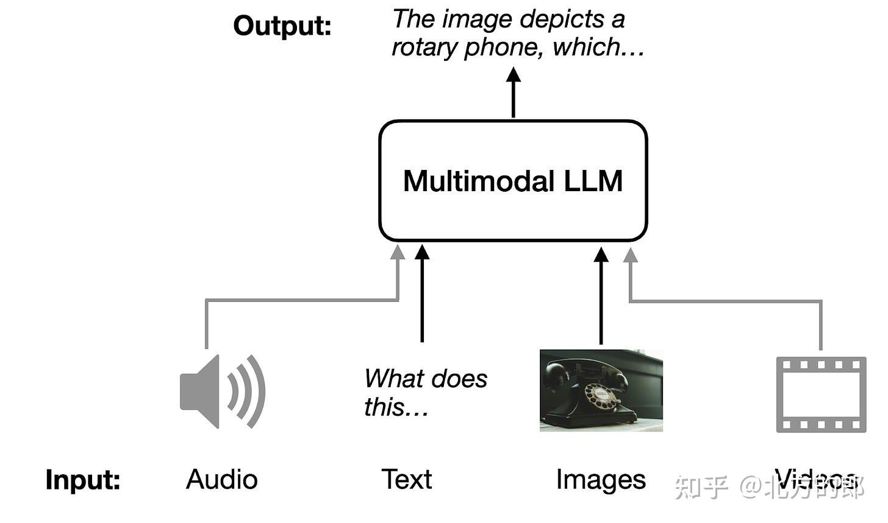
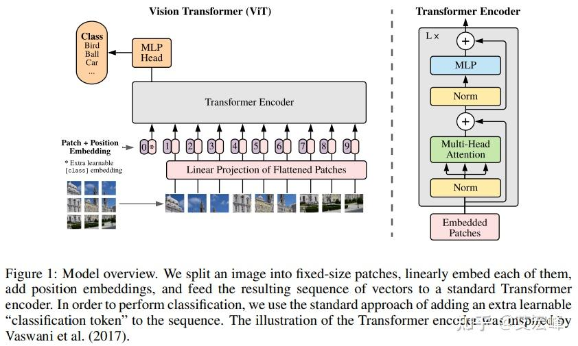
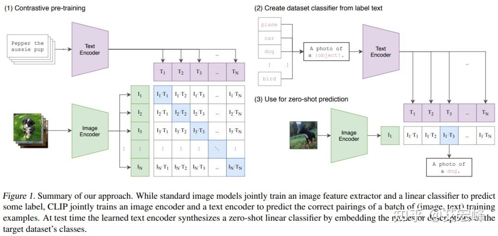
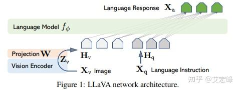
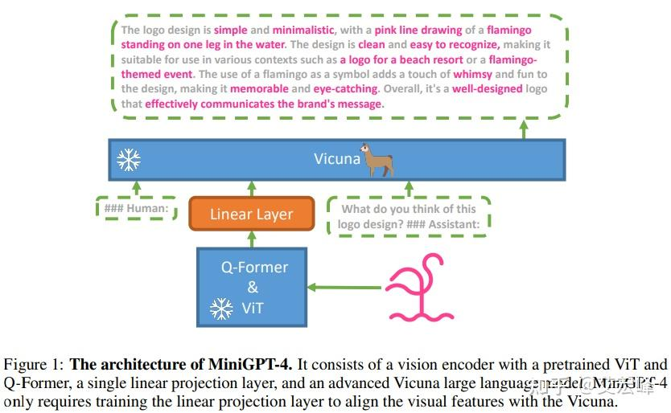
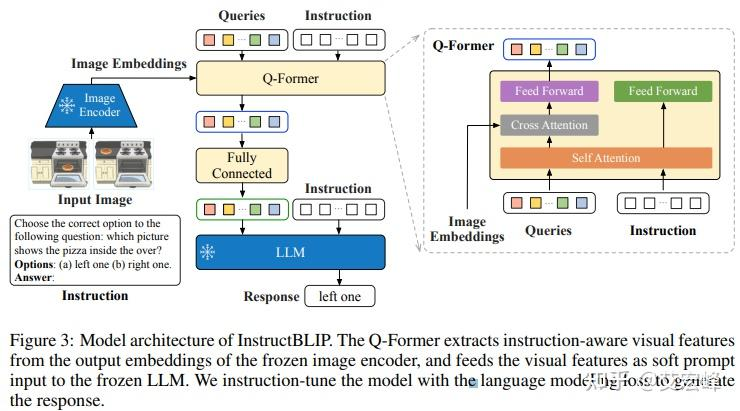
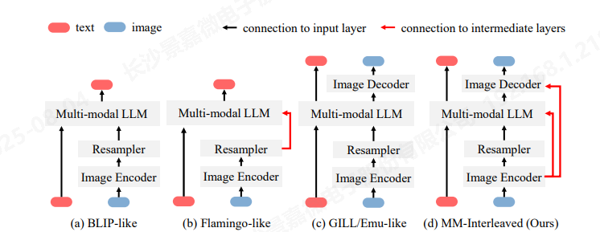
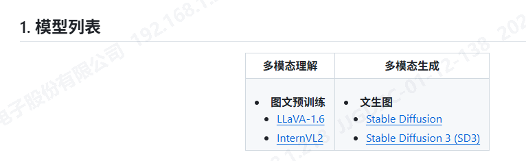

# 多模态大模型在图像描述与知识库构建中的应用调研

> 本次调研旨在深入了解当前多模态大模型在图片理解方面的能力，并探讨其在专家知识库构建中的应用潜力，特别是多模态大模型在图像解析中的作用。

## 1 多模态是什么
### 1.1 概念
多模态（Multimodal）指利用两种及以上不同模态的数据（如文本、图像、音频、视频、触觉、传感器信号等），通过融合、对齐与协同处理，使系统获得更全面、准确和鲁棒的理解与生成能力。

### 1.2 与单模态、跨模态、增强模态的区别
- 单模态：仅处理一种数据（如纯文本或纯图像）。
- 跨模态：强调在模态间相互转换（如文本生成图像）。
- 多模态：平等融合多种模态，追求协同理解与推理

## 2 多模态模型（MultiModal Model，MM）

### 2.1 概念
一种能够**同时处理并融合两种及以上不同类型数据（如图像、文本、音频、视频等）**的AI系统。通过将各模态信息映射到统一语义空间，实现互补增强，从而显著提升任务的**准确性**与**鲁棒性**。

### 2.2 核心组成

1. 输入编码器：每种模态一个独立网络（如 ViT 处理图像、BERT 处理文本、Whisper 处理音频），分别提取各模态特征。
2. 融合机制：将各模态特征合并成统一表示，可用简单拼接、注意力机制、Cross-modal Transformer 等。
3. 下游任务头：在融合特征上完成分类、生成、问答等最终任务。

### 2.3 发展进程：单模态 → 跨模态 → 多模态

1. 单模态时代（~2018）
- 特点：ResNet、VGG 等卷积网络只识图像；NLP：Word2Vec→Transformer 只懂文本。
- 局限：每类数据独立建模，任务、损失、优化完全隔离

2. 跨模态（Late-Fusion）阶段（2018~2022）
- 特点：保持“视觉编码器 + 文本编码器”各自预训练，后期用注意力或对比学习（CLIP、ViLT）把两种表征映射到公共空间，再做下游任务

- 局限：
    1. 信息损失：连续视觉/音频输出时候就已经被压成固定向量，细节难保留；
    2. 训练割裂：各编码器目标不同，难以端到端联合优化；
    3. 任务特定：换一个任务就要重搭流水线
- 方法：CLIP

3. 多模态阶段（2023-今）
- 特点：从训练第一天就把文本、图像、音频、视频等统一离散化为同一序列(token/patch/frame)，共享 Transformer 参数，实现“一套权重、任意模态输入/输出”
- 局限：
    1. 端到端训练：不再分阶段、不再冻结视觉骨干，所有参数在多模态海量数据上联合更新，降低对齐误差。
    2. 零样本跨模态：模型未经特定任务微调即可“看图说话”“听声作画”“视频问答”。

## 3 多模态大模型（MultiModal Large-scale Model, MLLM）

“使用大模型处理多模态的模型”——具体指：以**大规模预训练语言模型（LLM）为认知核心**，通过**模态编码器**（视觉、音频等）+ **连接器/接口**（Projection、Q-Former 等）将异构信息映射到统一语义空间，从而**原生地接收、对齐、融合并输出两种及以上模态（文本、图像、音频、视频、3D 点云等）**的超大模型系统。



### 3.1 为什么多模态任务要“做大”——大模型带来的优势？

1. 显著降低重训成本
   传统小规模多模态方案每次新增任务或模态都需端到端重训，代价高昂。MLLM 把重点放在“**如何把现成的单模态大模型（LLM、ViT、Whisper 等）连接起来**”，仅训练一个轻量级 Connector / Projector 即可完成跨模态对齐，节省大量算力。

2. 复用语言大模型的认知能力
   LLM 已具备强大的语言生成、推理和 few-shot 学习能力，把它作为“认知中枢”后，可直接继承这些能力，去处理视觉问答、图像描述等多模态任务，而无需为每个任务单独设计小模型。

3. 统一推理链路，降低系统复杂度
   原生 MLLM（如 GPT-4o、Janus-Pro、Qwen2.5-VL）从预训练第一天就把文本 token、图像 patch、音频帧全部转成统一离散 token，端到端 Transformer 一次完成多模态理解或生成，减少级联误差与延迟。

### 3.2 多模态理解 vs. 多模态生成

| 维度         | 多模态理解（Understanding）        | 多模态生成（Generation）                 |
| ------------ | ---------------------------------- | ---------------------------------------- |
| **输入**     | 多种模态（图+文、视频+音频）       | 一种或多种模态（文本、草图、音频）       |
| **输出**     | 对输入的“解释”或“答案”，文本或标签 | 新合成的另一模态内容：图像、视频、音频   |
| **典型任务** | 图像描述、VQA、图表推理、视频摘要  | 文生图、文生视频、语音驱动视频、草图上色 |
| **示例模型** | Qwen2.5-VL、InternVL2、Flamingo    | Janus-Pro、DALL·E 3、Sora                |

> “给定一张图片，生成描述文字”属于**多模态理解**任务（又称之为图像描述（Image Captioning））。虽然输出是一段新生成的文本，但这里的“生成”是基于对图像内容的**理解**而产生的，其本质任务是从图像中提取语义信息并用自然语言表达出来。不是“创造性合成新内容”，不是多模态生成。

---

## 4 研究进展

图文多模态大模型的经典研究进展包括：

- 纯图像编码器：ViT (2021)；
- 联动文本的图像编码器：CLIP (2021)、BLIP (2022)、BLIP2 (2023)；
- 图文多模态大模型：LLaVA (2023)、MiniGPT-4 (2023)、InstructBLIP (2023)、LLaVA1.5 (2024)。

### 4.1 ViT-2021-Google Research

论文：[《An image is worth 16x16 words: Transformers for image recognition at scale.》](https://arxiv.org/pdf/2010.11929)
[代码](https://github.com/google-research/vision_transformer)

Vision Transformer（ViT）的核心思想是将图像分割成固定大小的块（patches），然后将这些块视为“视觉词”（visual tokens），并将其嵌入到 Transformer 中进行处理。




### 4.2 CLIP-2021-OpenAI

论文：[《Learning Transferable Visual Models From Natural Language Supervision》](https://proceedings.mlr.press/v139/radford21a/radford21a.pdf)
[代码](https://github.com/openai/CLIP)

Contrastive Language-Image Pre-training（CLIP）是一种基于文本-图像对的对比学习预训练方法，其架构由图像编码器和文本编码器组成。图像编码器负责将图像转换为嵌入，文本编码器则将文本转换为嵌入。在训练过程中，对于每个匹配的图像-文本对，图像和文本嵌入会被拉近，使其彼此“接近”；而对于所有不匹配的图像-文本对，图像和文本嵌入则会被推远，使其彼此相距甚远。


### 4.3 BLIP-2022/3-Salesforce Research

论文1：[《BLIP: Bootstrapping Language-Image Pre-training for Unified Vision-Language Understanding and Generation》](https://arxiv.org/abs/2201.12086)
[代码](https://github.com/salesforce/BLIP)

BLIP采用统一的预训练框架，同时训练图像和文本编码器，而 CLIP 则是分别训练图像和文本编码器。这种统一的预训练框架使得 BLIP-1 在多模态任务中表现更为出色。此外， 引入了多任务学习机制，通过图像-文本对比损失（ITC）、图像-文本匹配损失（ITM）和语言建模损失（LM）进行训练，这不仅增强了模型的跨模态推理能力，还提高了对噪声数据的鲁棒性。
提出“bootstrapping caption”方案来“提纯”带噪声的网络爬取数据，从而提升多模态模型能力。（也很重要，对我们的爬虫信息做提纯）

论文2：[《Bootstrapping Language-Image Pre-training with Frozen Image Encoders and Large Language Models》]
[代码](https://github.com/salesforce/LAVIS/tree/main/projects/blip2/)
通过采用冻结的图像编码器和大型语言模型（LLM），并引入轻量级的 Q-Former 模块，实现了更高效的两阶段训练策略。

#### 4.3.1 Q-Former（Querying Transformer）
是一种轻量级的 Transformer 结构，专门用于桥接视觉特征和语言模型（LLM），在多模态任务中实现高效的视觉-语言对齐。它由两个 Transformer 子模块组成：图像 Transformer 和文本 Transformer。图像 Transformer 与冻结的图像编码器交互，通过可学习的查询向量提取视觉特征；文本 Transformer 则负责处理文本信息，既可以作为文本编码器，也可以作为文本解码器。


### 4.4 LLaVA-2023-Microsoft Research

论文：[《Visual Instruction Tuning》](https://arxiv.org/abs/2304.08485)  是多模态大模型的经典之作
[代码](https://llava-vl.github.io/)

模型架构：LLaVA模型结合了CLIP的视觉编码器和Vicuna的语言解码器。在二者之间设计了一个线性投影层，将视觉特征映射到语言模型的词嵌入空间，从而实现了视觉信息与语言指令的融合。

两阶段训练：

- **第一阶段：特征对齐预训练**。此阶段只更新投影层，目的是将视觉特征与语言模型的词嵌入空间对齐。
- **第二阶段：端到端微调**。在GPT-4生成的视觉指令遵循数据上进行训练，更新投影层和语言模型的参数，而视觉编码器保持冻结。



#### 4.4.1 LLaVA 1.5

论文：[《Improved Baselines with Visual Instruction Tuning](https://arxiv.org/abs/2310.03744)

[代码](https://llava-vl.github.io/)

1. 架构改进

- 视觉-语言连接器：LLaVA 1.5将视觉编码器和语言模型之间的连接器从线性投影改为两层MLP（多层感知器），增强了多模态表达能力。
- 输入图像分辨率：LLaVA 1.5将输入图像分辨率从224x224提升到336x336，使模型能够更好地捕捉图像细节。
- 语言模型规模：LLaVA 1.5将语言模型从7B参数扩展到13B参数，提升了模型在视觉对话任务中的表现。

2. 数据集扩展

- 特定任务数据集：LLaVA 1.5增加了OCR、领域级识别和GQA等特定任务数据集，丰富了视觉知识来源。
- 数据量：LLaVA 1.5在预训练和微调阶段增加了约100万量级的视觉指令数据。

### 4.5 MiniGPT-4-2023-King Abdullah University of Science and Technology
论文：[《Minigpt-4: Enhancing vision-language understanding with advanced large language models.》](https://arxiv.org/pdf/2304.10592)
[代码](https://minigpt-4.github.io/)

1. 模型结构

- 视觉特征对齐方式：MiniGPT-4使用了“BLIP-2 QFormer + Project Layer”的结构，通过Q-Former模块更好地对齐图像和文本特征；而LLaVA仅使用“purely Project Layer”，即简单的线性投影层。
- 视觉编码器：MiniGPT-4使用了BLIP-2中的ViT-G/14作为视觉编码器，而LLaVA使用基于ViT的视觉编码器。

2. 训练策略
- 参数更新：LLaVA在两阶段训练中数据不同且更新的参数也不同；MiniGPT-4在训练过程中只更新Projection层的参数。



#### 4.5.1 BLIP-2的Q-Former VS MiniGPT-4的Q-Former vs

共同点：用于将视觉特征（图像）与语言特征（文本)对齐

区别：

- BLIP-2：输出直接作为语言模型的输入

- MiniGPT-4：输出经过**额外的线性投影层**，将特征维度从768映射到4096，适配Vicuna语言模型的输入维度。

### 4.6 InstructBLIP-2023-Salesforce Research

论文：[《InstructBLIP: Towards General-purpose Vision-Language Models with Instruction Tuning》](https://arxiv.org/pdf/2305.06500)
[代码](https://github.com/salesforce/LAVIS/tree/main/projects/instructblip)

在BLIP2的基础上，加入指令微调数据集（VQA数据集），并将用户提问文本加入到图像处理侧。



#### 4.6.1 BLIP VS LLaVA VS MiniGPT-4

BLIP+Q-Former=>BLIP2

BLIP+指令微调=>LLaVA

LLaVA（BLIP+指令微调）+Q-Former=>MiniGPT-4

BLIP2（BLIP+Q-Former）+指令微调=>InstructBLIP

> MiniGPT-4和InstructBLIP都使用BLIP+Q-Former+指令微调，他们的区别？
>
> [InstructBLIP vs MiniGPT-4：视觉语言模型全面对决](https://developer.baidu.com/article/detail.html?id=3342908)
>
> 各有使用场景：
>
> - **MiniGPT-4**：
>   - 在图像描述任务上能够生成细节丰富和精确的图像描述。
>   - 在图像识别和分类任务，如电商图像搜索、安全监控等表现优异。
> - **InstructBLIP**：
>   - 在理解和定位等视觉语言任务上表现出色。
>   - 更适用于需要精细语义理解和推理的任务，如智能客服、智能助手等。

### 4.7 MM-Interleaved-2024-上海人工智能实验室

论文：[《MM-Interleaved: Interleaved Image-Text Generation via Multi-modal Feature Synchronizer》](https://arxiv.org/pdf/2401.10208)

[代码](https://github.com/OpenGVLab/MM-Interleaved)

核心创新是引入了多模态特征同步器（Multimodal Feature Synchronizer）。该同步器能够动态注入多张高分辨率图像的细粒度特征到多模态大模型和图像解码器中，实现对文本和图像的解码生成的同时进行跨模态的特征同步。




#### 4.7.1 问题：多模态大模型时代，图像字幕（image caption）任务还有存在的必要吗？
https://www.zhihu.com/question/653483354
在MiniGPT-4、LLaVA等提出后，image captioning似乎自然而然地成为了模型附属的一个能力，专门做这个内容的人就少了。
因为intuitively这些模型能输出很精细的描述，主观上就会让用户觉得它们表现得很“好”，但目前LLM存在比较严重的幻觉问题。这一点对于一些特殊的任务会更加明显，比如说specific domain下的image captioning，有一个任务叫医疗影像报告生成做的其实就是这件事，一般来说对于特定领域下的captioning任务NLG metric关于n-gram重合度的评测方式其实是比较合适的，因为像诊断报告这种类型的数据，对于输出结果的准确程度会有一定要求。

### 其他

#### PaddleMIX

尝试跑一下

~~T800为KunLun G5680 V2，所以尝试安装昆仑版本的，但是平台要求不对，他是linux/arm64/v8，要求平台后，也没有对应的版本返回。~~

PaddleMIX昇腾使用说明：https://github.com/PaddlePaddle/PaddleMIX/blob/develop/docs/hardware_support/ascend_usage.md，安装昇腾的可以，但是有包的依赖问题（是这样的，因为人家是昇腾的NPU）

```shell
docker ps # 查看当前正在运行的容器
docker run -it --name paddle-npu-dev1 -v $(pwd):/work \
    --privileged --network=host --shm-size=128G -w=/work \
    -v /usr/local/Ascend/driver:/usr/local/Ascend/driver \
    -v /usr/local/bin/npu-smi:/usr/local/bin/npu-smi \
    -v /usr/local/dcmi:/usr/local/dcmi \
    -e ASCEND_RT_VISIBLE_DEVICES="0,1,2,3,4,5,6,7" \
    registry.baidubce.com/device/paddle-npu:cann80T13-ubuntu20-$(uname -m)-gcc84-py39 /bin/bash
    
docker exec -it paddle-npu-dev1 /bin/bash # 进入容器的 shell
docker cp my_folder paddle-npu-dev1:/work/ # 导入文件

```

`decord` 主要用于高效读取视频帧，不支持 Linux ARM64，如果你**不需要视频解码功能**，可以跳过它。（虽然可以自己编辑，但是编译有各种依赖问题）

```bash
pip install paddlemix --no-deps
```



能用的也不多，就试试把，还是要用华为自己的。