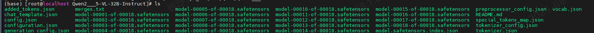
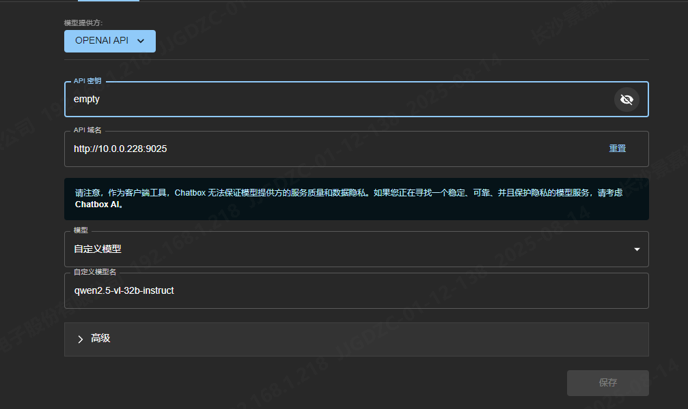
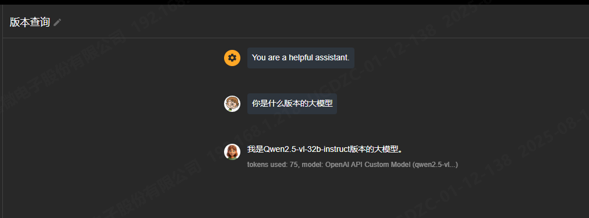
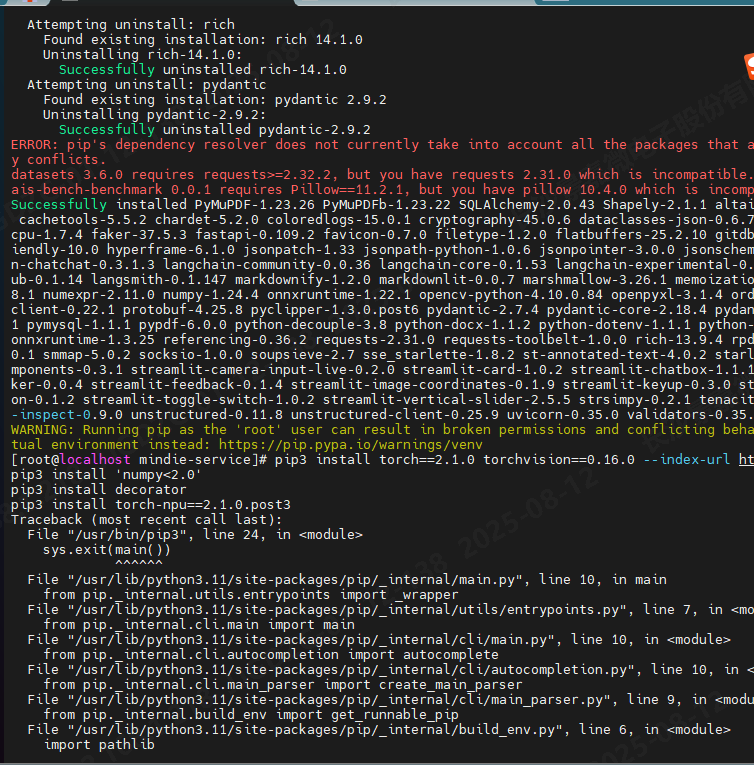

# Qwen2.5-VL部署与MindIE环境配置

参考：大模型部署mindie

## 1 环境配置

### 1.1 服务器配置

- 服务器型号：华为800T A2
- CPU：鲲鹏920 5250
- NPU：华为昇腾910B4
- 操作系统：openEuler 22.03 (LTS-SP4)

### 1.2 部署策略

采用Docker容器部署Qwen2.5-VL模型服务，结合MindIE推理引擎进行加速，确保高效和稳定的推理性能。

## 2 Qwen2.5-VL模型下载

下载链接：[ModelScope社区](https://www.modelscope.cn/)

模型路径：

```shell
/data/modelscope_hub/hub/Qwen/Qwen2___5-VL-32B-Instruct
/data/modelscope_hub/QwQ-32B
```



下载完成后，需要设置模型文件的权限

```shell
chmod -R 640 /data/modelscope_hub/hub/Qwen/Qwen2___5-VL-32B-Instruct
```

## 3 启动服务

### 3.1 主机环境

激活环境

```
conda activate hsw_modelscope
```

### 3.2 查看主机架构

```
(hsw_modelscope) [root@localhost Ascend]# uname -m
aarch64
```

- `x86_64` → `amd64`
- `aarch64` → `arm64`
- `armv7l` → `arm`

### 3.3 查看镜像

有权限的同事帮忙下好的，获取已下载的Qwen2.5-VL镜像ID：b9508450a680

```shell
(base) [root@localhost Qwen2___5-VL-32B-Instruct]# docker images | grep 2.1.RC1
swr.cn-south-1.myhuaweicloud.com/ascendhub/mindie                                        2.1.RC1-800I-A2-py311-openeuler24.03-lts                                               b9508450a680   10 days ago     16GB

(base) [root@localhost modelscope_hub]# docker images | grep 1.0.RC3
mindie_portable                                                                          1.0.RC3-800I-A2-arm64                                                                  b7a656294b13   6 months ago    13.3GB
swr.cn-central-232.csai.hunan.com.cn/changsha-aicc/mindie                                1.0.RC3-800I-A2-arm64                                                                  760b27e753c2   10 months ago   12.9GB
```

启动Docker容器：

```shell
docker run -it -d --net=host --shm-size=1g \
    --name hsw_Qwen2.5-VL \  # 镜像命名
    --device=/dev/davinci_manager \
    --device=/dev/hisi_hdc \
    --device=/dev/devmm_svm \
    --device=/dev/davinci4 \ # 使用的GPU：与其他docker独占
    --device=/dev/davinci5 \
    -v /usr/local/Ascend/driver:/usr/local/Ascend/driver:ro \
    -v /usr/local/sbin:/usr/local/sbin:ro \
    -v /data/hsw/hsw_Qwen2.5:/path-to-weights:ro \ # 模型权重
    -v /data/hsw/MLMM:/data/hsw/hsw_Qwen2.5_data:ro \ # 数据交互的通道
b9508450a680       bash
```

```shell
docker run -it -d --net=host --shm-size=1g \
    --name hsw_Qwen2.5-VL \
    --device=/dev/davinci_manager \
    --device=/dev/hisi_hdc \
    --device=/dev/devmm_svm \
    --device=/dev/davinci4 \
    --device=/dev/davinci5 \
    -v /usr/local/Ascend/driver:/usr/local/Ascend/driver:ro \
    -v /usr/local/sbin:/usr/local/sbin:ro \
    -v /data/modelscope_hub:/path-to-weights:ro \
    -v /data/hsw/MLMM:/data/hsw/hsw_Qwen2.5_data:ro \
b9508450a680       bash

docker run -it -d --net=host --shm-size=1g \
    --name hsw_QwQ3 \
    --device=/dev/davinci_manager \
    --device=/dev/hisi_hdc \
    --device=/dev/devmm_svm \
    --device=/dev/davinci4 \
    --device=/dev/davinci5 \
    -v /usr/local/Ascend/driver:/usr/local/Ascend/driver:ro \
    -v /usr/local/sbin:/usr/local/sbin:ro \
    -v /data/modelscope_hub/QwQ-32B:/path-to-weights:ro \
    -v /data/hsw/QwQ3:/data \
760b27e753c2       bash
```

## 4 安装依赖与配置

### 4.1 进入Docker容器

```shell
docker exec -it hsw_Qwen2.5-VL /bin/bash
docker exec -it hsw_QwQ3 /bin/bash
```

### 4.2 安装依赖

```shell
cd /usr/local/Ascend/atb-models
pip install -r requirements/models/requirements_qwen2_vl.txt
```

### 4.3 修改MindIE推理引擎配置参数

```shell
vim /usr/local/Ascend/mindie/latest/mindie-service/conf/config.json
```


```
# 关键配置项
Ipaddress 自己的ip
port 自己的端口
httpsEnabled  true改为false
npuDeviceIds  [[0,1,2,3]]  根据npu-smi info与实际需求设置
worldsize   4  改成与npuDeviceIds个数一致
modelWeightPath  /path-to-weights   （模型的路径）
Modelname 模型名称

path：/path-to-weights/hub/Qwen/Qwen2___5-VL-32B-Instruct

maxSeqLen 最大序列长度。用户根据自己的推理场景选择maxSeqLen。
maxInputTokenLen 输入token id的最大长度。要小于maxSeqLen
maxPrefillTokens [1, 4194304]，且必须大于或等于maxSeqLen的取值。一般保持和maxSeqLen相等。
maxIterTimes 模型全局最大输出长度。（目前主流的大模型一般最大输出为8192）
```

### 4.4 启动服务
1. 执行，直接启动服务（简单直观）

```shell
cd /usr/local/Ascend/mindie/latest/mindie-service
./bin/mindieservice_daemon
```

2. 使用后台进程方式启动服务（后续还可以使用该窗口的命令行）

```shell
nohup ./bin/mindieservice_daemon > output.log 2>&1 &
```
然后输入tail -f output.log查看进程输出，回显Daemon start success! 说明服务开启成功

---


```shell
find /dev/shm -name '*llm_backend_*' -type f -delete
find /dev/shm -name 'llm_tokenizer_shared_memory_*' -type f -delete
```

如果出现2025-08-12 21:47:01.194 Port 8501 is already in use，清理共享内存中的旧文件

```bash
yum install net-tools
netstat -tulnp | grep 8501
Kill -9 
```

---

## 5 Qwen2.5-VL 交互操作

### 5.1 chatbox 界面





### 5.2 命令行交互

```shell
curl -H "Accept: application/json" -H "Content-type: application/json" -X POST -d '{
    "inputs": [
        {"type": "text", "text": "100字概述这张图片"},
        {
            "type": "image_url",
            "image_url": "/path-to-weights/test_image/image-20250808105111842.png" #图片路径放在共享文件夹下
        }
    ],
    "stream": false,
    "parameters": {
        "temperature": 0.5,
        "top_k": 10,
        "top_p": 0.95,
        "max_new_tokens": 2000,
        "do_sample": true,
        "seed": null,
        "repetition_penalty": 1.03,
        "details": true,
        "typical_p": 0.5,
        "watermark": false,
        "priority": 5,
        "timeout": 10
    }
}' http://10.0.0.228:9025/generate
```

stream：流式和文本

- 流式推理主要处理实时数据流，强调快速响应和逐步输出结果，适用于实时监控和决策场景；

- 文本推理则处理离散的完整文本，注重理解和生成连贯文本，常用于自然语言处理任务。


## 6 其他

### 6.1 AI社区

1. [魔乐社区](https://modelers.cn/)

2. [昇腾MindSpeed MM微调多模态Qwen2.5-VL](https://www.hiascend.com/developer/blog/details/0205183807801766010)

   **推理** 是使用模型对新数据进行预测的过程，目的是生成有用的输出。

   **评测** 是评估模型性能的过程，目的是衡量模型在特定任务上的表现，通常通过计算性能指标来完成。

3. [AI开发平台MODELARTS-昇腾能力应用地图:多模态模型](https://www.huaweicloud.com/guide/productsdesc-bms_e3f6bc110060f8259631c4b1be454b5fsupport0)

4. [使用LoRA微调Qwen2.5-VL-7B-Instruct完成电气主接线图识别](https://blog.csdn.net/WASEFADG/article/details/147993631)

有人干一样的事情ye，但是要自己构造数据集

```python
    # 图像分辨率统一为256×256（平衡细节与显存）
    # 文本标注需包含设备类型（如出线柜）、参数（如630A）和位置关系（如下层母线连接）
    {
  "conversations": [
    {
      "from": "user",
      "value": "Picture 1: ./substation_01.png\n提取图中干式变压器的参数"
    },
    {
      "from": "assistant",
      "value": "型号：SCB10-1600/10\n额定容量：1600kVA\n电压比：10kV/0.4kV"
    }
  ]
}

```

 ### 6.2 安装chatchat报错

搞完：pip install "langchain-chatchat[xinference]" -U，pip就挂了



如果确认 `/usr/local/lib/python3.11/site-packages/pathlib.py` 是错误的第三方模块，你可以尝试删除它：

```bash
rm -f /usr/local/lib/python3.11/site-packages/pathlib.py
```

```python
import pathlib
print(pathlib.__file__)
```

### 6.3 gg

```
sudo sh -c "$(curl -L https://region-hk-download.ne.world/new/linux/gg/go.sh)"
gg config -w node=
```

下载的时候，命令前面加上gg

### 6.4 zip

```
yum install -y unzip zip
```

### 6.5 Langchain-Chatchat和Xinference 

Langchain-Chatchat 是一个开源的、可离线部署的基于大语言模型的 RAG（检索增强生成）和 Agent  应用项目。它支持多种主流开源大语言模型和 embedding 模型，如 GLM-4-Chat、Qwen2-Instruct、Llama3  等，还支持调用 OpenAI 等在线 API。其核心功能包括 LLM 对话、知识库问答、搜索引擎对话、文件对话、数据库对话、多模态图片对话等，适用于企业级私有知识图谱构建场景。

Xinference 是一个性能强大且功能全面的分布式推理框架，专注于简化大语言模型（LLM）、多模态模型及语音模型的部署与推理流程。它支持多种模型，包括文本生成、Embedding 向量化、语音识别、图像处理等，提供一键部署、异构硬件推理、分布式架构、灵活的 API 调用等功能。