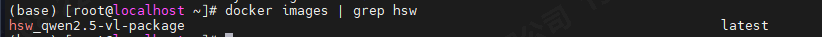
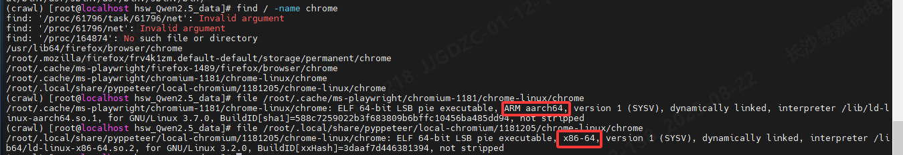
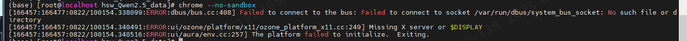
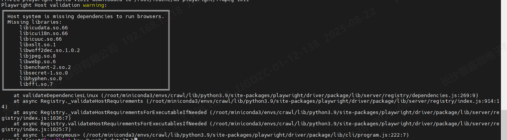
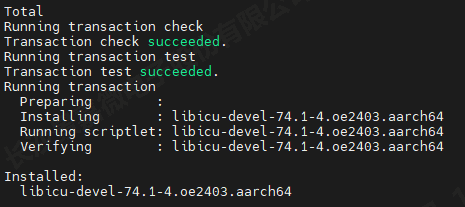
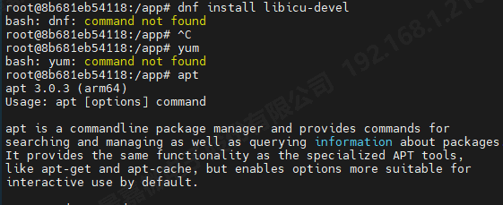

# 基于Docker部署爬虫服务

> 本文记录了在 Docker 环境下部署爬虫服务的全过程，涵盖了爬虫服务的构建、镜像打包、浏览器自动化配置、依赖安装以及常见问题的解决方法。

## 1 目录结构

### 1.1 服务端代码 (`server.py`)

server.py：Flask 应用程序，用于处理 HTTP POST 请求并返回爬取结果。将该 Flask 应用程序容器化，并使用 Docker 部署和运行，使其成为一个 Docker 服务。

```python
from flask import Flask, request, jsonify

app = Flask(__name__)

# 定义一个路由，当收到 POST 请求到 /crawl 路径时，调用 handle_post 函数
@app.route('/crawl', methods=['POST'])
def handle_post():
    data = request.json  # 从请求中获取 JSON 数据
    print(f"收到的 data：{data}")
    
    crawl_result = {# 调用实际代码获取结果
        "files": [
            {
                "path": "example.com/page1.html",   # 存储URL
                "title": "示例页面1 - Example.com",   # 页面标题
                "url": "https://example.com/page1 "  # 原始URL
            },
            {...},
        ],
    }    
    return jsonify(crawl_result), 200 # 将爬取结果以JSON格式返回，并设置HTTP状态码为200（表示成功）


if __name__ == '__main__':
    app.run(host='0.0.0.0', port=7799, debug=True)
    #开启调试模式：当代码发生变化时，Flask 会自动检测到这些变化并重新加载应用，无需手动重启服务器。
```

### 1.2 请求爬虫服务 (`xxx_request.py`)

HTTP 协议中的 POST 和 GET 是两种最常见的请求方法

- **GET**：
  - 数据通过 URL 的查询字符串（Query String）传输。
  - 数据会附加在 URL 后面，例如 `http://example.com?key1=value1&key2=value2`。
  - 数据长度有限制，通常不超过 2048 个字符。
- **POST**：
  - 数据通过请求体（Request Body）传输。
  - 数据不会显示在 URL 中，更加安全。
  - 数据长度没有限制，可以传输大量数据。

通过 Python 的 `requests` 库，发送 POST 请求到 Flask 服务端，获取爬虫服务的响应。

```python
import requests

url1 = "http://example.com/page1"
url2 = "http://example.com/page2"

# 构造请求体
payload = {
    "urls": [url1, url2],  # URL 列表
}

# 发送 POST 请求到指定的爬虫服务
response = requests.post("http://10.0.0.228:7979/crawl", json=payload)

# 检查响应
if response.status_code == 200:
    print("Crawl request successful")
    print(response.json())  # 打印响应内容
else:
    print(f"Failed to send crawl request, status code: {response.status_code}")
    print(response.text)  # 打印错误信息
```

### 1.3 Dockerfile

这是用于构建爬虫服务镜像的文件，定义了服务运行的环境和安装步骤：

```python
# 基础镜像为轻量级Python 3.10镜像
FROM python:3.10-slim 

# 设置工作目录
WORKDIR /app 

# 配置 pip 使用国内源
RUN pip config set global.index-url https://pypi.tuna.tsinghua.edu.cn/simple/ && \
    pip config set global.trusted-host pypi.tuna.tsinghua.edu.cn

# 注意：暂时跳过 curl 安装，如果后续需要可以再添加
# 或者使用 python 内置的 urllib 替代 curl 进行健康检查

# 复制依赖文件
COPY requirements.txt . # 将当前目录下的 requirements.txt 文件复制到容器的工作目录 /app

# 安装 Python 依赖
RUN pip install --no-cache-dir -r requirements.txt #--no-cache-dir 参数禁用了 pip 的缓存，减少生成的镜像大小。

# 复制应用代码
COPY . .

# 暴露端口（通过环境变量配置）
EXPOSE ${PORT:-7799} # EXPOSE 指令仅声明端口，实际运行时需要通过 docker run 的 -p 参数将容器端口映射到宿主机端口。

# 健康检查（使用 python 内置模块替代 curl）
HEALTHCHECK --interval=30s --timeout=10s --start-period=20s --retries=3 \
    CMD python -c "import urllib.request; urllib.request.urlopen('http://localhost:${PORT:-7799}/health')" || exit 1

# --interval=30s：每隔 30 秒检查一次。
# --timeout=10s：每次检查的超时时间为 10 秒。
# --start-period=20s：容器启动后 20 秒内不进行健康检查。
# --retries=3：如果检查失败，最多重试 3 次。
# CMD：使用 Python 内置的 urllib 模块访问 http://localhost:${PORT:-7799}/health，检查服务是否正常运行。
    
# 启动服务
CMD ["python", "server.py"]

```


## 2 构建与运行 Docker 镜像

### 2.1 构建 Docker 镜像

参考：http://git.xcube.com/ai/ragflow-jjw/src/branch/main/docker/README-algorithms.md

1. 下载：`http://git.xcube.com/ai/ragflow-jjw.git`
2. 进入`算法服务`文件夹：`cd algorithms/ner`
3. 根据文件夹下的Dockerfile创建docker
```bash
docker build -t hsw_qwen2.5-vl-service .
```
- `hsw_qwen2.5-vl-service` 是为该镜像指定的标签，构建完成后可以通过 `docker images` 查看。
- 若要删除镜像，使用 `docker rmi <镜像ID>`。

### 2.2 启动 Docker 容器

启动一个容器实例来运行爬虫服务：

```bash
docker run -d -p 7799:7799 --name hsw-ner hsw_qwen2.5-vl-service
```
- `-p 7799:7799` 端口映射，将容器的端口 7799 映射到宿主机的 7799 端口。
- `--name hsw-ner` 设置容器名称。
- 容器启动后，可以通过 `docker ps -a` 查看容器状态，使用 `docker rm <容器ID>` 删除容器。

### 2.3 **常用 Docker 命令**

```bash
docker stop hsw-ner & docker remove hsw-ner # 停止并删除容器
docker restart hsw-ner # 重启容器
docker exec -it hsw-ner /bin/bash # 进入容器命令行
```
### 2.4 提交容器为镜像

如果在容器内进行了一些修改或安装了软件，可以使用 docker commit 将当前容器保存为新的镜像：

```bash
docker commit [OPTIONS] CONTAINER [REPOSITORY[:TAG]]
```
- **`-a`**：指定提交的作者（author）。
- **`-m`**：指定提交的信息（message）。
- **`CONTAINER`**：要提交的容器的名称或 ID。
- **`REPOSITORY[:TAG]`**：目标镜像的名称和标签（可选）。如果不指定，默认为 `none:none`。

```bash
docker commit -a 'hsw' -m '20250825-package' hsw-ner hsw_qwen2.5-vl-package
```




### 2.5 保存镜像为 tar 文件
将镜像导出为 tar 文件，以便在其他机器上导入使用：
```xshell
docker save -o hsw_qwen2.5-vl-package.tar hsw_qwen2.5-vl-package
```


### 2.6 导入 tar 文件为镜像
若要导入之前导出的 tar 文件：

```bash
docker load < hsw_qwen2.5-vl-package.tar
```

如果出错了（server.py报错导致服务起不来），可以选择不执行直接启动

```bash
docker run -it --name my_container my_image
docker run -it --name hsw_crawl4ai hsw_qwen2.5-vl-package
```

正常启动

```bash
docker run -d --name my_container my_image /bin/bash

```

不执行python server.py，直接启动

```shell
docker run -it --name hsw_crawl4ai --entrypoint sh hsw_qwen2.5-vl-package

```

​    from markupsafe import soft_unicode

## 3 安装环境

### 3.1 安装浏览器
为了确保爬虫能够顺利模拟浏览器操作，安装浏览器是必不可少的步骤。
1. chrome

直接安装chrome会是x86的，版本不对，官网上也很难找。最后是在playwright可以自动安装，成功了！

`playwright` 是一个更现代的浏览器自动化工具，支持多种浏览器，包括 Chromium、Firefox 等。

```xshell
pip install playwright
playwright install
```

如图所示，直接安装的是x86-64版本的，playwright安装的是arrch64版本的，后者符合要求。



安装完成浏览器后，需要给其执行权限，并将其加入到环境变量中

```bash
chmod +x /root/.cache/ms-playwright/chromium-1181/chrome-linux/chrome
export PATH=$PATH:/root/.cache/ms-playwright/chromium-1181/chrome-linux
source ~/.bashrc
```




2. firefox

   中间曾退而求其次，更换为firefox，但是爬虫是基于chrome开发设计的，所以尽可能还是使用chrome

```bash
 dnf install firefox
```

#### 3.1.1 启动浏览器

linux下使用pyppeteer启动失败了

```python
browser = await pyppeteer.launch(
executablePath='/root/.cache/ms-playwright/chromium-1181/chrome-linux/chrome', 
args=['--no-sandbox'],
headless=False 
)
page = await browser.newPage()
```

换成playwright里面的async_playwright解决了问题

```python
from playwright.async_api import async_playwright

async with async_playwright() as p:
browser = await p.chromium.launch(executable_path='/root/.cache/ms-playwright/chromium-1181/chrome-linux/chrome', headless=True)
page = await browser.new_page()
```

### 3.2 安装依赖

将所需的包添加到 `requirements_hsw.txt` 文件中。在添加包时，可以不指定版本，`pip` 会自动解析依赖关系，并安装最合适的版本。

```bash
pip install -r requirements_hsw.txt
```

在使用 `pip` 安装 Python 包时，`pip` 会从指定的 Python 包索引下载所需的包及其依赖项。在下载过程中，`pip` 会显示每个包的下载链接。这些链接可以直接复制到浏览器中，手动下载包。

---

缺少库文件，需要安装



```bash
# 服务器上这么安装
dnf install libicu-devel
dnf install libxslt
dnf install libsecret
```

安装了74版本的



```bash
# 但是要66的，软链接一下
ln -s /usr/lib64/libicuuc.so.74.1 /usr/lib64/libicuuc.so.66
ln -s /usr/lib64/libicui18n.so.74.1 /usr/lib64/libicui18n.so.66
ln -s /usr/lib64/libicudata.so.74.1 /usr/lib64/libicudata.so.66
```
容器里面没有dnf、yum，但是有apt


```bash
# 用apt安装，中间会失败，根据报错信息，单独安装
apt-get update
apt-get install -y gconf-service libasound2t64 libatk1.0-0t64 libc6 libcairo2 libcups2t64 libdbus-1-3 libexpat1 libfontconfig1 libgcc-s1 libgconf-2-4 libgdk-libgdk-pixbuf-xlib-2.0-0 pixbuf2.0-0 libglib2.0-0t64 libgtk-3-0t64 libnspr4 libpango-1.0-0 libpangocairo-1.0-0 libstdc++6 libx11-6 libx11-xcb1 libxcb1 libxcomposite1 libxcursor1 libxdamage1 libxext6 libxfixes3 libxi6 libxrandr2 libxrender1 libxss1 libxtst6 ca-certificates fonts-liberation libappindicator1 libnss3 lsb-release xdg-utils wget
apt-get install -y libgbm1
```