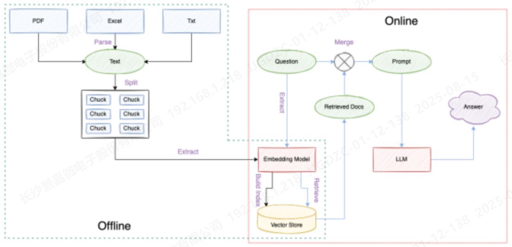
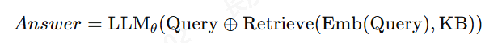

# 走进RAG：检索增强生成的核心概念

## 1 为何采用RAG技术

### 1.1 LLM的固有局限性

1. 知识局限：大型语言模型（LLM）无法覆盖垂直领域的深度知识，且无法访问私有或非公开的数据。
2. 时效性问题：静态的模型参数使得LLM在知识的时效性上滞后（后训练阶段的知识截止）。
3. 幻觉问题：LLM采用概率自回归生成机制，在缺乏足够事实依据的情况下容易产生“幻觉”或错误推理。

### 1.2 RAG技术的提出

为了解决上述问题，RAG（Retrieval-Augmented Generation，检索增强生成）应运而生：

1. 利用外部检索结果即时注入垂直与私有知识，弥合 LLM 的领域盲区与非公开数据缺口。

2. 通过实时检索外部知识库，把“离线”模型变成“在线可更新”，解决**知识时效问题**（实时更新）。

   将检索到的可信文档作为上下文输入模型，为其提供显式事实依据，降低仅靠概率“编造”导致的**幻觉**。

此外，RAG还具有下述优势：

1. 数据隐私——敏感数据仅存于检索库，无需写入模型参数，降低泄露风险。
2. 成本优化——新增或变更知识只需更新检索库，无需重训或微调，显著节省算力与费用。
3. 可解释性与可溯源——答案附带检索到的具体文档片段（PDF、段落、URL 等），实现“答案-来源”一一对应，用户可直接核验原始出处。

### 1.3 RAG的局限性：

1. 质量受限于检索库——覆盖不全、更新滞后或内容错误时，模型仍难输出高质量答案（Garbage in, garbage out）。
2. 系统复杂度与资源开销同步上升——检索、排序、重排、上下文融合等链路使架构、运维、延迟及计算成本均明显增加。

## 2. RAG和微调的区别

RAG和微调代表了两条互补的知识增强路径：

- **RAG**：在推理阶段动态引入即时知识，模型参数保持不变；类似“开卷考试”——通过现场翻阅资料获得答案。

  **微调**：在训练阶段将知识内化进模型，参数发生永久变化；类似“背课本”——知识被记住，闭卷考试时不依赖外部资料。

1. 作用环节 
    • RAG：推理前实时检索 → 动态注入上下文；模型权重冻结。 
    • 微调：训练期继续梯度更新 → 知识写入参数；推理时无外源。 
2. 更新方式与成本 
    • RAG：分钟级增删检索库即可生效，零重训成本。 
    • 微调：需重新训练或增量训练，算力、存储、人力均高。 
3. 数据隐私 
    • RAG：敏感数据仅驻留检索端，可加密、脱敏，模型不记忆。 
    • 微调：敏感数据必须参与训练，参数含隐私，泄露面更大。 
4. 适用场景 
    • RAG：知识高频变动、需可追溯来源、快速迭代场景。 
    • 微调：知识稳定、对延迟极敏感、需深度风格内化任务。

## 3 RAG三种架构

1. 简单 RAG (Naïve RAG)
 单轮检索-生成管道pipeline（Retrieve → Concatenate → Generate），固定链路
2. 高级 RAG (Advanced RAG)
 多阶段增强~查询改写、检索-重排-压缩、迭代检索、链式验证等策略
3. 模块化 RAG (Modular RAG)
 组件化微架构：检索器、重排器、记忆、生成器等全部抽象为可插拔模块，支持动态拓扑

**总结**：

- **简单RAG**：单次搜索-生成。
- **高级RAG**：在搜索与拼接之间增加优化步骤（如重排、摘要、多轮检索等）。
- **模块化RAG**：拆解成独立的组件，可以像积木一样自由组合。

## 4 RAG技术原理

### 4.1 索引阶段（离线）
- 将文档切分成 chunk → Embedding → 存入向量数据库（或建图、建表）。
- 目标：把知识转成可快速检索的表征。

### 4.2 查询阶段（在线）
#### 4.2.1 查询改写（可选）

通过LLM对查询进行关键词扩展、同义词改写，或生成假设文档。

#### 4.2.2 检索

使用Embedding匹配（向量检索）、BM25、图检索等方式，召回Top-k chunk或子图。

#### 4.2.3 重排（可选）

使用Cross-Encoder、RRF、ColBERT等技术进行二次评分，提高相关性。

#### 4.2.4 上下文组装

对检索到的文档进行截断、去重，并加上引用标记，拼接成Prompt。

### 4.3 生成阶段（在线）

- 将组装好的Prompt输入大模型，通过自回归机制生成答案。

- 在生成时，模型的注意力集中在检索到的文档片段，显著降低“幻觉”现象的发生。

 公式化：

 其中，θ为LLM的固定模型参数，RAG的推理阶段不会更新θ；⊕表示拼接或组合操作。
