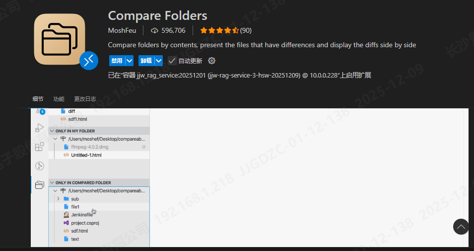
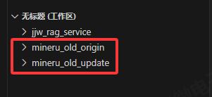
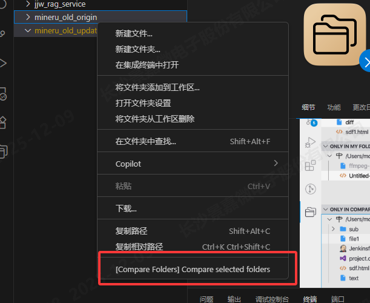
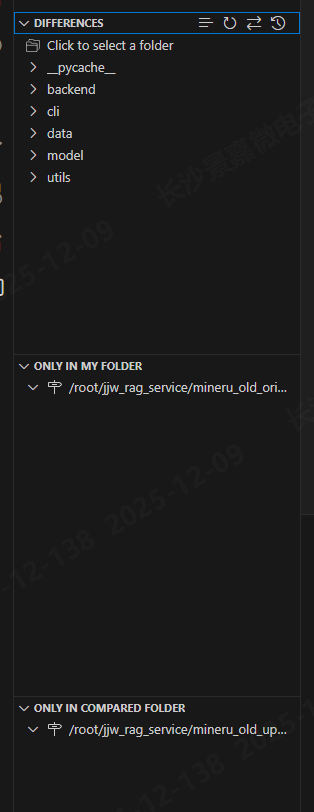
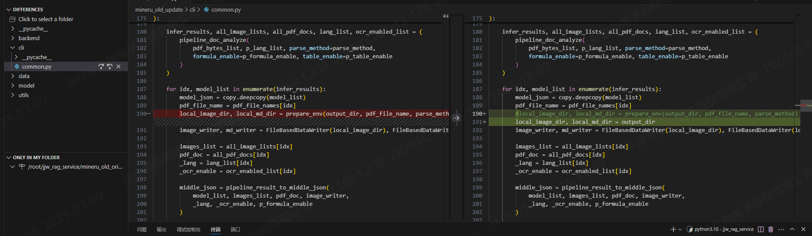

## 使用 VSCode Compare Folders 对比两个项目的差异

当你手上有两份修改过的项目，需要查看它们之间到底改动了哪些内容时，可以使用 VSCode 的 **Compare Folders** 插件。这种方式比 Beyond Compare 更轻量、更直观，不需要逐个文件打开，效率更高。

## 1. 安装并打开 Compare Folders 插件

## 2. 将两个项目文件夹加入工作区

在 VSCode 顶部栏选择：文件 → 将文件夹添加到工作区，分别选择你要对比的两个项目目录。

## 3. 在工作区中选择两个项目进行对比

按住 **Ctrl**，同时在左侧资源管理器中选中这两个文件夹，右键 → **Compare Folders**

## 4. 查看项目差异

Compare Folders 会生成对比结果：

- 顶部：两份项目中内容不一致的文件（最重要）
- 左侧：仅存在于“我的项目”的文件
- 右侧：仅存在于“对比项目”的文件

## 5. 单击文件即可查看修改内容

点击任意文件，即可直接看到两边具体有哪些差异。

## 对比 Beyond Compare 的优势

相比 Beyond Compare 需要逐个手动打开文件，VSCode Compare Folders 最大的优点就是：所有差异集中展示，一眼就能看到项目级的修改范围。