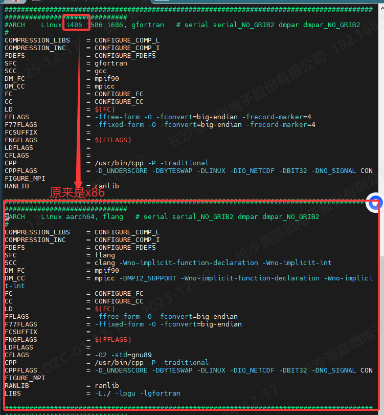

# 鲲鹏920B-WRF安装手册

[toc]

## 1 安装WRF-4.2

### 1.1 下载所有软件包

| 项目                  | 版本      | 下载地址                                                     |
| --------------------- | --------- | ------------------------------------------------------------ |
| ZLIB                  | 1.2.11    | https://zlib.net/fossils/zlib-1.2.11.tar.gz                  |
| HDF5                  | 1.10.1    | https://support.hdfgroup.org/ftp/HDF5/releases/hdf5-1.10/hdf5-1.10.1/src/hdf5-1.10.1.tar.gz |
| PNETCDF               | 1.9.0     | http://cucis.ece.northwestern.edu/projects/PnetCDF           |
| NETCDF-C              | 4.4.1.1   | https://github.com/Unidata/netcdf-c/releases/tag/v4.4.1.1    |
| NETCDF-Fortran        | 4.4.1     | https://github.com/Unidata/netcdf-fortran/releases/tag/v4.4.1 |
| WRF                   | 4.2       | https://github.com/wrf-model/WRF/archive/refs/tags/v4.2.tar.gz |
| 毕昇编译器和Hyper MPI | 24.0.RC1  | https://www.hikunpeng.com/developer/hpc/hpckit-download      |
| 测试用例              | conus12km | https://www2.mmm.ucar.edu/wrf/src/conus12km.tar.gz           |

选择的安装目录：/usr/local，文件目录都在/data/xxx

表1 移植规划数据

| 序号 | 软件安装规划路径     | 用途                           |
| ---- | -------------------- | ------------------------------ |
| 1    | /usr/local/hypermpi  | Hyper MPI的安装规划路径。      |
| 2    | /usr/local/PNETCDF   | PNETCDF的安装规划路径。        |
| 3    | /usr/local/HDF5      | HDF5的安装规划路径。           |
| 4    | /usr/local/NETCDF    | NETCDF的安装规划路径。         |
|      |                      | NETCDF-Fortran的安装规划路径。 |
| 5    | /usr/local/ZLIB      | ZLIB的安装规划路径。           |
| 6    | /data/xxx/WRF        | WRF的安装规划路径。            |
| 7    | /usr/local/conus12km | WRF的测试规划路径。            |

### 1.2 安装毕昇编译器

参考：https://www.hikunpeng.com/document/detail/zh/kunpenghpcs/hpckit/instg/KunpengHPCKit_install_009.html

```
cd HPCKit软件包所在目录
tar xvf HPCKit_25.1.0.SPC001_Linux-aarch64.tar.gz

cd /data/xxx/HPCKit_25.1.0.SPC001_Linux-aarch64/
sh install.sh
安装目录：/usr/local，然后一直回车即可
```

注意：首次安装还需安装HIO桥接目标库。请按步骤完成一次性安装；后续只需重新设置环境变量即可，无需再次安装。

```
Start Installing HIO
libhdf5.so >= 1.12.0 required, Please update the library to the required version.
Continue Installation? [y/n]
y
Confirm Installation.
libnetcdf.so >= 4.7.4 required, Please update the library to the required version.
Continue Installation? [y/n]
y
Confirm Installation.
libpnetcdf.so >= 1.12.1 required, Please update the library to the required version.
Continue Installation? [y/n]
y
Confirm Installation.
HIO Installation Finished
```

### 1.3 安装HIO桥接目标库
参考链接：https://www.hikunpeng.com/document/detail/zh/kunpenghpcs/hpckit/instg/KunpengHPCKit_install_018.html


| 项目                  | 版本      | 下载地址                                                     |
| --------------------- | --------- | ------------------------------------------------------------ |
| hdf5                 | 1.12.3    | https://hdf-wordpress-1.s3.amazonaws.com/wp-content/uploads/manual/HDF5/HDF5_1_12_3/src/hdf5-1.12.3.tar.gz |
| netcdf-c              | 4.9.2    | https://downloads.unidata.ucar.edu/netcdf-c/4.9.2/netcdf-c-4.9.2.tar.gz |
| pnetcdf               | 1.12.1     | https://parallel-netcdf.github.io/Release/pnetcdf-1.12.1.tar.gz |

#### 1.3.1 安装libhdf5.so


```
tar zxf hdf5-1.12.3.tar.gz
cd hdf5-1.12.3
mkdir build
cd build
../configure --prefix=/usr/local/hdf5-install
make -j
make install
```
ls /usr/local/hdf5-install/lib

回显如下说明安装目录下已经存在hdf5动态库，表示安装成功。
```
libhdf5.a  libhdf5_hl.a  libhdf5_hl.la  libhdf5_hl.so  libhdf5_hl.so.200  libhdf5_hl.so.200.1.1  libhdf5.la  libhdf5.settings  libhdf5.so  libhdf5.so.200  libhdf5.so.200.3.0
```
#### 1.3.2 安装libnetcdf.so
```
tar zxf netcdf-c-4.9.2.tar.gz
cd netcdf-c-4.9.2
mkdir build
cd build
../configure --prefix=/usr/local/netcdf-install
make -j
make install
```
ls /usr/local/netcdf-install/lib

回显如下说明安装目录下已经存在NetCDF相关动态库，表示安装成功。
```
libnetcdf.a  libnetcdf.la  libnetcdf.settings  libnetcdf.so  libnetcdf.so.19  libnetcdf.so.19.2.2  pkgconfig
```
#### 1.3.3 安装libpnetcdf.so
```
tar zxf pnetcdf-1.12.1.tar.gz
cd pnetcdf-1.12.1
mkdir build
cd build
export MPICC=/usr/local/HPCKit/25.1.0.SPC001/hmpi/gcc/release/hmpi/bin/mpicc
../configure --prefix=/usr/local/pnetcdf-install --enable-shared
make -j
make install
```
ls /path/to/pnetcdf-install/lib
回显如下说明安装目录下已经存在PnetCDF相关动态库，表示安装成功。
```
libpnetcdf.a  libpnetcdf.la  libpnetcdf.so  libpnetcdf.so.4  libpnetcdf.so.4.0.1  pkgconfig
```

配置HIO桥目标接库的环境变量，下面的选一个就行
- 仅对当前会话生效：
export LD_LIBRARY_PATH=/usr/local/hdf5-install/lib:$LD_LIBRARY_PATH
export LD_LIBRARY_PATH=/usr/local/netcdf-install/lib:$LD_LIBRARY_PATH
export LD_LIBRARY_PATH=/usr/local/pnetcdf-install/lib:$LD_LIBRARY_PATH
- 对当前用户生效：
vim ~/.bashrc
按“i”进入编辑模式，在文件~/.bashrc末尾增加如下命令行。
export LD_LIBRARY_PATH=/path/to/pnetcdf-install/lib:$LD_LIBRARY_PATH
按“ESC”退出编辑模式，然后输入":wq!"保存并退出。
执行以下命令，使配置立即生效。
source ~/.bashrc


安装完成后，需要设置环境变量，参考：https://www.hikunpeng.com/document/detail/zh/kunpenghpcs/hpckit/instg/KunpengHPCKit_install_012.html


#### 1.3.4  环境变量

参考：https://www.hikunpeng.com/document/detail/zh/kunpenghpcs/hpckit/instg/KunpengHPCKit_install_012.html，选其一就行

##### 1.3.4.1  modules方式


```
yum list | grep kernel # 配置yum源。
yum list installed | grep tcl.aarch64 # 检查是否已安装tcl工具，有回显即有
yum install -y tcl* #安装tcl工具
yum list installed | grep environment-modules.aarch64 # 检查是否已安装module工具
yum install -y environment-modules # 安装module工具
source /etc/profile.d/modules.sh # 加载环境变量

cd /usr/local/HPCKit/latest
module use modulefiles # 添加modulefiles
module avail  # 查询可用环境变量模块
```


> 回显如下类似信息：---------------------------------- /opt/HPCKit/25.1.0.SPC001/modulefiles -------------------------------------------
> bisheng/compiler4.2.0.2/bishengmodule            bisheng/kml25.1.0.SPC001/kvml/omp     gcc/kml25.1.0.SPC001/kblas/serial-locking    hio25.0.0/hio  
> bisheng/hmpi25.1.0.SPC001/debug                  bisheng/kml25.1.0.SPC001/kvml/serial  gcc/kml25.1.0.SPC001/kblas/serial-nolocking  
> bisheng/hmpi25.1.0.SPC001/release                bisheng/kupl25.1.0.SPC001/prof        gcc/kml25.1.0.SPC001/kml                     
> bisheng/kml25.1.0.SPC001/kblas/multi             bisheng/kupl25.1.0.SPC001/release     gcc/kml25.1.0.SPC001/kspblas/omp             
> bisheng/kml25.1.0.SPC001/kblas/serial-locking    bisheng/kutacc25.1.0.SPC001/kutacc    gcc/kml25.1.0.SPC001/kspblas/serial          
> bisheng/kml25.1.0.SPC001/kblas/serial-nolocking  gcc/compiler12.3.1/gccmodule          gcc/kml25.1.0.SPC001/kvml/omp                
> bisheng/kml25.1.0.SPC001/kml                     gcc/hmpi25.1.0.SPC001/debug           gcc/kml25.1.0.SPC001/kvml/serial             
> bisheng/kml25.1.0.SPC001/kspblas/omp             gcc/hmpi25.1.0.SPC001/release         gcc/kupl25.1.0.SPC001/prof                   
> bisheng/kml25.1.0.SPC001/kspblas/serial          gcc/kml25.1.0.SPC001/kblas/multi      gcc/kupl25.1.0.SPC001/release
> bisheng/kulitho25.1.0.SPC001/kulitho             gcc/kulitho25.1.0.SPC001/kulitho


```
module load bisheng/hmpi25.1.0.SPC001/release # module load modulefile 将组件的相关信息添加至环境变量中
module load bisheng/compiler4.2.0.2/bishengmodule
module load hio25.0.0/hio

module list # 查看已加载环境变量模块
```

##### 1.3.4.2 setvars.sh方式
```
cd /usr/local/HPCKit/latest
source setvars.sh --use-bisheng --force
```


### 1.2 编译环境
#### 1.2.1 安装ZLIB

参考：https://www.hikunpeng.com/document/detail/zh/kunpenghpcs/hpcindapp/prtg-osc/openmind_kunpengwrf_02_0006.html

```
export CC=clang
export CXX=clang++
export FC=flang
export MPICC=mpicc
export MPICXX=mpicxx
export MPIFC=mpifort
```

```
tar -vxf zlib-1.2.11.tar.gz
cd /data/xxx/zlib-1.2.11
./configure -prefix=/usr/local/ZLIB
make
make install
```

```
export LD_LIBRARY_PATH=/usr/local/ZLIB/lib:$LD_LIBRARY_PATH
export ZLIB=/usr/local/ZLIB
```

#### 1.2.2 安装PNETCDF

参考：https://www.hikunpeng.com/document/detail/zh/kunpenghpcs/hpcindapp/prtg-osc/openmind_kunpengwrf_02_0007.html

```
tar -xvf parallel-netcdf-1.9.0.tar.gz
cd /data/xxx/parallel-netcdf-1.9.0/
./configure --prefix=/usr/local/PNETCDF --build=aarch64-unknown-linux-gnu CFLAGS="-fPIC -DPIC" CXXFLAGS="-fPIC -DPIC" FCFLAGS="-fPIC" FFLAGS="-fPIC" CC=$MPICC CXX=$MPICXX FC=$MPIFC F77=$MPIFC
make
make install
```

```
export PATH=/usr/local/PNETCDF/bin:$PATH
export LD_LIBRARY_PATH=/usr/local/PNETCDF/lib:$LD_LIBRARY_PATH
export PNETCDF=/usr/local/PNETCDF
```

#### 1.2.3 安装HDF5

参考：https://www.hikunpeng.com/document/detail/zh/kunpenghpcs/hpcindapp/prtg-osc/openmind_kunpengwrf_02_0008.html

```
tar -xvf hdf5-1.10.1.tar.gz
cd /data/xxx/hdf5-1.10.1
./configure --prefix=/usr/local/HDF5 --build=aarch64-unknown-linux-gnu  --enable-fortran --enable-static=yes --enable-parallel --enable-shared CFLAGS="-O3 -fPIC -Wno-incompatible-pointer-types-discards-qualifiers -Wno-non-literal-null-conversion -fGNU-warning-compatibility -fGNU-error-compatibility" FCFLAGS="-O3 -fPIC" LDFLAGS="-Wl,--build-id" --enable-fortran --enable-parallel CC=mpicc FC=mpif90 CXX=mpicxx
```

```
vi libtool # 打开“libtool”文件
wl='-Wl,'  # 修改“libtool”文件中第11835行的内容，注意，打开一定是空的，否则肯定是配置有问题，需要重新./configure...
```

```
make
make install
```

```
export PATH=/usr/local/HDF5/bin:$PATH
export LD_LIBRARY_PATH=/usr/local/HDF5/lib:$LD_LIBRARY_PATH
export HDF5=/usr/local/HDF5
```

#### 1.2.4 安装NETCDF-C

参考1：https://www.hikunpeng.com/document/detail/zh/kunpenghpcs/hpcindapp/prtg-osc/openmind_kunpengwrf_02_0009.html

参考2：https://www.hikunpeng.com/document/detail/zh/kunpenghpcs/hpcindapp/prtg-osc/centos_kunpeng_wps_39_02_0008.html

```
tar -xvf netcdf-c-4.4.1.1.tar.gz
cd /data/xxx/netcdf-c-4.4.1.1/

./configure --prefix=/usr/local/NETCDF LDFLAGS="-L$HDF5/lib" CPPFLAGS="-I$HDF5/include" CC=mpicc --disable-dap FC=mpif90 CXX=mpicxx # 仅安装WRF

./configure --prefix=/usr/local/NETCDF --build=aarch64-unknown-linux-gnu --enable-shared --enable-netcdf-4 --enable-dap --with-pic --disable-doxygen --enable-static --enable-pnetcdf --enable-largefile CC=mpicc CXX=mpicxx FC=mpifort F77=mpifort CPPFLAGS="-I/usr/local/HDF5/include -I/usr/local/PNETCDF/include" LDFLAGS="-L/usr/local/HDF5/lib -L/usr/local/PNETCDF/lib -Wl,-rpath=/usr/local/HDF5/lib -Wl,-rpath=/usr/local/PNETCDF/lib" CFLAGS="-L/usr/local/HDF5/lib -L/usr/local/PNETCDF/lib -I/usr/local/HDF5/include -I/usr/local/PNETCDF/include" # 还想安装WPS

make clean
make install
```

```
export PATH=/usr/local/NETCDF/bin:$PATH
export LD_LIBRARY_PATH=/usr/local/NETCDF/lib:$LD_LIBRARY_PATH
export NETCDF=/usr/local/NETCDF
```

#### 1.2.5 安装NETCDF-Fortran

参考1：https://www.hikunpeng.com/document/detail/zh/kunpenghpcs/hpcindapp/prtg-osc/openmind_kunpengwrf_02_0009.html

参考2：https://www.hikunpeng.com/document/detail/zh/kunpenghpcs/hpcindapp/prtg-osc/centos_kunpeng_wps_39_02_0009.html

```
tar -xvf netcdf-fortran-4.4.1.tar.gz
cd /data/xxx/netcdf-fortran-4.4.1

./configure --prefix=/usr/local/NETCDF CPPFLAGS="-I$HDF5/include -I$NETCDF/include" LDFLAGS="-L$HDF5/lib -L$NETCDF/lib" --build=aarch64-unknown-linux-gnu --enable-static=yes --enable-shared CFLAGS="-O3 -fPIC -Wno-incompatible-pointer-types-discards-qualifiers -Wno-non-literal-conversion -Wno-implicit-function-declaration" FCFLAGS="-O3 -fPIC" LDFLAGS="-Wl,--build-id" CC=mpicc FC=mpif90 CXX=mpicxx # 仅安装WRF

./configure --prefix=/usr/local/install/NETCDF --build=aarch64-unknown-linux-gnu --enable-shared --with-pic --disable-doxygen --enable-largefile --enable-static CC=mpicc CXX=mpicxx FC=mpifort F77=mpifort CPPFLAGS=" -fPIC  -I/path/to/install/HDF5/include -I/path/to/install/NETCDF/include" LDFLAGS="-L/path/to/install/HDF5/lib -L/path/to/install/NETCDF/lib -Wl,-rpath=/path/to/install/HDF5/lib -Wl,-rpath=/path/to/install/NETCDF/lib" CFLAGS=" -fPIC -L/path/to/install/HDF5/lib -L/path/to/install/NETCDF/lib -I/path/to/install/HDF5/include -I/path/to/install/NETCDF/include" CXXFLAGS=" -fPIC -L/path/to/install/HDF5/lib -L/path/to/install/NETCDF/lib -I/path/to/install/HDF5/include -I/path/to/install/NETCDF/include" FCFLAGS=" -fPIC -L/path/to/install/HDF5/lib -L/path/to/install/NETCDF/lib -I/path/to/install/HDF5/include -I/path/to/install/NETCDF/include"  # 还想安装WPS
```

```
vi libtool # 打开“libtool”文件
wl='-Wl,'  # 修改“libtool”文件中第10118和10270行的内容，注意，打开一定是空的，否则肯定是配置有问题，需要重新./configure...
```

```
make
make install
```

```
export PATH=/usr/local/NETCDF/bin:$PATH
export LD_LIBRARY_PATH=/usr/local/NETCDF/lib:$LD_LIBRARY_PATH
```


### 1.3 WRF4.2 安装

参考：https://www.hikunpeng.com/document/detail/zh/kunpenghpcs/hpcindapp/prtg-osc/openmind_kunpengwrf_02_0012.html

```
tar -vxf WRF-4.2.tar.gz
cd /data/xxx/WRF-4.2
```

```
vi arch/configure.defaults
```

在文件中第1978行末尾插入如下全部内容

```
################################################## #########
#ARCH   Linux   aarch64,clang HYPERMPI#serial smpar dmpar dm+sm
DESCRIPTION     =       CLANG ($SFC/$SCC)
DMPARALLEL      =        1
OMPCPP          =        -D_OPENMP
OMP             =        -fopenmp
OMPCC           =        -fopenmp
SFC             =       flang
SCC             =       clang -Wno-implicit-function-declaration -Wno-implicit-int
CCOMP           =       clang
DM_FC           =       mpif90 -f90=$(SFC)
DM_CC           =       mpicc -cc=$(SCC) -DMPI2_SUPPORT -Wno-implicit-function-declaration -Wno-implicit-int
FC              =       CONFIGURE_FC
CC              =       CONFIGURE_CC
LD              =       $(FC)
RWORDSIZE       =       CONFIGURE_RWORDSIZE
PROMOTION       =       #-fdefault-real-8
ARCH_LOCAL      =       -DNONSTANDARD_SYSTEM_SUBR  -DWRF_USE_CLM
CFLAGS_LOCAL    =      -mcpu=native -w -O3 -c -march=armv8.2-a
LDFLAGS_LOCAL   =
CPLUSPLUSLIB    =
ESMF_LDFLAG     =      $(CPLUSPLUSLIB)
FCOPTIM         =       -O3 -funroll-loops -march=armv8.2-a
FCREDUCEDOPT    =       $(FCOPTIM)
FCNOOPT         =       -O0
FCDEBUG         =      -g # -fbacktrace -ggdb-fcheck=bounds,do,mem,pointer -ffpe-trap=invalid,zero,overflow
FORMAT_FIXED    =       -ffixed-form
FORMAT_FREE     =       -ffree-form -ffree-line-length-0
FCSUFFIX        =
BYTESWAPIO      =       -fconvert=big-endian
FCBASEOPTS_NO_G =       -w $(FORMAT_FREE) $(BYTESWAPIO)
FCBASEOPTS      =       -mcpu=native $(OMP) $(FCBASEOPTS_NO_G)
MODULE_SRCH_FLAG =
TRADFLAG        =      -traditional
CPP             =      /lib/cpp -P
AR              =      ar
ARFLAGS         =      ru
M4              =      m4 -G
RANLIB          =      ranlib
RLFLAGS         =
CC_TOOLS        =      $(SCC)
```

```
vi phys/module_mp_SBM_polar_radar.F
```

在文件中第452行添加如下内容

```
external :: derf
```

```
export WRFIO_NCD_LARGE_FILE_SUPPORT=1
export CPPFLAGS="-I$HDF5/include -I$PNETCDF/include -I$NETCDF/include"
export LDFLAGS="-L$HDF5/lib -L$PNETCDF/lib -L$NETCDF/lib -L$ZLIB/lib -lnetcdf -lnetcdff -lpnetcdf -lhdf5_hl -lhdf5 -lz"
```

```
yum install time # 安装time，可用于计算跑了多长时间
```

```
echo 4 | ./configure
sed -i "s%-lz% -L/usr/local/ZLIB/lib -lz%g" configure.wrf
./compile -j 16 em_real 2>&1 | tee -a compile.log
```

### 1.4 WRF4.2 运行和测试

参考：https://www.hikunpeng.com/document/detail/zh/kunpenghpcs/hpcindapp/prtg-osc/openmind_kunpengwrf_02_0013.html

必须安装和WRF相同的版本，否则会报错

```
tar -vxf conus12km.tar.gz
cp -r /data/xxx/WRF/WRF-4.2/run/* /data/xxx/conus12km
cd /data/xxx/conus12km
ln -sf /data/xxx/WRF/WRF-4.2/main/*.exe ./
```

```
time mpirun --allow-run-as-root -np 8 ./wrf.exe  # 运行WRF程序。
less rsl.out.0000 # 验证程序是否正常结束
```

## 2 安装WPS4.2

参考：https://www.hikunpeng.com/document/detail/zh/kunpenghpcs/hpcindapp/prtg-osc/centos_kunpeng_wps_39_02_0013.html

下载：https://github.com/wrf-model/WPS/archive/refs/tags/v4.2.tar.gz

```
export WRFIO_NCD_LARGE_FILE_SUPPORT=1
export NETCDF=/usr/local/NETCDF
export HDF5=/usr/local/HDF5
export PNETCDF=/usr/local/PNETCDF
export CPPFLAGS="-I$HDF5/include -I$PNETCDF/include -I$NETCDF/include"
export LDFLAGS="-L$HDF5/lib -L$PNETCDF/lib -L$NETCDF/lib -lnetcdf -lnetcdff -lpnetcdf -lhdf5_hl -lhdf5 -lz"
unset MPI MPI_DIR MPI_INC
export WRF_DIR=/data/xxx/WRF-4.2
```

```
tar -zxvf WPS-4.2.tar.gz
cd /data/xxx/WPS-4.2
```

```
vi arch/configure.defaults   # 修改171开始的那一段

########################################################################################################################
#ARCH    Linux aarch64, flang   # serial serial_NO_GRIB2 dmpar dmpar_NO_GRIB2
#
COMPRESSION_LIBS    = CONFIGURE_COMP_L
COMPRESSION_INC     = CONFIGURE_COMP_I
FDEFS               = CONFIGURE_FDEFS
SFC                 = flang
SCC                 = clang -Wno-implicit-function-declaration -Wno-implicit-int
DM_FC               = mpif90
DM_CC               = mpicc -DMPI2_SUPPORT -Wno-implicit-function-declaration -Wno-implicit-int
FC                  = CONFIGURE_FC
CC                  = CONFIGURE_CC
LD                  = $(FC)
FFLAGS              = -ffree-form -O -fconvert=big-endian
F77FLAGS            = -ffixed-form -O -fconvert=big-endian
FCSUFFIX            =
FNGFLAGS            = $(FFLAGS)
LDFLAGS             =
CFLAGS              = -O2 -std=gnu89
CPP                 = /usr/bin/cpp -P -traditional
CPPFLAGS            = -D_UNDERSCORE -DBYTESWAP -DLINUX -DIO_NETCDF -DBIT32 -DNO_SIGNAL CONFIGURE_MPI
RANLIB              = ranlib
LIBS                = -L./ -lpgu -lgfortran

```



```
echo 3 | ./configure
vi configure.wps
48行最后面加 -lomp（必须，否则会少一个exe）
./compile
```


## 3 其他  

### 3.1 安装JASPER

参考：https://www.hikunpeng.com/document/detail/zh/kunpenghpcs/hpcindapp/prtg-osc/openeuler_kunpeng_WRFDA_391_02_0006.html

clang失败，cpp编译成功。。。

```
export BISHENG=/usr/local/HPCKit/25.1.0.SPC001/compiler/bisheng
export BISHENG_DIR=$BISHENG
export BISHENG_PATH=$BISHENG/bin
export BISHENG_LIB=$BISHENG/lib
export BISHENG_INC=$BISHENG/include

export LD_LIBRARY_PATH=$BISHENG_LIB:$LD_LIBRARY_PATH
export INCLUDE=$BISHENG_INC:$INCLUDE

export CC=clang
export CXX=clang++
export FC=flang
export F77=flang
export F90=flang


export CPPFLAGS="-I/usr/local/HPCKit/25.1.0.SPC001/compiler/bisheng/include"
export LDFLAGS="-L/usr/local/HPCKit/25.1.0.SPC001/compiler/bisheng/lib"
export CFLAGS="-O2 -std=gnu89 -Wno-implicit-function-declaration"


cd /data/xxx/jasper-1.900.2/
make clean
./configure --prefix=/usr/local/JASPER
make -j8
```

### 3.2 安装RTTOV
参考：https://www.hikunpeng.com/document/detail/zh/kunpenghpcs/hpcindapp/prtg-osc/openeuler_kunpeng_WRFDA_391_02_0007.html
```
export BISHENG=/usr/local/HPCKit/25.1.0.SPC001/compiler/bisheng
export PATH=$BISHENG/bin:/usr/local/HPCKit/25.1.0.SPC001/hmpi/bisheng/release/hmpi/bin:/usr/local/HDF5/bin:/usr/local/PNETCDF/bin:/usr/local/NETCDF/bin:$PATH
export LD_LIBRARY_PATH=$BISHENG/lib:/usr/local/HPCKit/25.1.0.SPC001/hmpi/bisheng/release/hmpi/lib:/usr/local/HDF5/lib:/usr/local/PNETCDF/lib:/usr/local/NETCDF/lib:$LD_LIBRARY_PATH
export CC=clang CXX=clang++ FC=flang F77=flang F90=flang
```

```
cd /data/xxx/RTTOV
mkdir RTTOV-11.3
tar –zxvf RTTOV-11.3.tar.gz –C RTTOV-11.3
pip3 install numpy -i http://pypi.tuna.tsinghua.edu.cn/simple/ --trusted-host pypi.tuna.tsinghua.edu.cn
cd RTTOV-11.3
```

```
vim build/Makefile.local # 29、57行修改
HDF5_PREFIX=/usr/local/HDF5
NETCDF_PREFIX=/usr/local/NETCDF
```

自定义 arch 文件

```
cd build/arch
cp gfortran myflang
```
然后编辑 myflang 文件，把里面的编译器变量改成 flang：
```
vi myflang
FC = flang
FCFLAGS = -O2 -fPIC
LINK = flang
LDFLAGS = 
```
```
cd src
../build/rttov_compile.sh
```

根据安装交互依次选择：myflang，一直回车

### 3.3 安装WRFDA

```
export WRFIO_NCD_LARGE_FILE_SUPPORT=1
export NETCDF=/usr/local/NETCDF
export HDF5=/usr/local/HDF5
export PNETCDF=/usr/local/PNETCDF
export CPPFLAGS="-I$HDF5/include -I$PNETCDF/include -I$NETCDF/include"
export LDFLAGS="-L$HDF5/lib -L$PNETCDF/lib -L$NETCDF/lib -lnetcdf -lnetcdff -lpnetcdf -lhdf5_hl -lhdf5 -lz"
export JASPERLIB=/usr/local/JASPER/lib
export JASPREINC=/usr/local/JASPER/inlucde
export WRF_DIR=/data/xxx/WRF-4.2-bak
export RTTOV=/data/xxx/RTTOV-11.3
export MPI_LIB="-L$MPI_LIB -lmpi -lomp"
export CC=mpicc CXX=mpicxx FC=mpif90 F77=mpif90 F90=mpif90
```

还没成功。。。

