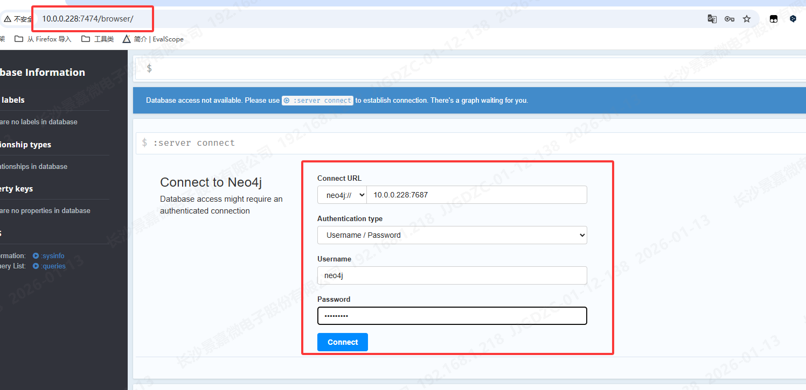
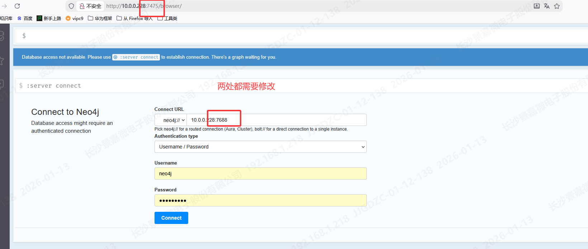
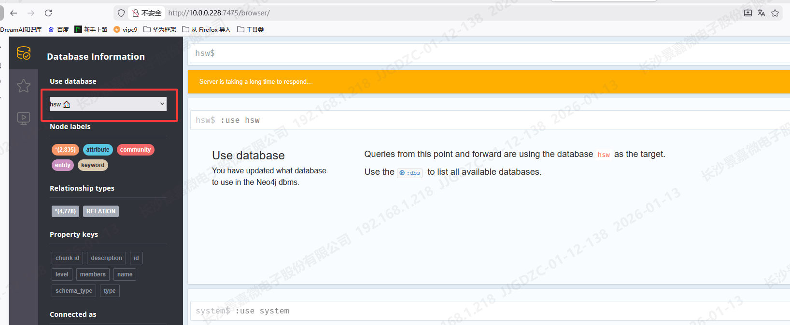
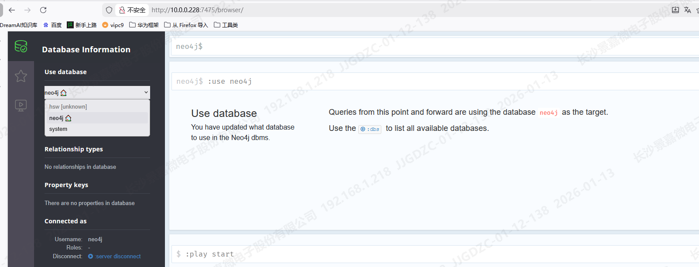
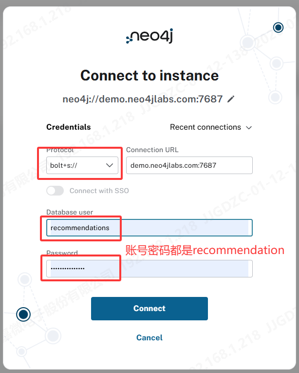
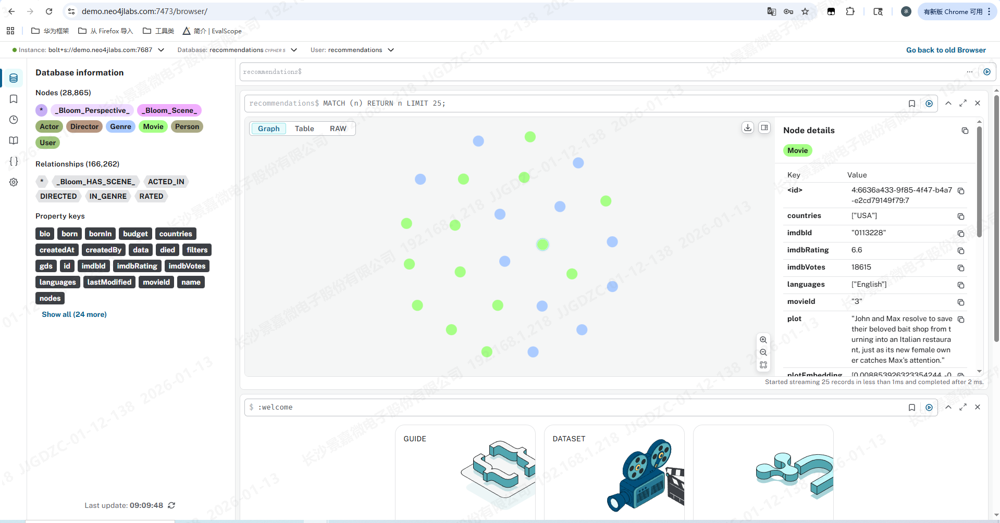
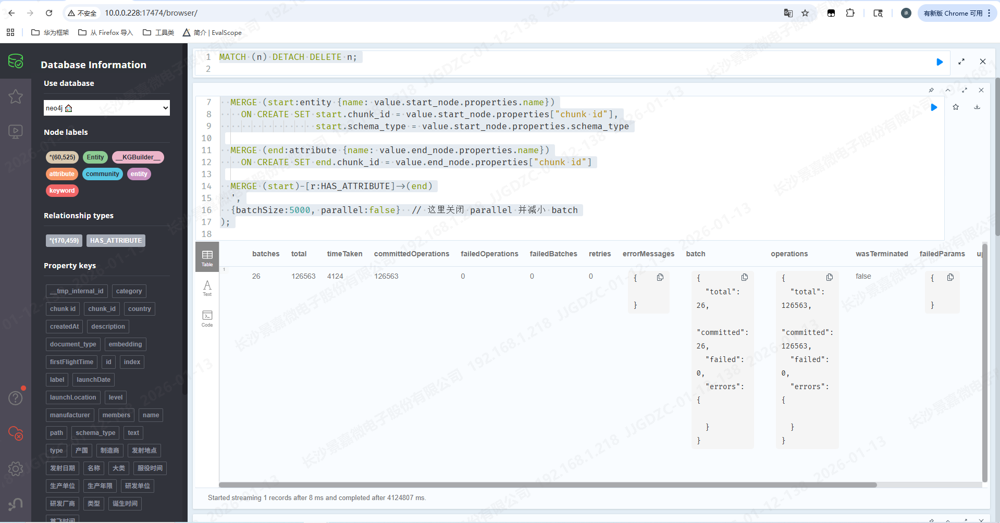

# Neo4j + GraphRAG 实践笔记

> 本文记录了 Neo4j 在 Docker 环境下的部署方案、图数据构建方法，以及 neo4j-graphrag 的基础使用经验，重点包括向量检索 GraphRAG 与 Text2CypherRetriever（自然语言 → Cypher） 的实践总结。

[toc]

## 1. Neo4j 服务启动（Docker 本地部署）

本文采用 **Docker 本地部署 Neo4j**，并启用 **APOC 插件**，以支持批量导入、并行处理等工程化能力。

### 1.1 APOC 是什么？

APOC（Awesome Procedures On Cypher）是 Neo4j 官方提供的扩展过程与函数库，用于弥补原生 Cypher 在复杂数据处理和工程实践中的不足。

官方文档： https://neo4j.com/docs/apoc/current/installation/

常用能力包括：

- 数据导入 / 导出（JSON、CSV 等）
- 批处理与并行执行（`apoc.periodic.iterate`）
- 图算法、字符串处理、时间处理等

### 1.2 Docker 启动 Neo4j（启用 APOC）

```shell
docker run \
   -p 7474:7474 -p 7687:7687 \
   --name neo4j-apoc \
   -e NEO4J_apoc_export_file_enabled=true \
   -e NEO4J_apoc_import_file_enabled=true \
   -e NEO4J_apoc_import_file_use__neo4j__config=true \
   -e NEO4J_PLUGINS=\[\"apoc\"\] \
   -e NEO4J_AUTH=neo4j/winter123 \
   neo4j:2025.10
```

说明：

- `7474`：Neo4j Browser / HTTP
- `7687`：Bolt 协议（客户端连接）
- `NEO4J_PLUGINS=["apoc"]`：启用 APOC
- `NEO4J_AUTH`：初始用户名密码（`neo4j / winter123`）

启动完成后，在浏览器访问：

```
http://10.0.0.228:7474/browser/
```

即可进入 Neo4j 控制台。



### 1.3 Neo4j 的多数据库方案

参考文档：https://qinyuenlp.com/article/1376bee9b28b/（在服务器中启动多个Neo4j数据库）

Neo4j 社区版不支持多数据库（只能使用默认数据库 `neo4j`）。但实际中，可以通过 **启动多个 Docker 容器**和**修改配置**的方式实现“多数据库隔离”的效果。

#### 1.3.1 方案一：通过 Docker 启动多个 Neo4j 实例

通过 **多个容器 + 不同端口 + 不同数据目录**，实现完全隔离的“多数据库”效果。

```shell
docker run -d \
  -p 7476:7474 \
  -p 7689:7687 \
  --name neo4j-apoc-v3 \
  -v /data/hsw/neo4j-data-warehouse/military_full/data:/var/lib/neo4j/data \
  -v /data/hsw/neo4j-data-warehouse/military_full/logs:/var/lib/neo4j/logs \
  -v /data/hsw/neo4j-data-warehouse/military_full/conf:/var/lib/neo4j/conf \
  -v /data/hsw/neo4j-data-warehouse/military_full/import:/var/lib/neo4j/import \
  -e NEO4J_apoc_export_file_enabled=true \
  -e NEO4J_apoc_import_file_enabled=true \
  -e NEO4J_apoc_import_file_use__neo4j__config=true \
  -e NEO4J_PLUGINS='["apoc"]' \
  -e NEO4J_AUTH=neo4j/winter123 \
  neo4j:2025.10
```

- 不同实例需使用 **不同端口**（避免冲突）
- 每个实例绑定独立目录：如`/data/hsw/neo4j-data-warehouse/military_demo/`：
  - `data`：数据库数据
  - `logs`：日志
  - `conf`：配置
  - `import`：导入文件目录

浏览器访问时需对应修改端口：



这种方式**最接近实际使用习惯**。

```shell
# 使用到的命令
docker stop neo4j-apoc-v2
docker rm neo4j-apoc-v2
docker restart neo4j-apoc-v2

cd /data/hsw/neo4j-data-warehouse/military_demo/
rm -rf conf/* data/* import/* logs/*
```

#### 1.3.2 方案二：修改 Neo4j 配置创建/切换数据集

通过修改 `neo4j.conf`，可以模拟“创建/切换数据集”的效果（本质仍是单数据库，一次只能使用一个数据库，修改需要重启服务）：

步骤：

1. 在`data`目录下创建数据库（如hsw）

2. 修改conf/neo4j.conf，添加：

```
dbms.default_database=hsw
```

3. **重启 Neo4j**，打开浏览器即可看到数据库名称变成了hsw



切换数据库就是修改`dbms.default_database`的值，如修改回neo4j，那么hsw数据库变成`hsw[unknow]`，不可以使用，但是还在。

⚠️ 注意：

- 同一时间只能使用一个数据库
- 切换数据库必须重启
- 未启用的数据库仍保留在 `data/` 目录中，但状态为 `unknown`



该方案更适合临时实验，不适合生产或多项目并行场景。

## 2. 数据集构建与导入

## 2.1 Neo4j 官方示例数据集

Neo4j 官方提供了多个可直接访问的 Demo 数据集：https://demo.neo4jlabs.com:7473/browser/。

通过浏览器访问，填写协议以及数据库账号密码即可进入：





```python
# Python 连接方式
URI = "neo4j+s://demo.neo4jlabs.com"
AUTH = ("recommendations", "recommendations")
```
这些数据集适用于快速验证。

## 2.2 自定义数据集构建

### 2.2.1 使用 Python 批量导入

```python
import ijson
import re
import time
from neo4j import GraphDatabase
import logging

logging.basicConfig(level=logging.INFO)
logger = logging.getLogger(__name__)

# ======================
# 配置
# ======================
NEO4J_URI = "bolt://localhost:7688"
NEO4J_USER = "neo4j"
NEO4J_PASSWORD = "winter123"
INPUT_PATH = "/data/hsw/neo4j-graphrag/military_v3_clean_new.json"

LEVEL_MAP = {
    "attribute": 1,
    "entity": 2,
    "keyword": 3,
    "community": 4
}

BATCH_SIZE = 10000  # 初始批量，可调整

# ======================
# 工具函数
# ======================
def normalize_name(name):
    if isinstance(name, list):
        return ", ".join(str(x) for x in name)
    return "" if name is None else str(name)

def normalize_rel_type(rel: str) -> str:
    if not rel:
        return "related_to"
    rel = re.sub(r"[^\w]", "_", rel)
    if rel[0].isdigit():
        rel = "_" + rel
    return rel

# ======================
# 主流程
# ======================
def stream_graph_to_neo4j():
    driver = GraphDatabase.driver(NEO4J_URI, auth=(NEO4J_USER, NEO4J_PASSWORD))

    # ⚡ 创建节点唯一约束（兼容 4.x/5.x）
    with driver.session() as session:
        try:
            session.run(
                "CREATE CONSTRAINT node_id_unique IF NOT EXISTS FOR (n) ON (n.id) REQUIRE n.id IS UNIQUE;"
            )
        except Exception:
            try:
                session.run("CREATE CONSTRAINT ON (n) ASSERT n.id IS UNIQUE;")
            except Exception:
                logger.info("约束可能已存在，跳过")

    node_mapping = {}
    node_counter = 0
    edge_counter = 0

    node_batch = []
    edge_batch = []

    start_time = time.time()
    batch_start_time = start_time

    with driver.session() as session, open(INPUT_PATH, "r", encoding="utf-8") as f:
        objects = ijson.items(f, "item")

        for rel in objects:
            # ---------- start node ----------
            sn = rel["start_node"]
            sl, sn_name = sn["label"], normalize_name(sn["properties"].get("name"))
            sk = (sl, sn_name)

            if sk not in node_mapping:
                sid = f"{sl}_{node_counter}"
                node_mapping[sk] = sid
                node_counter += 1

                props = dict(sn["properties"])
                props["name"] = sn_name
                props["level"] = LEVEL_MAP.get(sl, 2)

                node_batch.append({
                    "id": sid,
                    "label": sl,
                    "props": props
                })
            else:
                sid = node_mapping[sk]

            # ---------- end node ----------
            en = rel["end_node"]
            el, en_name = en["label"], normalize_name(en["properties"].get("name"))
            ek = (el, en_name)

            if ek not in node_mapping:
                eid = f"{el}_{node_counter}"
                node_mapping[ek] = eid
                node_counter += 1

                props = dict(en["properties"])
                props["name"] = en_name
                props["level"] = LEVEL_MAP.get(el, 2)

                node_batch.append({
                    "id": eid,
                    "label": el,
                    "props": props
                })
            else:
                eid = node_mapping[ek]

            # ---------- edge ----------
            edge_batch.append({
                "u": sid,
                "v": eid,
                "type": normalize_rel_type(rel.get("relation"))
            })

            edge_counter += 1

            # ---------- 批量提交 ----------
            if edge_counter % BATCH_SIZE == 0:
                now = time.time()
                with session.begin_transaction() as tx:
                    # 写节点
                    if node_batch:
                        label_groups = {}
                        for n in node_batch:
                            label_groups.setdefault(n["label"], []).append(n)
                        for label, nodes in label_groups.items():
                            tx.run(
                                f"""
                                UNWIND $nodes AS n
                                MERGE (x:`{label}` {{id: n.id}})
                                SET x += n.props
                                """,
                                nodes=nodes
                            )

                    # 写边（统一关系 RELATION，type 属性保存原类型）
                    if edge_batch:
                        tx.run(
                            """
                            UNWIND $edges AS e
                            MATCH (a {id: e.u})
                            MATCH (b {id: e.v})
                            MERGE (a)-[r:RELATION]->(b)
                            SET r.type = e.type
                            """,
                            edges=edge_batch
                        )
                    tx.commit()

                batch_cost = now - batch_start_time
                speed = BATCH_SIZE / batch_cost if batch_cost > 0 else 0

                logger.info(
                    f"[batch] edges={edge_counter}, nodes={node_counter}, "
                    f"batch_time={batch_cost:.2f}s, speed={speed:.0f} edges/s, "
                    f"total_time={(now-start_time)/60:.2f} min"
                )

                node_batch.clear()
                edge_batch.clear()
                batch_start_time = now

    # ---------- 写入剩余未满批次 ----------
    if node_batch or edge_batch:
        with driver.session() as session:
            with session.begin_transaction() as tx:
                if node_batch:
                    label_groups = {}
                    for n in node_batch:
                        label_groups.setdefault(n["label"], []).append(n)
                    for label, nodes in label_groups.items():
                        tx.run(
                            f"""
                            UNWIND $nodes AS n
                            MERGE (x:`{label}` {{id: n.id}})
                            SET x += n.props
                            """,
                            nodes=nodes
                        )
                if edge_batch:
                    tx.run(
                        """
                        UNWIND $edges AS e
                        MATCH (a {id: e.u})
                        MATCH (b {id: e.v})
                        MERGE (a)-[r:RELATION]->(b)
                        SET r.type = e.type
                        """,
                        edges=edge_batch
                    )
                tx.commit()

    driver.close()
    total_time = time.time() - start_time
    logger.info(
        f"FINISHED ✅ nodes={node_counter}, edges={edge_counter}, total_time={total_time/60:.2f} min"
    )

# ======================
# 入口
# ======================
if __name__ == "__main__":
    stream_graph_to_neo4j()

```

### 2.2.2 使用 APOC 导入 JSON

官方文档：https://neo4j.ac.cn/docs/apoc/2025.05/import/load-json/

基本流程：

1. 将 JSON 文件放入 Neo4j 的 `import/` 目录
2. 使用 `apoc.load.json` + `apoc.periodic.iterate` 批量导入

```
CALL apoc.periodic.iterate(
  '
  CALL apoc.load.json("file:///军事装备（全）_new.json") YIELD value
  RETURN value
  ',
  '
  MERGE (start:entity {name: value.start_node.properties.name})
    ON CREATE SET start.chunk_id = value.start_node.properties["chunk id"],
                  start.schema_type = value.start_node.properties.schema_type

  MERGE (end:attribute {name: value.end_node.properties.name})
    ON CREATE SET end.chunk_id = value.end_node.properties["chunk id"]

  MERGE (start)-[r:HAS_ATTRIBUTE]->(end)
  ',
  {batchSize:10000, parallel:false}  // 这里关闭 parallel 并减小 batch
);
```

- 在**超大数据量**下，APOC也需要一定时间
- `parallel=true` 容易引发锁竞争与 OOM，建议关闭



```
CALL apoc.periodic.iterate(
  "MATCH (n) RETURN n",
  "DETACH DELETE n",
  {batchSize:5000, parallel:true}
)
```

```
CALL apoc.periodic.iterate(
  '
  CALL apoc.load.json("file:///军事装备（全）_new.json") YIELD value
  RETURN value
  ',
  '
  WITH value
  WHERE value.end_node.properties.value IS NOT NULL
    AND trim(value.end_node.properties.value) <> ""

  MERGE (start:entity {name: value.start_node.properties.name})
  ON CREATE SET
    start.chunk_id    = value.start_node.properties["chunk id"],
    start.schema_type = value.start_node.properties.schema_type

  MERGE (end:attribute {
    name:  value.end_node.properties.name,
    value: value.end_node.properties.value
  })
  ON CREATE SET
    end.chunk_id = value.end_node.properties["chunk id"]

  MERGE (start)-[:HAS_ATTRIBUTE]->(end)
  ',
  {batchSize: 10000, parallel: false}
);

```


## 2. neo4j-graphrag使用实践

官方文档：https://neo4j.com/docs/neo4j-graphrag-python/current/user_guide_rag.html#

Github链接：https://github.com/neo4j/neo4j-graphrag-python/tree/main?tab=readme-ov-file

### 2.1 基于向量索引的 GraphRAG

该模式本质是：

> **Neo4j 作为向量数据库 + 图上下文存储**

整体流程：

1. 将节点文本嵌入为向量并写入 Neo4j 向量索引
2. 基于向量相似度召回相关节点
3. LLM 结合图上下文生成答案

```python
from neo4j import GraphDatabase


# 演示数据库凭证
URI = "neo4j+s://demo.neo4jlabs.com"
AUTH = ("recommendations", "recommendations")
# 连接到 Neo4j 数据库
driver = GraphDatabase.driver(URI, auth=AUTH)


import os
os.environ["OPENAI_API_BASE"] = "https://api.chatanywhere.tech/v1"
os.environ["OPENAI_API_KEY"] = "sk-zQuZ0LlQnQvbxC3pVpRqywC9fMVE3iq8kQFZrULNkVk2nWWE"


from neo4j_graphrag.retrievers import VectorRetriever
from neo4j_graphrag.embeddings.openai import OpenAIEmbeddings
embedder = OpenAIEmbeddings(
    model="text-embedding-ada-002",
    api_key="sk-zQuZ0LlQnQvbxC3pVpRqywC9fMVE3iq8kQFZrULNkVk2nWWE",
    base_url="https://api.chatanywhere.tech/v1"                        
)

retriever = VectorRetriever(
    driver,
    index_name="moviePlotsEmbedding",
    embedder=embedder,
    return_properties=["title", "plot"],
)
query_text = "A movie about the famous sinking of the Titanic"
retriever_result = retriever.search(query_text=query_text, top_k=3)
print(retriever_result)
import re

for k, item in enumerate(retriever_result.items):
    plot = re.search(r"'plot':\s*'([^']*)'", item.content).group(1)
    title = re.search(r"'title':\s*'([^']*)'", item.content).group(1)
    score = item.metadata["score"]
    print(f"Result {k}: {title} - {score} - {plot}")
    
    
from neo4j_graphrag.llm import OpenAILLM
from neo4j_graphrag.generation import GraphRAG

# LLM
llm =OpenAILLM(
    model_name="gpt-4", 
    model_params={"temperature":0},
    api_key="sk-zQuZ0LlQnQvbxC3pVpRqywC9fMVE3iq8kQFZrULNkVk2nWWE",
    base_url="https://api.chatanywhere.tech/v1"    
)

# 初始化 RAG 流程
rag =GraphRAG(retriever=retriever, llm=llm)

# 查询图谱
query_text ="What movies are sad romances?"
response = rag.search(query_text=query_text, retriever_config={"top_k":5})
print(response.answer)

```

### 2.2 Text2CypherRetriever （自然语言 → 图查询）

`Text2CypherRetriever` 的作用是：

> 将自然语言问题，自动转换为 Cypher 查询，并直接在图数据库中执行。

注意：

- **强依赖 Example Prompt**（少量示例引导的提示工程，few-shot prompt engineering）
- 用户问题的句式需尽量贴近示例

参考文档：

- API 文档（函数介绍）：https://neo4j.com/docs/neo4j-graphrag-python/current/api.html#text2cypherretriever

- 源码：https://neo4j.com/docs/neo4j-graphrag-python/current/_modules/neo4j_graphrag/retrievers/text2cypher.html

- 官方使用指南（博客）：https://neo4j.com/blog/developer/effortless-rag-text2cypherretriever/

- 微调数据集：https://www.reddit.com/r/Neo4j/comments/19f73nc/crowdsourcing_a_text2cypher_dataset/?tl=zh-hans

- 使用 GraphRAG Python 包通过图遍历（给定cypher查询语句）增强向量搜索：https://neo4j.com/blog/developer/graph-traversal-graphrag-python-package/


```python
import os
os.environ["OPENAI_API_BASE"] = "https://api.chatanywhere.tech/v1"
os.environ["OPENAI_API_KEY"] = "sk-zQuZ0LlQnQvbxC3pVpRqywC9fMVE3iq8kQFZrULNkVk2nWWE"

# Demo database credentials
# URI = "neo4j+s://demo.neo4jlabs.com"
# AUTH = ("recommendations", "recommendations")
URI = "neo4j://10.0.0.228:7687"
AUTH = ("neo4j", "winter123")

from neo4j import GraphDatabase
driver = GraphDatabase.driver(URI, auth=AUTH)


from neo4j_graphrag.retrievers import Text2CypherRetriever
from neo4j_graphrag.llm import OpenAILLM

t2c_llm = OpenAILLM(
    model_name="gpt-3.5-turbo",        
    api_key="sk-zQuZ0LlQnQvbxC3pVpRqywC9fMVE3iq8kQFZrULNkVk2nWWE",
    base_url="https://api.chatanywhere.tech/v1"   
)


examples = [
  """
    USER INPUT: '美国的战斗机有哪些？'
    QUERY: 
        MATCH (e)-[]-(i)
        MATCH (e)-[]-(j)
        WHERE i.name = "战斗机"
            AND    j.name = "美国"
                AND e.schema_type = "装备"
        return e.name AS name
        LIMIT 25
    
"""
]

# Initialize the retriever
retriever = Text2CypherRetriever(
  driver=driver,
  llm=t2c_llm,
#   neo4j_schema=neo4j_schema,
  examples=examples,
)

query_text = "捷克生产了多少种炸弹？" # 不可以
query_text = "法国的高射炮有哪些？" # 要和example的形式一样，才会照着example的样式修改

print(retriever.search(query_text=query_text))


from neo4j_graphrag.llm import OpenAILLM
from neo4j_graphrag.generation import GraphRAG
rag = GraphRAG(retriever=retriever, llm=t2c_llm)
response = rag.search(query_text=query_text)
print(response.answer)
```


