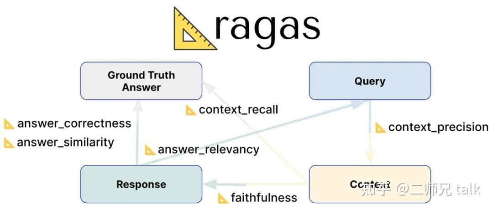
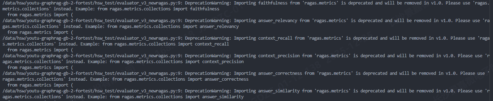
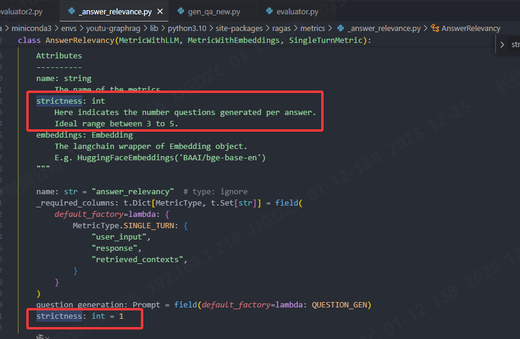
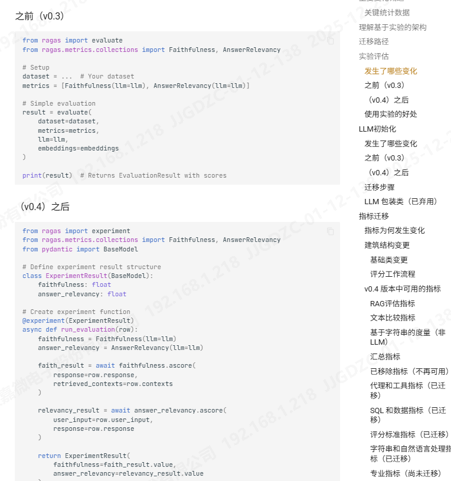

# 基于 RAGAS 的 RAG 系统性能评估

## 0 前沿

为了不断优化RAG系统，需要对其生成答案的准确性进行评估。常用的方法有两种：人工评估和大模型（LLM）评估。

人工评估的问题在于，人类标记者之间的一致性通常不超过 80%，这意味着评估结果可能带有主观偏差。相比之下，LLM 在约 80% 的情况下能与人类评估保持一致。因此，虽然让一名 LLM 评估另一名 LLM 听起来有些不寻常，但这实际上是一种可行且高效的方法。使用 LLM 自动化评估不仅能够加快评估速度，还能提高可扩展性，同时节省大量人工标注的成本和时间。

在众多方法中，RAGAs 是目前较为常用的 RAG 系统评估方法。其核心理念是：LLM 可以通过固定的评分规则或模板来评估自然语言输出。这些规则帮助模型避免“自由评分”——即随意判断对错或好坏，容易出现不稳定或不一致的结果。通过固定规则，RAGAs 不仅减少了评估偏差，还能提供可解释且直观的连续分数，方便量化和比较不同答案的质量。

## 1 RAGAs 核心思想

拉加斯是最早提出 RAGAs 方法的人或团队。他们在研究中提出，使用统计稳定性和少量人工标注就能评估 RAG 系统的表现。其核心思想是：事实答案在语义上应该比幻觉答案更一致。也就是说，真实答案的样本在统计抽样中表现出更高的稳定性。

基于这一原理，RAGAs 可以使用 LLM、嵌入向量和少量手工策划的问答对（约 10 个）来自动化评估过程，而不需要数百个手工 QA 对。

## 2 评估所需数据

根据 RAGAs 文档，RAG 系统的评估需要以下四类关键数据：

1. **问题（Question）**：RAG 系统需要回答的查询或输入问题。
2. **上下文（Context）**：RAG 系统实际检索到的文本块，用作生成答案的依据
3. **答案（Answer）**：RAG 系统针对问题生成的回答。
4. **真实答案（Ground Truth）**：问题的标准答案或期望答案。



## 3 核心评估指标

RAGAs 提供了一系列可量化指标，包括：

1. **上下文精度（Context Precision）**
   - 检索到的上下文中，有多少比例是真正对回答问题有用的信息
     - 高精度：噪声少，大部分内容有用；
     - 低精度：干扰信息多，噪声占比高。
2. **上下文召回（Context Recall）**
   - 检索到的上下文覆盖了答案所需信息的比例
     - **高召回**：关键信息基本都被检索到；
     - **低召回**：有重要信息未被检索到。
3. **忠实度（Faithfulness）**
   - 衡量答案中的陈述是否可以从检索到的上下文中推断出来。
     - **高忠实度**：答案内容可靠，没有编造；
     - **低忠实度**：答案包含上下文中没有的信息。
4. **答案相关性（Answer Relevance）**
   - 评估生成答案是否回答了问题，不考虑事实正确性，但会惩罚不完整或冗余答案。
     - **高相关性**：答案紧扣问题，完整清晰；
     - **低相关性**：答案偏题、不完整或包含冗余信息。
5. **答案正确性（Answer Accuracy）**
   - 通过与真实答案对比，计算 TP/FP/FN 并用 F1 衡量答案事实的正确性。（关注**事实对错**，衡量答案信息是否真实。）
     - **高正确性**：答案事实准确，无缺失；
     - **低正确性**：答案有错误或缺失事实信息。
6. **答案相似度（Answer Similarity）**
   - 使用嵌入向量计算生成答案与真实答案的语义相似度。（关注**语义接近度**，衡量答案意思是否与真实答案一致，即使表述方式不同也可能高。）
     - **高相似度**：生成答案语义接近真实答案；
     - **低相似度**：生成答案偏离预期语义。

## 4 模块设计

### 4.1 总体架构

- 目标：对 QA 数据（问题 + GraphRAG 回答 + 标准答案 + 上下文）自动计算 RAGAS 指标，并写回 Excel。

- 核心流程：**读取数据 → 向量化 → 指标计算 → 写回 Excel**

### 4.2  模块划分

| 模块                          | 功能                                 | 设计原则                               |
| ----------------------------- | ------------------------------------ | -------------------------------------- |
| 数据读取与预处理              | 读取 Excel，标准化上下文             | 职责单一，可扩展                       |
| Embedding（CustomEmbeddings） | 文本向量化，支持同步/异步            | 接口统一、可替换、解耦 RAGAS           |
| 评估器（RagasEvaluator）      | 封装 RAGAS evaluate，计算单行指标    | 封装核心逻辑，支持单行评估，可扩展指标 |
| 主流程                        | 遍历数据，调用评估器，逐行写回 Excel | 容错、解耦、可复用                     |

### 4.3 模块设计原则

  1. **职责单一**：向量化、指标计算、文件处理分离
  2. **可扩展**：可替换 embedding 模型和评估指标
  3. **解耦**：主流程与具体评估逻辑分离
  4. **容错稳健**：逐行写 Excel，安全解析上下文
  5. **效率优化**：批量 embedding + 异步接口

## 5 实现代码

```python
import os
import pandas as pd
from datasets import Dataset
from langchain_openai import ChatOpenAI
from ragas import evaluate
from ragas.metrics import (
    faithfulness,
    answer_relevancy,
    context_recall,
    context_precision,
    answer_correctness,
    answer_similarity
)
from ragas.run_config import RunConfig
from sentence_transformers import SentenceTransformer
import typing as t
import asyncio

# ================== 自定义 Embedding ==================
class CustomEmbeddings:
    """
    自定义向量嵌入类，供 RAGAS 在评估过程中使用
    使用 sentence-transformers 模型进行文本向量化
    """
    def __init__(
        self,
        model_path: str = "/data/hf_hub/hub/models--sentence-transformers--all-MiniLM-L6-v2/snapshots",
        batch_size: int = 32
    ):
        self.batch_size = batch_size
        
        # 选择本地 HuggingFace 模型目录下最新的 snapshot
        snapshots = sorted(os.listdir(model_path))
        latest_snapshot = os.path.join(model_path, snapshots[-1])
        
        # 加载 SentenceTransformer 模型
        self.model = SentenceTransformer(latest_snapshot)

    def embed_documents(self, texts: t.List[str]) -> t.List[t.List[float]]:
        """
        对文档列表进行向量化（同步）
        :param texts: 文本列表
        :return: 向量列表
        """
        embeddings = []
        for i in range(0, len(texts), self.batch_size):
            batch = texts[i:i + self.batch_size]
            batch_emb = self.model.encode(
                batch, 
                show_progress_bar=False, 
                normalize_embeddings=True # 归一化向量，便于相似度计算
            )
            embeddings.extend(batch_emb.tolist())
        return embeddings

    def embed_query(self, text: str) -> t.List[float]:
        """
        对单条查询文本进行向量化
        """
        return self.model.encode(
            [text], 
            show_progress_bar=False, 
            normalize_embeddings=True
        )[0].tolist()

    # ----------------- 异步接口，RAGAS 调用 -----------------
    async def embed_text(self, text: str, is_async=True) -> t.List[float]:
        """
        RAGAS 所需的异步接口（单条）
        """
        return (await self.embed_texts([text], is_async=is_async))[0]

    async def embed_texts(self, texts: t.List[str], is_async=True) -> t.List[t.List[float]]:
        """
        RAGAS 所需的异步接口（多条）
        使用线程池避免阻塞主事件循环
        """
        if is_async:
            loop = asyncio.get_event_loop()
            return await loop.run_in_executor(
                None, 
                self.embed_documents, 
                texts
            )
        else:
            return self.embed_documents(texts)

# ================== RAGAS 评估器 ==================
class RagasEvaluator:
    def __init__(self, llm_base_url: str, model_name: str):
        """
        RAGAS 封装评估类
        支持对单条 QA + Context 进行指标计算
        """
        self.llm = ChatOpenAI(
            openai_api_base=llm_base_url,
            model_name=model_name,
            openai_api_key="none",
            max_tokens=8192,
            temperature=0, # 评估时保持确定性
        )
        self.embedding = CustomEmbeddings() # 自定义 Embedding
        self.metrics = [  # 使用的 RAGAS 评估指标
            faithfulness,
            answer_relevancy,
            context_recall,
            context_precision,
            answer_correctness,
            answer_similarity
        ]

    def evaluate_row(self, row_data: t.Dict) -> t.Dict:
        """
        对单行数据计算 RAGAS 指标
        :param row_data: 包含 question / answer / ground_truth / contexts
        :return: 各指标得分字典
        """
        # 构造 HuggingFace Dataset（RAGAS 要求）
        dataset = Dataset.from_dict({ 
            "question": [row_data["question"]],
            "answer": [row_data["answer"]],
            "ground_truth": [row_data["ground_truth"]],
            "contexts": [row_data["contexts"]]
        })
        result = evaluate( 
            dataset=dataset,
            metrics=self.metrics,
            llm=self.llm,
            embeddings=self.embedding,
            run_config=RunConfig(timeout=800) # 防止长时间阻塞
        )
        return {
            "faithfulness": result["faithfulness"],
            "answer_relevancy": result["answer_relevancy"],
            "context_recall": result["context_recall"],
            "context_precision": result["context_precision"],
            "answer_correctness": result["answer_correctness"],
            "answer_similarity": result["answer_similarity"]
        }

# ================== 工具函数 ==================
def parse_retrieved(x):
    if isinstance(x, list):
        return x
    try:
        return eval(x)
    except:
        return [x]

# 输入 / 输出文件路径
from gen_qa_new_v4_ragas import SAMPLE_FILE, QA_RAGAS_FILE
METRIC_RAGAS_FILE = SAMPLE_FILE + "_rags_metric.xlsx"

# ================== 主流程 ==================
if __name__ == "__main__":
    # 读取待评估 Excel 文件
    excel_path = QA_RAGAS_FILE
    df = pd.read_excel(excel_path)

    metric_excel_path = METRIC_RAGAS_FILE

    # 如果指标文件不存在，先创建并补充指标列
    if not os.path.exists(metric_excel_path):
        df_head = df.copy()
        metric_cols = [
            "faithfulness", 
            "answer_relevancy", 
            "context_recall",
            "context_precision", 
            "answer_correctness", 
            "answer_similarity"
        ]
        
        for col in metric_cols:
            df_head[col] = None
        df_head.to_excel(metric_excel_path, index=False)

    # 初始化评估器
    evaluator = RagasEvaluator(
        llm_base_url="http://10.0.0.228:9925/v1",
        model_name="qwen3-32b"
    )

    # 遍历每行，逐行计算指标并追加写入
    for idx, row in df.iterrows():
        row_data = {
            "question": str(row["问题"]),
            "answer": str(row["回答"]),
            "ground_truth": str(row["答案"]),
            "contexts": parse_retrieved(row["上下文"])
        }

        metrics_result = evaluator.evaluate_row(row_data)
        print(f"已计算第 {idx+1} 行指标：{metrics_result}")

        # 读取当前文件，更新该行
        df_current = pd.read_excel(metric_excel_path)
        for k, v in metrics_result.items():
            df_current.loc[idx, k] = v
            
        # 写回 Excel（逐行写，避免中断丢失）
        df_current.to_excel(metric_excel_path, index=False)

    print(f"所有行指标已写入：{metric_excel_path}")
```


### 5.1 为什么 Embedding 设计为异步接口

> Embedding 本身是同步阻塞计算，而 RAGAS 的评估流程是异步并发的，为了不阻塞事件循环，需要将 embedding 放入异步接口中执行。

**RAGAS 的评估流程是异步并发**：在 RAGAS 的整体评估架构中，指标计算是通过异步方式统一调度的。RAGAS 在评估过程中会同时触发对 LLM 和 embedding 的调用，因此默认假设 embedding 接口是可 `await` 的。如果 embedding 只能以同步方式执行，就无法很好地融入这一异步评估流程。

**Embedding 本身是同步阻塞计算**：SentenceTransformer 的 `encode` 方法本质上是一个同步、阻塞的数值计算过程，通常会占用 CPU 或 GPU 资源。在计算完成之前，当前线程无法执行其他任务。如果在异步函数中直接调用该方法，会阻塞 asyncio 的事件循环，导致其他异步任务（例如 LLM 请求或其他指标计算）无法被调度。

为了避免同步计算阻塞事件循环，需要在 embedding 层引入异步适配。通过 `run_in_executor` 将实际的 embedding 计算任务提交到线程池中执行，可以让主事件循环在等待 embedding 结果的同时继续调度其他任务，从而保持评估流程的并发性。

这种异步设计的目的并不是让 embedding 计算本身变得更快，而是为了保证评估系统在并发执行多个指标时的稳定性。如果 embedding 阶段阻塞了事件循环，整个 RAGAS 评估流程都会被拖慢甚至卡死，而异步适配可以有效避免这一问题。

因此，在使用本地 SentenceTransformer 作为自定义 embedding 时，实现异步接口是一种必要的工程适配手段，用来桥接“同步计算模型”和“异步评估调度框架”之间的差异。

### 5.2 为什么评估过程既用到 LLM，又用到 Embedding

> 因为 RAGAS 的评估既需要主观语义理解，又需要客观向量匹配，所以同时使用 LLM 和 Embedding，才能给出全面、可靠的答案质量评估。

1. **大模型（LLM）的作用**

LLM 负责理解问题和答案的语义，进行“主观判断”。它的作用体现在以下指标上：

- **Faithfulness（忠实度）**：判断答案是否忠实于提供的上下文。
- **Answer Correctness（正确性）**：判断答案是否正确、符合事实或标准答案。
- **Answer Relevancy（相关性）**：判断答案是否回答了用户的问题，没有偏离主题。

换句话说，LLM 是评估答案语义合理性和准确性的核心“裁判”。

2. **Embedding 的作用**

Embedding 模型将文本映射为向量，用于计算语义相似度，衡量答案与上下文或标准答案的匹配程度。它的作用体现在以下指标上：

- **Answer Similarity（答案相似度）**：衡量答案与标准答案在语义向量空间的相似度。
- **Context Recall（上下文召回）**：衡量答案是否包含了上下文中关键的信息。
- **Context Precision（上下文精确度）**：衡量答案中包含的上下文信息是否都是必要且相关的。

可以理解为，Embedding 是评估答案与上下文匹配程度的“量化工具”。

## 6 其他

### 6.1 answer_relevancy的错误

在 RAGAS 0.1.20 版本中，`answer_relevancy` metric 的源码默认要求 LLM 返回 **三个生成（n=3）**。如果大模型实际只能返回 **一条生成**，则会导致计算分数时报 `NaN` 错误。因此，在使用此版本时，需要修改 `answer_relevancy` 的源码。

该情况在0.4版本中，会变成一个警告`LLM returned 1 generations instead of requested 3. Proceeding with 1 generations.`





### 6.2 ragas v4.0 

优化有点多，和版本相关性太大了

https://docs.ragas.io/en/stable/howtos/migrations/migrate_from_v03_to_v04/#what-changed

