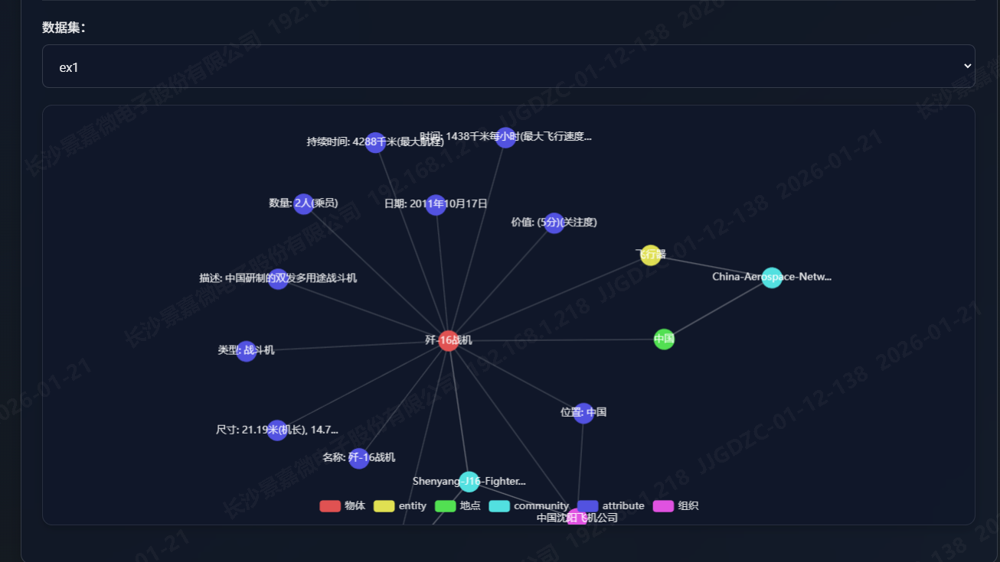
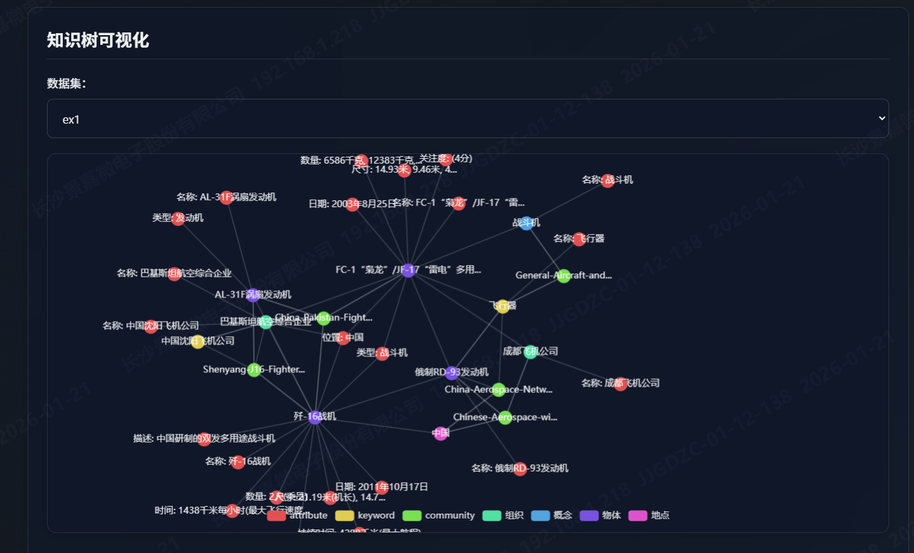

# 从文档到知识图谱：扩展图谱实现

[toc]

代码位置：https://github.com/TencentCloudADP/youtu-graphrag/blob/main/models/constructor/kt_gen.py

该模块用于将非结构化文档自动构造成知识图谱（Knowledge Graph）。整体流程由 `KTBuilder`类实现，其中 KT（Knowledge Triples） 表示知识图谱中的三元组（`实体–关系–实体`），多个三元组组合在一起即构成完整的知识图谱。

## 1 技术实现解析

### 1.1 `__init__`：构造器初始化

```python
    def __init__(self, dataset_name, schema_path=None, mode=None, config=None, graph=None):
        if config is None:			
            config = get_config()
        
        self.config = config 				# 配置信息
        self.dataset_name = dataset_name	# 数据集
        self.schema = self.load_schema(schema_path or config.get_dataset_config(dataset_name).schema_path) #图模式 Schema
        if graph is None:					# 图结构初始化（支持扩展图）
            self.graph = nx.MultiDiGraph()
        else:
            self.graph = graph				# 传入已有 graph，则在原有图基础上继续构建，实现图谱扩展
        self.node_counter = 0				# 节点计数器，为新创建的节点生成唯一标识
        self.datasets_no_chunk = config.construction.datasets_no_chunk	# 哪些数据集不进行文本切分
        self.token_len = 0					# 构图过程中累计使用的 token 数
        self.lock = threading.Lock()		# 线程锁，确保共享图结构的安全性
        self.llm_client = call_llm_api.LLMCompletionCall() # LLM 调用封装类，用于从文本中抽取实体、关系和知识三元组
        self.all_chunks = {}				# 用于缓存所有 chunk
        self.mode = mode or config.construction.mode	# 指定当前构图模式，agent和general
```

### 1.2 文本块（Chunks）

在知识图谱中，在检索到相关三元组后，系统会将对应的文本块一并返回，作为补充片段，便于理解上下文或提供原文依据。

#### 1.2.1 chunk_text：文本切块

文本切块（Chunking）是知识图谱构建流程中的第一步。

其主要目的是将原始文档整理并拆分为适合后续处理的文本单元。

在该步骤中，系统会将文档内容拼接成完整字符串，然后根据切块策略生成多个文本 chunk（注：当前实现中文档实际未进行切分），并为每个 chunk 分配一个唯一标识符（chunk_id）。

```python
chunks, chunk2id = self.chunk_text(doc)
```

- `chunks`：文本块列表
- `chunk2id`：chunk 到唯一 ID 的映射关系

通过 `chunk_id` 可以快速定位对应的文本内容，`chunk2id[chunk_id] = chunk`

#### 1.2.2 save_chunks_to_file：保存文本块

将生成的文本块保存到文件，路径：，`output/chunks/{self.dataset_name}.txt`，文件包含 chunk ID 和对应文本

### 1.3 大模型（LLM）

在知识图谱构建过程中，大模型（LLM）主要用于**从文本块中抽取实体、关系等结构化信息**，同时配合 token 统计控制调用成本。

#### 1.3.1 extract_with_llm：LLM抽取

调用大模型，并返回结构化的 JSON 结果。

#### 1.3.2 token_cal：Token 统计

统计文本或提示词的token 数量

#### 1.3.3 _get_construction_prompt：获取提示词

#### 1.3.4 _validate_and_parse_llm_response

判断 LLM 是否给出了有效回答，并计算使用的 token 长度，便于统计调用成本

### 1.4 三元组（Triples）

知识图谱的核心是**实体–关系–实体**三元组。

#### 1.4.1 _find_or_create_entity：找到或创建实体节点

在图中查找指定实体节点，若不存在则创建新节点。

**关键逻辑**：

1. **加锁处理**，保证多线程构图安全
2. 遍历图中所有节点，查找：
   - 标签（`label`）为 `"entity"`
   - 名称（`name`）与给定 `entity_name` 相同
3. 若存在则返回其 `entity_node_id`
4. 若不存在：
   - 创建新节点，命名为 `f"entity_{self.node_counter}"`
   - 属性包含：
     - `name`：实体名
     - `chunk_id`：来源文本块
     - 可选 `schema_type`
   - 将新节点加入 `nodes_to_add`
   - 更新 `self.node_counter`

```python
entity_node_id = self._find_or_create_entity(entity_name, chunk_id, nodes_to_add, entity_type)
```

**_find_or_create_entity_direct**：将结果直接加入图中

#### 1.4.2 _validate_triple_format：验证三元组格式

保证三元组合法性，只处理三个元素 `(subject, predicate, object)`。

- 三元组不足三个元素 → 忽略
- 三元组超过三个元素 → 截取前三个

#### 1.4.3 _process_attributes：处理属性

在知识图谱中，**属性（attribute，Level 1）是依附于实体节点（Level 2）**。

流程：

1. 创建属性节点
    - 为每个抽取出的属性生成一个唯一节点 ID（如 `attr_{self.node_counter}`）
    - 将属性节点加入待添加节点列表 `nodes_to_add`

2. 找到对应实体节点
    - 调用 `_find_or_create_entity`，确保实体节点在图中存在
    - 支持增量构建：若实体节点不存在，则创建
3. 创建实体–属性关系
    - 在实体节点和属性节点之间添加边
    - 边的类型为 `"has_attribute"`
    - 将边加入待添加边列表 `edges_to_add`

**返回值**：新增的节点列表和边列表

```python
nodes_to_add, edges_to_add = _process_attributes(extracted_attr, chunk_id, entity_types)
```

**_process_attributes_agent**：agent模式下直接生成的属性和边直接入库

#### 1.4.4 _process_triples：处理三元组

将抽取的三元组映射为图中的实体节点和边。

流程：

1. **验证三元组有效性**
   - 调用 `_validate_triple_format`
   - 无效或长度不足的三元组会被忽略
2. **获取或创建实体节点**
   - 调用 `_find_or_create_entity` 获取两个实体节点
   - 支持增量构建：节点不存在时自动创建
   - 可根据 `entity_types` 指定节点的 schema 类型
3. **创建关系边**
   - 在主体节点和客体节点之间添加边
   - 将边加入 `edges_to_add` 列表
4. **返回新增节点和边**
   - 返回 `(nodes_to_add, edges_to_add)`

```python
nodes_to_add, edges_to_add = _process_triples(extracted_triples, chunk_id, entity_t
```

**_process_triples_agent**：agent模式下直接生成的三元组直接入库

#### 1.4.5 process_level1_level2：Level 1 & Level 2 构图

对给定文本块（chunk）完成 **Level 1 属性节点** 和 **Level 2 实体–三元组节点** 的构建，并将新增节点与边增量加入知识图谱。

流程

1. **生成 LLM 提示词并调用大模型**
   - 输入文本块，生成构图 prompt
   - 调用 LLM 抽取：
     - 属性 (`attributes`)
     - 三元组 (`triples`)
     - 实体类型 (`entity_types`)
2. **解析 LLM 输出**
   - 验证输出有效性
   - 提取属性字典、三元组列表和实体类型信息
3. **处理属性和三元组**
   - 调用 `_process_attributes` 生成属性节点和边
   - 调用 `_process_triples` 生成三元组节点和边
   - 合并生成的节点和边集合
4. **加锁更新图结构**
   - 将所有新增节点加入图
   - 将所有新增边加入图
   - 保证多线程安全，支持增量构建

特点：

- **增量构建**：可逐块处理文本，新增节点和边不断累积到图中
- **多线程安全**：使用锁保护图操作，避免并发冲突

process_level1_level2_agent：agent模式下提取到的新内容直接入库

#### triple_deduplicate：三元组去重

```python
  def triple_deduplicate(self):
        """deduplicate triples in lv1 and lv2"""
        new_graph = nx.MultiDiGraph()

        for node, node_data in self.graph.nodes(data=True):
            new_graph.add_node(node, **node_data)

        seen_triples = set()
        for u, v, key, data in self.graph.edges(keys=True, data=True):
            relation = data.get('relation') 
            if (u, v, relation) not in seen_triples:
                seen_triples.add((u, v, relation))
                new_graph.add_edge(u, v, **data)
        self.graph = new_graph
```

### 1.5 Schema

Schema 用于约束知识图谱中的**节点、关系和属性类型**，同时支持在构图过程中进行**增量更新**。

#### 1.5.1 _update_schema_with_new_types：更新Schema

用于将 LLM 抽取出的**新类型**写回到 Schema 文件中。

**当前限制**：
 仅对以下数据集启用 Schema 更新：

- `hotpot`、`2wiki`、`musique`、`novel`、`graphrag-bench`
   （Schema 路径通过硬编码指定，后续可优化为自动从 `schemas/` 目录查找）

**功能流程**：

1. 根据 `dataset_name` 读取对应的 Schema 文件
2. 从 `new_schema_types` 中获取：
   - 新节点类型（nodes）
   - 新关系类型（relations）
   - 新属性类型（attributes）
3. 仅当类型不存在时才追加到 Schema
4. 若发生更新，则写回文件并同步更新 `self.schema`

**特点**：

- 增量更新，不覆盖原有 Schema
- 避免重复写入

### 1.6 关键词和社区

Level 3：关键词（Keywords）

对多个实体进行**语义抽象与概括**，用于总结实体集合的核心主题，并作为实体与社区之间的过渡层。

Level 4：社区（Communities）

图中的**高层语义聚合节点**，由结构与语义相近的实体组成，通过社区发现算法（如 Tree-Comm）自动生成，用于刻画整体主题或子图语义。

#### 1.6.1 process_level4： 处理社区

基于 **Level 2 实体节点**进行社区发现：

1. 获取所有 Level 2 的实体节点
2. 使用 `tree_comm.FastTreeComm` 算法进行社区划分（结合结构与语义嵌入）
3. 为每个社区创建 **Level 4 超级节点**，并自动生成社区关键词
4. 将社区节点加入图中，用于高层语义索引


#### 1.6.2 _connect_keywords_to_communities：：关键词–社区关联

将 **Level 3 关键词节点**与 **Level 4 社区节点**进行连接：

- 遍历社区节点与关键词节点
- 若关键词名称与社区名称存在包含关系
- 在二者之间建立 `"describes"` 关系

该步骤用于增强社区的**可解释性**，使社区语义可以通过关键词直观表达。

### 1.7 文档

文档在知识图谱中指**解析后的 JSON 文件**，每条文档包含原始内容。

流程是**逐文档处理 → 切块 → Level 1 & Level 2 构图 → Level 3/4 高层抽象**。

#### 1.7.1 process_document：处理单文档

流程：

1. **文本切块**
   - 调用 `chunk_text(doc)` 生成 chunk 列表和 `chunk2id` （ chunk 唯一 ID）映射
2. **Level 1 & Level 2 构图**
   - 如果模式为 `"agent"` → 调用 `process_level1_level2_agent`（支持 Schema 演化）
   - 否则 → 调用 `process_level1_level2`（标准处理）

#### 1.7.2 process_all_documents：处理多文档

支持**多文档高并发处理**，并在最后生成 Level 3（关键词）和 Level 4（社区）：

1. **线程池并发**
   - 使用 `ThreadPoolExecutor`，最大 worker 数由 CPU 核心数和配置控制
   - 每条文档提交 `process_document`
2. **进度跟踪**
   - 每 10 条文档或全部完成时打印日志：
     - 已处理数、失败数、进度百分比
     - 估算剩余处理时间
3. **后处理**
   - 去重三元组：`triple_deduplicate()`
   - 生成社区和关键词：`process_level4()`

#### 1.7.3 format_output：图谱格式化输出

将内部 `graph` 对象转换为 **JSON 可序列化格式**：

- 遍历图中所有边 `(u, v, data)`

- 获取起点、终点节点属性

- 构造成字典：
```python
  {
      "start_node": { "label": "...", "properties": {...} },
      "relation": "...",
      "end_node": { "label": "...", "properties": {...} }
  }
```

- 返回列表，表示所有实体关系的三元组

#### 1.7.4 build_knowledge_graph：构建知识图谱总入口

流程概览：

1. **读取文档**
   - 从 `corpus`（JSON 文件）加载解析后的文档列表
2. **处理文档**
   - 调用 `process_all_documents(documents)`
   - 自动完成 Level 1（属性）、Level 2（三元组）、Level 3（关键词）、Level 4（社区）构建
   - 支持并发处理和异常统计
3. **保存 chunk**
   - 调用 `save_chunks_to_file()`，保存文本块及其 ID
4. **格式化输出**
   - 调用 `format_output()`，生成 JSON 可序列化三元组列表
5. **保存图谱文件**
   - 路径为 `output/graphs/{dataset_name}_new.json`
   - 如果文件夹不存在则自动创建

---

## 2 图谱扩展的实现

由于数据通常是**持续更新和迭代的**，知识图谱在初次构建完成后，**支持在原有基础上的扩展**就显得尤为重要。

在该项目中，实现图谱扩展主要依赖两个关键点：`KTBuilder` 的初始化过程以及 `build_knowledge_graph` 函数。

### 2.1 KTBuilder：初始化与图复用

在 `KTBuilder` 的初始化逻辑中，原本默认通过 `nx.MultiDiGraph()` 创建一张**全新的图**。
 因此，只需在初始化时**将已有的知识图谱作为参数传入**，即可实现基于原图的增量构建。

```python
class KTBuilder: # KT：Knowledge Triples
    def __init__(self, dataset_name, schema_path=None, mode=None, config=None, graph=None):
		···
        if graph is None:
            self.graph = nx.MultiDiGraph()
        else:
            self.graph = graph
        ···
```

- `graph=None`：创建新图，从零开始构建知识图谱

- `graph=existing_graph`：在已有图谱基础上继续添加节点与关系，实现图谱扩展

---

### 2.2 build_knowledge_graph：扩展构图入口

`build_knowledge_graph` 是知识图谱构造的**统一入口函数**。
只需传入**解析后的 JSON 文件**，即可自动完成实体与关系的抽取，并将结果写入当前图结构中。

构建完成后，图谱会被保存至：`output/graphs/{self.dataset_name}_new.json`

当 `KTBuilder` 初始化时传入的是已有图对象时，该函数实际上执行的是**增量式构图**。



