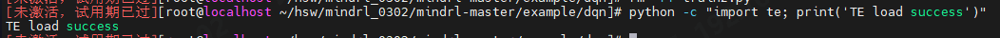
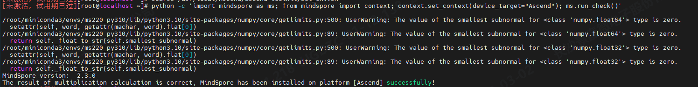
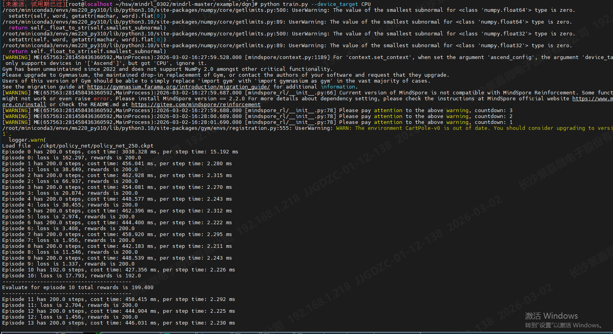
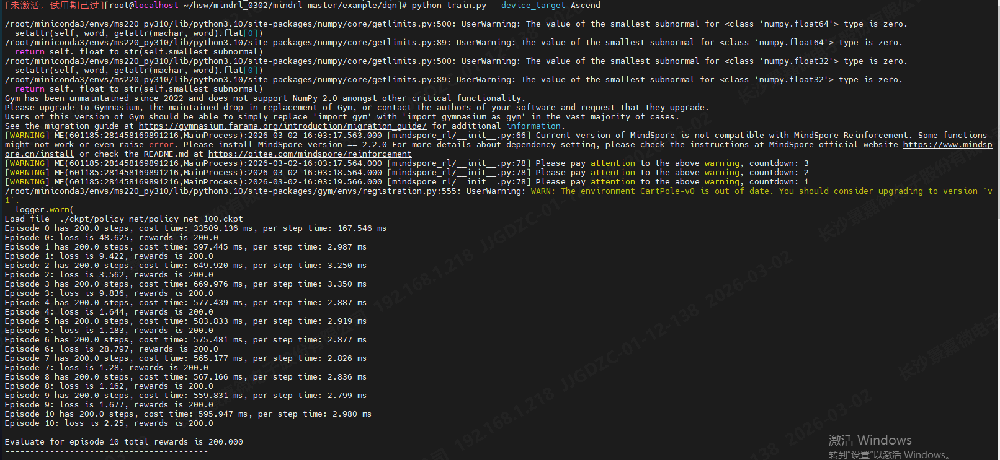
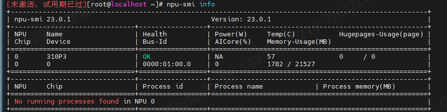
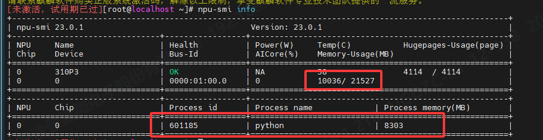
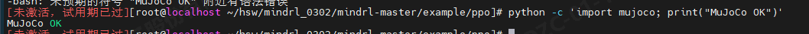
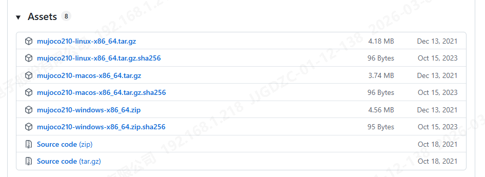
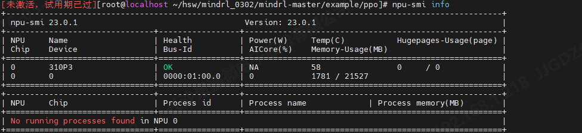

# 强化学习训练环境验证

> DQN + PPO（MindSpore + Ascend）

##  一、DQN 训练

### 1. 环境初始化

#### 1.1 激活 Conda 环境

```python
conda activate ms220_py310
```

#### 1.2 加载 Ascend 环境变量

```python
source /usr/local/Ascend/ascend-toolkit/set_env.sh
```

#### 1.3 兼容飞腾 D2000 CPU 指令集

```shell
export OPENBLAS_CORETYPE=ARMV8
```
作用说明：
- 强制 OpenBLAS 使用通用 ARMv8 指令
- 避免因飞腾 CPU 不支持高级指令导致：Illegal instruction (core dumped)

#### 1.4 手动补充 Ascend 关键路径（防止环境变量缺失）

```shell
export LOCAL_ASCEND=/usr/local/Ascend
export ASCEND_HOME=/usr/local/Ascend/ascend-toolkit/latest

export LD_LIBRARY_PATH=$ASCEND_HOME/lib64:$LD_LIBRARY_PATH
export PYTHONPATH=$ASCEND_HOME/python/site-packages:$PYTHONPATH
export PATH=$ASCEND_HOME/bin:$ASCEND_HOME/compiler/ccec_compiler/bin:$PATH
export ASCEND_OPP_PATH=/usr/local/Ascend/ascend-toolkit/latest/opp
```

### 2. 环境验证

#### 2.1 验证 TE 组件

```python
python -c "import te; print('TE load success')"
```



#### 2.2 验证 MindSpore + Ascend

```python
python -c 'import mindspore as ms; from mindspore import context; context.set_context(device_target="Ascend"); ms.run_check()'
```



### 3. DQN 训练运行

进入 DQN 示例目录

```shell
cd /root/hsw/mindrl_0302/mindrl-master/example/dqn/
```

#### 3.1 CPU 运行

```python
python train.py --device_target CPU
```



#### 3.2 Ascend 运行

```python
python train.py --device_target Ascend
```







## 二、PPO 训练

### 1. 环境变量
由于 PPO 示例依赖 MuJoCo 渲染环境，需要设置如下变量：

```sehll
export MUJOCO_GL=osmesa
export PYOPENGL_PLATFORM=osmesa
export LIBGL_ALWAYS_SOFTWARE=true
export LD_PRELOAD=/usr/lib64/libffi.so.7
```

如果出现段错误 (核心已转储)，重新加载 Ascend 环境：

```shell
source /usr/local/Ascend/ascend-toolkit/set_env.sh
```

### 2. MuJoCo 环境验证

```python
python -c 'import mujoco; print("MuJoCo OK")'
```



> 问题：`mujoco_py` 依赖 MuJoCo 2.1.0，MuJoCo 2.1.0 无 aarch64 (ARM64) 版本，飞腾 D2000 为 ARM 架构，因此无法直接安装 mujoco_py。https://github.com/google-deepmind/mujoco/releases?page=5
>
> 
>
> 解决方案：mujoco 伪装为 mujoco_py。由于新版 `mujoco` 官方 Python API 已支持 ARM，PPO 示例代码仅依赖部分接口，可以通过模块重定向方式兼容。
>
> ```python
> try:
>     import mujoco
>     sys.modules["mujoco_py"] = mujoco  # 伪装成 mujoco_py
> except ImportError:
>     pass
> ```


### 3. PPO 训练验证

进入 PPO 示例目录

```python
cd /root/hsw/mindrl_0302/mindrl-master/example/ppo
```

#### 3.1 CPU 运行

```python
python train.py --device_target CPU
```


#### 3.2 Ascend 运行

```python
python train.py --device_target Ascend
```




