# 强化学习环境搭建（Ascend NPU + 飞腾 D2000）

## 1. 简介

### 1.1 目标

在 **Ascend NPU + 飞腾 D2000（ARM）** 平台上完成强化学习环境部署，成功运行并验证两种基础算法：DQN和PPO。

### 1.2 强化学习框架

当前支持 Ascend 的主流强化学习框架主要有两个：

1. MindSpore Reinforcement（MindRL）

   - 项目地址：https://github.com/mindspore-lab/mindrl

   - 开发：华为

   - 优点：原生支持 Ascend，适配简单

   - 缺点：算法少，扩展性一般

2. Xuance

   - 项目地址：https://github.com/agi-brain/xuance
   - 开发：中山大学 HCP 实验室
   - 优点：算法全，结构统一
   - 缺点：Ascend 适配一般（实际测试中出现 **训练阶段内存溢出（OOM）问题**）

## 2. 环境介绍

本节介绍两个强化学习框架的环境依赖与版本要求。

两个框架都依赖：

- Ascend 驱动
- CANN
- MindSpore

重要提示：MindSpore 必须与 CANN 版本严格匹配，否则即使安装成功，也只能使用 CPU，无法调用 Ascend加速。

### 2.1 MindRL 环境

- MindSpore Reinforcement：**0.8.0**
- MindSpore：**2.3.0**
- CANN：8.0.RC2.beta1

> 原本官方推荐版本是 2.2.0，但由于缺少对应的 CANN 版本，经测试 **2.3.0** 可正常使用。

### 2.2 Xuance 环境

- MindSpore：**2.6.0**
- CANN：CANN 8.1.RC1

### 2.3 PPO 额外依赖

如果运行 PPO（连续控制任务），还需要安装 MuJoCo 组件：否则相关环境无法启动。

## 3. 环境安装

安装Miniconda3，并创建一个干净的Python环境：

```shell
# 安装miniconda3
wget https://repo.anaconda.com/miniconda/Miniconda3-py310_25.1.1-2-Linux-aarch64.sh
bash Miniconda3-py310_25.1.1-2-Linux-aarch64.sh
/root/miniconda3/bin/conda init bash
source ~/.bashrc

# 创建并激活新的 Conda 环境
conda create --name ms220_py310 python=3.10
conda activate ms220_py310
```

### 3.1 安装 MindRL

#### 3.1.1 配置 CANN

mindspore2.3.0 版本所需的 CANN 版本可以参考以下链接进行查找。需要确保版本匹配，否则安装后 Mindspore 只能使用CPU，无法使 用Ascend。

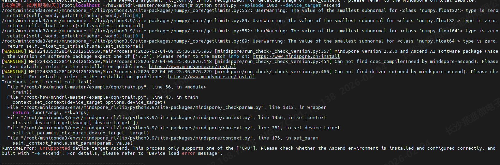

https://www.mindspore.cn/versions/en#2.3.0

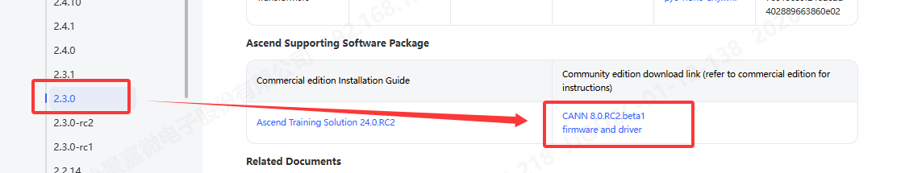

查看 CANN 版本后，下载对应的 toolkit 和 kernel文件：


```shell
chmod +x Ascend-cann-toolkit_8.0.RC2_linux-aarch64.run
chmod +x Ascend-cann-kernels-310p_8.0.RC2_linux.run

bash ./Ascend-cann-toolkit_8.0.RC2_linux-aarch64.run --install
bash ./Ascend-cann-kernels-310p_8.0.RC2_linux.run --install
```

如果需要修改安装路径，可以在 `/etc/Ascend/ascend_cann_install.info` 文件中调整。**注意**：安装路径尽量避免安装到 Conda 环境中，建议使用默认路径：

```shell
[root@localhost ~/hsw]# cat /etc/Ascend/ascend_cann_install.info
Install_Path=/usr/local/Ascend
Toolkit_InstallPath=/usr/local/Ascend/ascend-toolkit
```

为了使环境变量生效，执行以下命令：

```shell
source /usr/local/Ascend/ascend-toolkit/set_env.sh
```

> 同理可以下载对应的驱动和固件，但这些的影响相对较小。
>
> https://www.hiascend.com/hardware/firmware-drivers/community
>
> 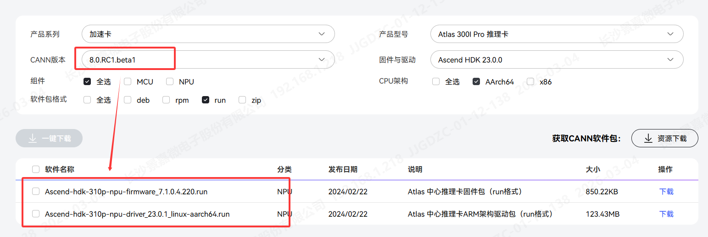
>
> ```
> bash ./Ascend-hdk-310p-npu-driver_23.0.1_linux-aarch64.run --full
> bash ./Ascend-hdk-310p-npu-firmware_7.1.0.4.220.run --full
> ```
>
> 安装成功后需要重启，然后通过npu-smi info可以查看安装成功成功
>
> 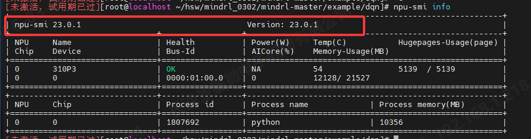

##### 3.1.1.1 切换CANN注意事项

- 切换不同版本的 CANN 时，必须重新安装，不能仅修改latest链接。这样做可能会导致底层文件异常的问题。。参考：https://www.hiascend.com/forum/thread-0259190973810064306-1-1.html。
- 如果需要安装不同版本的 CANN，推荐使用 Docker来避免环境冲突

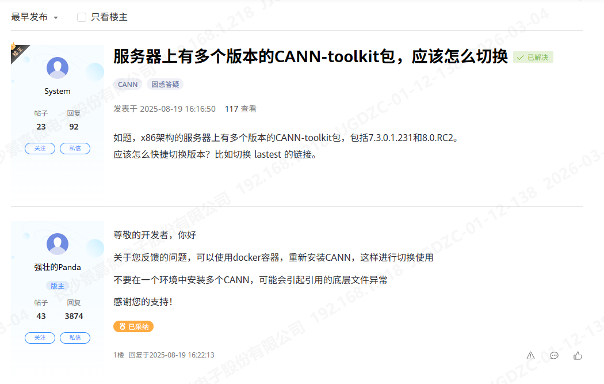


#### 3.1.2 mindspore 安装

参考文档：https://gitee.com/mindspore/docs/blob/master/install/mindspore_ascend_install_conda.md

首先，卸载可能与 MindSpore 冲突的包，确保使用华为的版本。无需从其他地方安装这些包，它们会自动从 toolkit 中安装：

```shell
pip uninstall te topi hccl -y
```

安装必要的依赖包：

```shell
pip install sympy protobuf attrs cloudpickle decorator ml-dtypes psutil scipy tornado jinja2
```

接下来，卸载旧版本的 MindSpore，并安装 2.3.0 版本：

```shell
conda uninstall mindspore
conda install mindspore==2.3.0 -c mindspore -c conda-forge 
```

由于与 Numpy 的版本兼容性要求，需要降级 Numpy：

```shell
pip install 'numpy<2' --force-reinstall
pip install numpy==1.23.5 --force-reinstall
```

配置 MindSpore 环境变量：

```shell
export GLOG_v=2
export LOCAL_ASCEND=/usr/local/Ascend/
```

验证安装

1. run_check

```shell
# 新版本
python -c "import mindspore;mindspore.set_device('Ascend');mindspore.run_check()"

# 老版本
python -c 'import mindspore as ms; from mindspore import context; context.set_context(device_target="Ascend"); ms.run_check()'
```

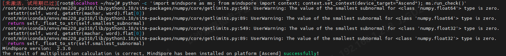

2. 算子测试

```python
import numpy as np
import mindspore as ms
import mindspore.ops as ops
from mindspore import context
context.set_context(device_target="Ascend")
x = ms.Tensor(np.ones([1,3,3,4]).astype(np.float32))
y = ms.Tensor(np.ones([1,3,3,4]).astype(np.float32))
print(ops.add(x, y))
```

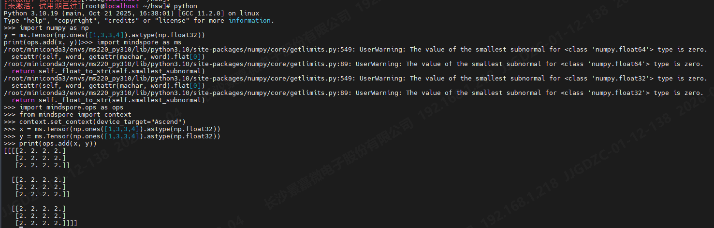

##### 3.1.2.1 TE 缺失问题（常见）

当出现以下错误时：

```shell
ModuleNotFoundError: te
```

可以手动安装 TE 模块解决此问题：

```shell
pip install /usr/local/Ascend/ascend-toolkit/latest/lib64/hccl-*-py3-none-any.whl --force-reinstall

pip install /usr/local/Ascend/ascend-toolkit/latest/lib64/te-*-py3-none-any.whl --force-reinstall
```

```
pip install "numpy<1.24"  --force-reinstall # 必须

export LD_LIBRARY_PATH=/usr/local/Ascend/ascend-toolkit/latest/compiler/lib64:$LD_LIBRARY_PATH
```

验证 TE 模块


```python
python -c "import te; print('TE load success')"
```

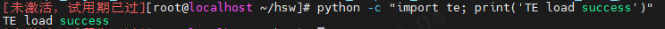


#### 3.1.3 mindrl 安装

克隆 MindRL 仓库并构建

```shell
git clone https://github.com/mindspore-lab/mindrl.git
cd mindrl/
bash build.sh
```

然后，安装生成的 `.whl` 文件：

```shell
pip install output/mindspore_rl-0.8.0-py3-none-linux_aarch64.whl
```

> 下载到的都是0.8.0，对应的mindspore正常应该是2.2.0，但缺少了对应的CANN，目前下载不到了
>
> 下载到的都是0.8.0，对应的mindspore正常应该是2.2.0，但缺少了对应的CANN，目前下载不到了
>
> 下载的版本是 0.8.0，对应的 MindSpore 版本本应是 2.2.0，但由于缺少相应的 CANN，目前无法下载到该版本。实测 2.3.0的MindSpore 版本可以正常使用。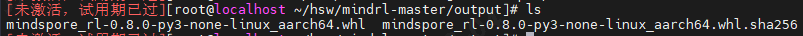

进入 `mindrl` 目录后，安装所需的依赖：

```shell
cd mindrl && pip install requirements.txt
```

验证 MindRL 是否加载成功

```python
import mindspore_rl
```

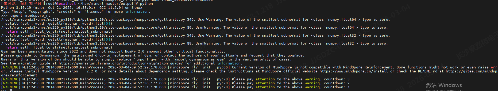

#### 3.1.4 MuJoCo  安装

##### 3.1.4.1 MuJoCo 是什么 

MuJoCo（Multi-Joint dynamics with Contact）是一个高性能的物理仿真引擎，它负责模拟重力、碰撞等真实的物理环境（即“躯体”），为 PPO（Proximal Policy Optimization）算法提供一个安全、高效且高精度的“虚拟实验室”。PPO 通过在 MuJoCo 提供的连续动作空间中不断“试错”并获取奖励反馈，从而进化出精密控制机器人的策略，两者结合已成为强化学习领域处理复杂动力学任务的**标准配置**。

---

##### 3.1.4.2 MuJoCo、mujoco_py 与 mujoco的关系

在安装过程中，可能会遇到以下三个术语，了解它们之间的关系有助于理解安装过程：

1. **MuJoCo (底层引擎)**： 由 C++ 编写的底层**物理模拟发动机**。在 2.1.0 版本之前是闭源收费的（需 `.txt` 证书）；从 2.1.1 版本开始由 DeepMind 开源并标准化。
2. **mujoco-py (旧版适配器)**： 由 OpenAI 开发的 **Python 封装库**（Wrapper），其作用是让 Python 代码能调用 C++ 的 MuJoCo 引擎。它是早期 `gym` 环境的标准依赖，**深度绑定 MuJoCo 2.1.0**。
3. **mujoco (新版原生库)**： DeepMind 开源后推出的 **官方原生 Python 绑定**。它不再需要手动安装底层引擎，直接 `pip install mujoco` 即可使用，是目前的主流推荐方案。

---

##### 3.1.4.3 为什么 ARM64 架构下无法直接安装 mujoco-py？

在 **ARM 架构**（如飞腾 D2000）上，`mujoco-py` 安装过程中可能会遇到如下问题：

- **依赖链**：`MindRL` → `mujoco-py` → `MuJoCo 2.1.0`。

- `mujoco-py` 强制要求底层必须是 **MuJoCo 2.1.0** 编译版本。官方的 **MuJoCo 2.1.0 仅发布了 x86_64 版本**，并未提供 `aarch64` (ARM64) 编译包。由于底层“发动机”不支持 ARM 架构，导致上层的 Python 适配器 `mujoco-py` 在飞腾服务器上无法直接运行。

**MuJoCo 2.1.0** 的发布说明：https://github.com/google-deepmind/mujoco/releases?page=5

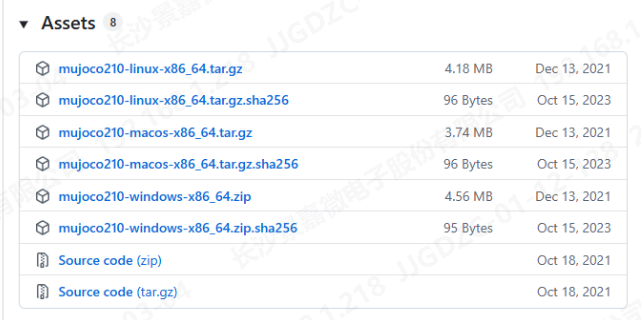

---

##### 3.1.4.4 解决思路：ARM 架构下安装 mujoco

```shell
pip install mujoco
```

由于 **MuJoCo** 已支持 **ARM 架构**，可以通过将 **mujoco** 伪装为 **mujoco_py** 来解决此问题。新版 **mujoco** 官方 Python API 已经支持 ARM 架构，且 PPO 示例代码仅依赖于部分接口，因此可以通过模块重定向的方式兼容：

```python
try:
	import mujoco
	sys.modules["mujoco_py"] = mujoco  # 伪装成 mujoco_py
except ImportError:
	pass
```

安装成功后，设置环境变量

```shell
export MUJOCO_GL=osmesa            # 设置 MuJoCo 渲染模式为 osmesa，使用不依赖显示硬件的 OSMesa 渲染器（适用于无头（headless）环境）
export PYOPENGL_PLATFORM=osmesa    # 设置 PyOpenGL 使用 osmesa 渲染，确保 OpenGL 在无图形显示的情况下工作
export LIBGL_ALWAYS_SOFTWARE=true  # 强制 OpenGL 使用软件渲染，而不是硬件加速，适用于没有图形硬件的环境
export LD_PRELOAD=/usr/lib64/libffi.so.7
```

##### 3.1.4.5 mujoco 环境验证

```python
python -c 'import mujoco; print("MuJoCo OK")'
```


相关链接：

- mujoco-py链接：https://github.com/openai/mujoco-py?tab=readme-ov-file#install-mujoco

- mujoco-py x86安装指南：https://gist.github.com/saratrajput/60b1310fe9d9df664f9983b38b50d5da


### 3.2 安装Xuance

在安装 Xuance 时，如果使用 **CANN 环境**，请参考 **3.1.1** 部分的配置要求。需要特别注意的是，安装 **MindSpore 2.6.0** 版本，其他版本（例如 **2.8.0**）可能会影响性能，经过实测，**2.8.0 的 CPU 性能**比 **2.6.0** 要慢得多。

安装命令：

```shell
pip install xuance[mindspore] -i https://pypi.tuna.tsinghua.edu.cn/simple
```

#### 其他选择：

除了使用 **MindSpore**，也可以尝试安装 **torch** 版本的 **Xuance**，并配合安装 **torch_npu**。目前还未进行过此策略的实测，因此仅作为参考。

## 4. 环境验证

### 4.1 MindRL-DQN

首先，进入实例目录：

```shell
cd /root/hsw/mindrl_0302/mindrl-master/example/dqn/
```
#### 4.1.1. 在 CPU 上运行

在 train.py 中需要做三处修改：

1. 禁用 Graph Kernel

   Graph Kernel 是 MindSpore 的图计算优化，能在 Ascend 等硬件上通过加速图计算提升性能。在 **CPU** 上，由于无法获得硬件加速，需禁用 Graph Kernel（在本环境下为必须）

    ```python
   if context.get_context('device_target') in ['CPU']:
   	context.set_context(enable_graph_kernel=False)
    ```
   
2. 禁用 JIT 优化

   JIT（Just-In-Time）编译可动态优化代码以提高性能。为避免在 CPU 上进行无效的优化，使用 `jit_level="O0"` 禁用 JIT 编译（在本环境下为必须）

   ```
   context.set_context(jit_config={"jit_level": "O0"})
   ```

    - jit_level="O0"：表示禁用 JIT 优化，所有操作都将在 **解释模式**（Interpreter Mode）下执行，适合用于调试和确保计算过程不被过度优化。
 - jit_level="O2"：表示启用较高级别的 JIT 优化，会进行图优化、内存优化、算子融合等，适用于训练和推理时提升性能。

在设置完成后，可以使用以下命令进行训练：

```shell
python train.py --device_target CPU
```

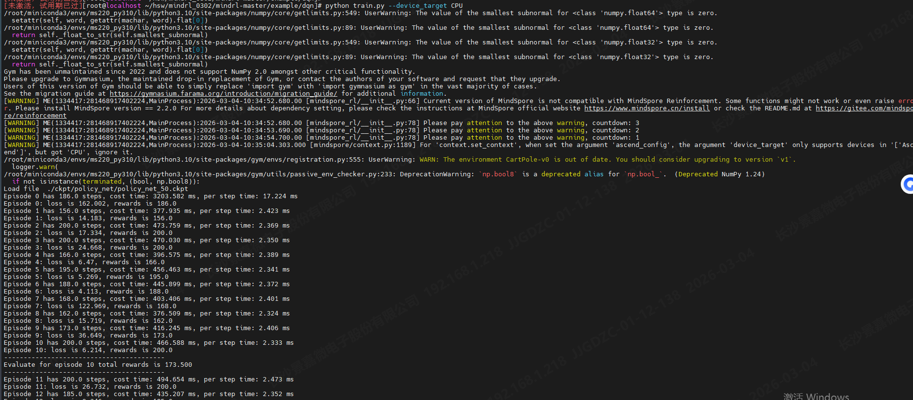


#### 4.1.2. 在 Ascend 上运行

在 train.py 中需要做两处修改：

1. 设置显存大小：配置 **Ascend** 设备的最大显存使用量：
  ```python
if context.get_context('device_target') in ['Ascend']:
    context.set_context(max_device_memory="10GB")
  ```
2. 初始化顺序调整

   确保将 mindspore_rl 的导入放在 mindspore 的 context 初始化之后

   ```python
   from mindspore_rl.algorithm.dqn import config
   from mindspore_rl.algorithm.dqn.dqn_session import DQNSession
   from mindspore_rl.algorithm.dqn.dqn_trainer import DQNTrainer
   ```

执行以下命令以在 Ascend 上进行训练：

```python
python train.py --device_target Ascend
```

显示 `npu-smi info` 的运行前后结果图

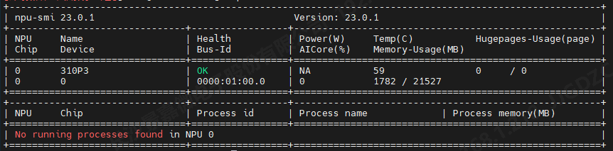

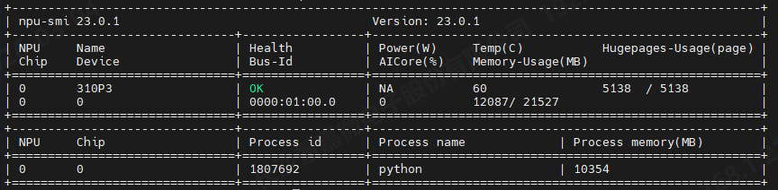

##### 4.1.2.1 JIT 配置对性能的影响

1. **JIT 设置为 O0（禁用优化）**

   当将 jit_level 设置为O0时候，Ascend运行速度较慢，约为7ms

   ```python
   if context.get_context('device_target') in ['Ascend']:
       context.set_context(max_device_memory="10GB",  jit_config={"jit_level": "O0"})
   ```

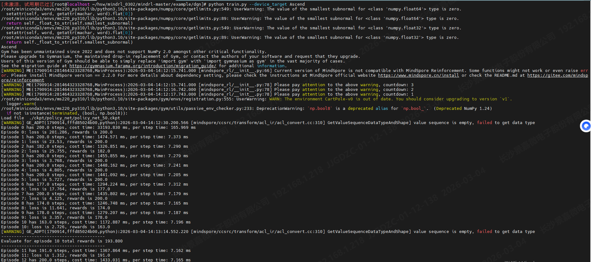

2. **JIT 设置为 O2（启用优化）**

   当将 `jit_level` 设置为 **O2** 时，Ascend 运行速度显著加快，约为 **2ms**：

   ```python
   if context.get_context('device_target') in ['Ascend']:
       context.set_context(max_device_memory="10GB",  jit_config={"jit_level": "O2"})
   ```

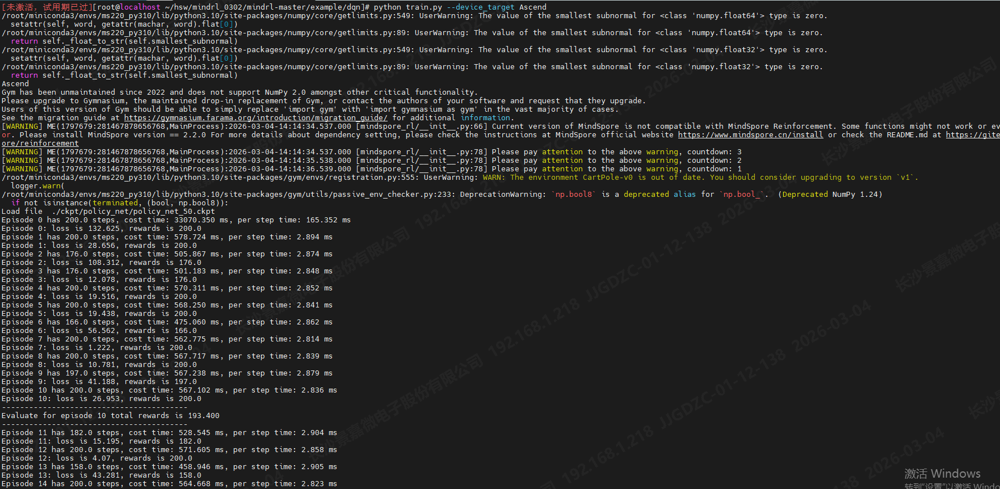

train.py的最终脚本如下：

```python
import argparse

from mindspore import context
from mindspore import dtype as mstype

parser = argparse.ArgumentParser(description='MindSpore Reinforcement DQN')
parser.add_argument('--episode', type=int, default=650, help='total episode numbers.')
parser.add_argument('--device_target', type=str, default='Auto', choices=['Ascend', 'CPU', 'GPU', 'Auto'],
                    help='Choose a device to run the dqn example(Default: Auto).')
parser.add_argument('--precision_mode', type=str, default='fp32', choices=['fp32', 'fp16'],
                    help='Precision mode')
parser.add_argument('--env_yaml', type=str, default='../env_yaml/CartPole-v0.yaml',
                    help='Choose an environment yaml to update the dqn example(Default: CartPole-v0.yaml).')
parser.add_argument('--algo_yaml', type=str, default=None,
                    help='Choose an algo yaml to update the dqn example(Default: None).')
options, _ = parser.parse_known_args()


def train(episode=options.episode):
    """start to train dqn algorithm"""
    if options.device_target != 'Auto':
        context.set_context(device_target=options.device_target)
    
    print(context.get_context('device_target'))
    if context.get_context('device_target') in ['CPU']:
        context.set_context(enable_graph_kernel=False, jit_config={"jit_level": "O0"})

    if context.get_context('device_target') in ['Ascend']:
        context.set_context(max_device_memory="10GB",  jit_config={"jit_level": "O2"})

    context.set_context(mode=context.GRAPH_MODE, ascend_config={"precision_mode": "allow_mix_precision"})
    compute_type = mstype.float32 if options.precision_mode == 'fp32' else mstype.float16
    
    from mindspore_rl.algorithm.dqn import config
    from mindspore_rl.algorithm.dqn.dqn_session import DQNSession
    from mindspore_rl.algorithm.dqn.dqn_trainer import DQNTrainer
    
    config.algorithm_config['policy_and_network']['params']['compute_type'] = compute_type
    if compute_type == mstype.float16 and options.device_target != 'Ascend':
        raise ValueError("Fp16 mode is supported by Ascend backend.")
    dqn_session = DQNSession(options.env_yaml, options.algo_yaml)
    dqn_session.run(class_type=DQNTrainer, episode=episode)

if __name__ == "__main__":
    train()
```


### 4.2 MindRL-PPO

#### 4.2.3 PPO 训练验证

进入 PPO 示例目录

```shell
cd /root/hsw/mindrl_0302/mindrl-master/example/ppo
```

##### 4.2.3.1 在 CPU 上运行

首先，需要修改以下代码：

```python
# 设置 MuJoCo 使用 OSMesa 软件渲染
os.environ["MUJOCO_GL"] = "osmesa"

# 下面是原本的 Gymnasium 重定向代码
import gymnasium as gym
sys.modules["gym"] = gym

try:
    import mujoco
    sys.modules["mujoco_py"] = mujoco  # 伪装成 mujoco_py
except ImportError:
    pass

from mindspore import context
context.set_context(max_device_memory="8GB")
...

        context.set_context(enable_graph_kernel=False)
```

然后使用以下命令在 **CPU** 上运行训练：

```python
python train.py --device_target CPU
```

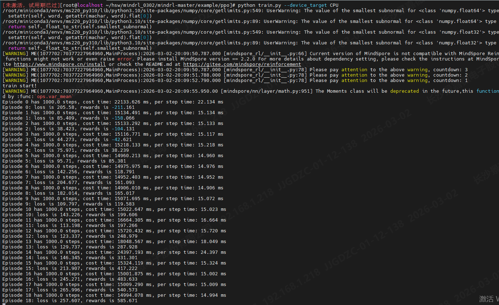

##### 4.2.3.2 在 Ascend 上运行

```python
python train.py --device_target Ascend
```

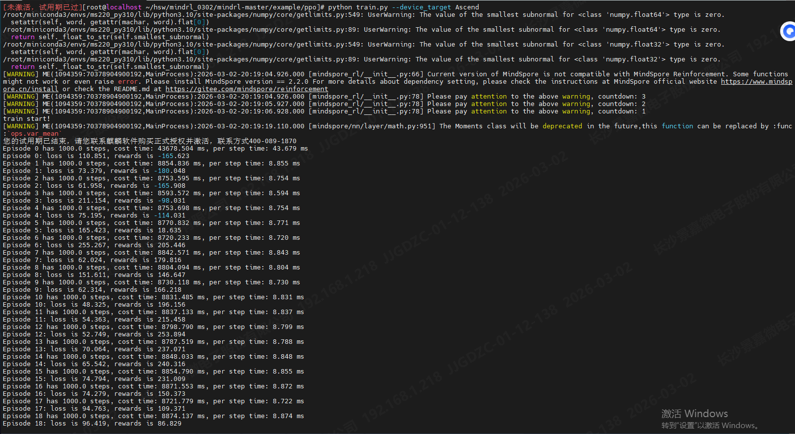


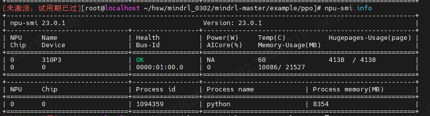


### 4.3 Xuance-PPO

1. 配置修改

   如果通过 Conda 安装的，请进入 Conda 环境的目录并修改基础配置 basic.yaml

   ```shell
   vim  /root/miniconda3/envs/ms260_py310/lib/python3.10/site-packages/xuance/configs/basic.yaml
   ```

   如果是源码安装的，则需要在源码目录下找到并修改该文件。

2. 修改basic.yaml配置

   修改以下配置项：

   ```yaml
   dl_toolbox: "mindspore"  # The deep learning toolbox. Choices: "torch", "mindspore", "tensorflow"
   ...
   device: "Ascend"  # Choose an calculating device. PyTorch: "cpu", "cuda:0"; TensorFlow: "cpu"/"CPU", "gpu"/"GPU"; MindSpore: "CPU", "GPU", "Ascend", "Davinci".
   
   parallels: 1  # The number of environments to run in parallel.
   render: False 不渲染
   ```

3. 源码修改

    发现源码有两处有问题，需要修改

    1. /root/hsw/xuance-master/xuance/mindspore/agents/base/agent.py：参数只有一个，参考torch里面的代码改的

       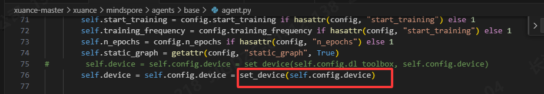

        ```shell
        # self.device = self.config.device = set_device(self.config.dl_toolbox, self.config.device)
        self.device = self.config.device = set_device(self.config.device)
        ```

    2. /root/hsw/xuance-master/xuance/engine/run_drl.py：需要加上判断，否则默认走第一个，会报错找不到Ascend

        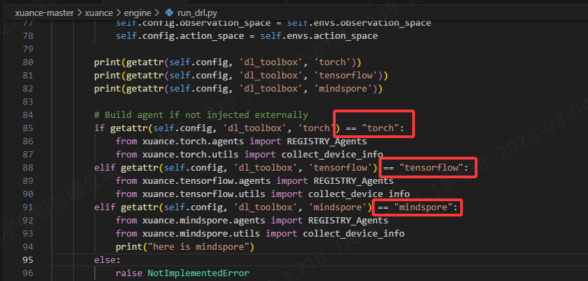

        ```python
        # Build agent if not injected externally
        if getattr(self.config, 'dl_toolbox', 'torch') == "torch":
            from xuance.torch.agents import REGISTRY_Agents
            from xuance.torch.utils import collect_device_info
        elif getattr(self.config, 'dl_toolbox', 'tensorflow') == "tensorflow":
            from xuance.tensorflow.agents import REGISTRY_Agents
            from xuance.tensorflow.utils import collect_device_info
        elif getattr(self.config, 'dl_toolbox', 'mindspore') == "mindspore":
            from xuance.mindspore.agents import REGISTRY_Agents
            from xuance.mindspore.utils import collect_device_info
            print("here is mindspore")
        else:
            raise NotImplementedError
        ```

4. 训练测试代码

    ```python
    import mindspore as ms
    
    ms.set_device("Ascend")
    
    import xuance
    
    runner = xuance.get_runner(
        algo='ppo',
        env='classic_control',
        env_id='CartPole-v1'
    )
    
    runner.run(mode='train')
    ```

4. 内存管理与泄漏

   实测过程中，存在内存泄漏的问题

   经过以下排查：

   1. HORIZON 配置修改**：经测试，修改 **HORIZON** 配置并不会影响 **host 内存** 的增加。
   2. **内存泄漏检测**：**测试**过程中没有发现内存泄漏问题。在 **CPU** 上运行时，同样没有出现内存泄漏。
   3. **Python 内存对象**：**Python 内存对象** 也没有问题。
   4. **静态图与动态图**：无论使用 **静态图** 还是 **动态图**，两者在内存泄漏方面表现一致，并未对内存泄漏产生影响。

   **Ascend 内存泄漏分析**：初步分析认为，内存泄漏问题可能来源于 **Ascend** 在 **重复构图** 时未能正确释放资源，导致内存不断增加。

   


## 5. 其他

### 5.1 gym 安装失败

参考：https://zhuanlan.zhihu.com/p/687521121

```shell
pip install setuptools==65.5.0 pip==21  # gym 0.21 installation is broken with more recent versions
pip install wheel==0.38.0
```

### 5.2 numpy 报错

遇到以下报错时：

```shell
[ERROR] ME(3066032:281471987109984,MainProcess):2026-02-04-14:20:38.306.089 [mindspore/run_check/_check_version.py:388] CheckFailed: `np.float_` was removed in the NumPy 2.0 release. Use `np.float64` instead.
```

https://stackoverflow.com/questions/78348773/how-to-resolve-np-float-was-removed-in-the-numpy-2-0-release-use-np-float64

解决方案是降级 `numpy` 版本：

```shell
pip install "numpy<2"
```

### 5.3 飞腾 CPU 指令集问题

在飞腾 D2000（基于 ARMv8 架构）上，可能会遇到 "非法指令" 的错误。原因是飞腾 D2000 不支持 LSE（Large System Extensions）指令集。

解决方案：

```shell
export OPENBLAS_CORETYPE=ARMV8 # 强制底层数学库放弃飞腾 D2000 不支持的高级指令，改用最基础通用的 ARMv8 指令集，从而避免了“非法指令”崩溃。
```

此外，使用的 `torch` 版本不能过高，建议安装 2.8.0 版本：

```shell
pip install torch==2.8.0 torch_npu==2.8.0
```

验证 `torch` 是否正常安装：

```shell
python -c "import torch; print('Torch OK')"
```

### 5.4 mujoco_py 安装

这里记录一下，之前安装的一些东西

Mujoco200是linux？https://www.roboti.us/download.html

```shell
dnf install -y gcc gcc-c++ make cmake autoconf automake patch binutils kernel-devel
dnf install -y mesa-libOSMesa-devel
dnf install -y python3-devel
dnf install -y openmpi openmpi-devel
dnf install mesa-libGL mesa-libGL-devel
yum install Xvfb # 虚拟图形显示

pip install mpi4py
pip install mujoco-py
pip install shimmy
pip install 'cython<3'   # https://github.com/Farama-Foundation/D4RL/issues/231
pip install mujoco
pip install gym==0.9.1
pip install gym[all]
yum install swig
pip install Pyrebase4
pip install gsd
pip install setuptools==65.5.0 pip==21.3.1 wheel==0.38.4
pip install gym==0.21.0 # 需要用老版本的setuptools

conda install conda-forge::glfw # glfw安装

export C_INCLUDE_PATH=:/root/miniconda3/envs/mindspore_rl/include 
export LD_LIBRARY_PATH=$LD_LIBRARY_PATH:/root/.mujoco/mujoco210/bin:/root/.mujoco/mujoco210/lib
export LD_LIBRARY_PATH=$HOME/.mujoco/mujoco210/bin 
export MUJOCO_PATH=/root/.mujoco/mujoco210


conda activate ms220_py310

# 告诉 MindSpore 基础目录在哪
export LOCAL_ASCEND=/usr/local/Ascend

export ASCEND_HOME=/usr/local/Ascend/ascend-toolkit/latest
source /usr/local/Ascend/ascend-toolkit/set_env.sh

export LD_LIBRARY_PATH=$ASCEND_HOME/lib64:$LD_LIBRARY_PATH
export PYTHONPATH=$ASCEND_HOME/python/site-packages:$PYTHONPATH
export PATH=$ASCEND_HOME/bin:$ASCEND_HOME/compiler/ccec_compiler/bin:$PATH

export ASCEND_OPP_PATH=/usr/local/Ascend/ascend-toolkit/latest/opp

export LD_LIBRARY_PATH=$LD_LIBRARY_PATH:/root/.mujoco/mujoco210/bin

export MUJOCO_PY_MUJOCO_PATH=~/.mujoco/mujoco210
export LD_LIBRARY_PATH=$LD_LIBRARY_PATH:~/.mujoco/mujoco210/bin
export C_INCLUDE_PATH=$C_INCLUDE_PATH:/root/.mujoco/mujoco210/include

```

```shell
python -c "import mujoco_py"
python3.9 -c "import ctypes; print('Success! ctypes is back.')"
```

### 5.5 麒麟 V4.0 创建环境

```shell
python3 -m venv test2env
source test2env/bin/activate
```

### 5.6 内存泄漏后的清空操作

```shell
# 强制结束所有 Python 进程
ps -ef | grep python | awk '{print $2}' | xargs kill -9 2>/dev/null

# 清理共享内存
df -h /dev/shm
rm -rf /dev/shm/*
rm -rf /tmp/mindspore*
rm -rf /tmp/tbe*
rm -rf kernel_meta/
rm -rf __pycache__/

# 强制结束相关进程
pkill -9 python
pkill -9 f_launch 
pkill -9 te_fusion
pkill -9 tbe

# 刷新交换分区
swapoff -a && swapon -a

# 查看系统内存情况
free -h

# 设置系统的资源限制
ulimit -u unlimited
ulimit -u 65535
ulimit -n 65535

# 清理缓存
sync; sudo echo 3 > /proc/sys/vm/drop_caches

# 调整大页内存
sysctl -w vm.nr_hugepages=10

# 查看大页内存使用情况
cat /proc/meminfo | grep -i huge

# 强制结束进程并清理缓存
pkill -9 python; pkill -9 te_fusion; pkill -9 tbe
sync; sudo echo 3 > /proc/sys/vm/drop_caches
```

```shell
[未激活，试用期已过][root@localhost ~]# free -h
              total        used        free      shared  buff/cache   available
Mem:           30Gi       1.1Gi        29Gi        11Mi       260Mi        26Gi
Swap:         8.0Gi       795Mi       7.2Gi

```

### 5.7 性能分析工具

文档：https://www.hiascend.com/document/detail/zh/Pytorch/60RC3/ptmoddevg/trainingmigrguide/performance_tuning_0013.html

项目：https://gitee.com/ascend/mstt/tree/7.0.RC3/profiler/compare_tools#https://gitee.com/link?target=https%3A%2F%2Fwww.mindspore.cn%2Fmindinsight%2Fdocs%2Fzh-CN%2Fr2.3%2Fperformance_profiling_ascend.html

### 5.8 AI框架典型算法简介

AI框架支持典型深度学习、强化学习算法，包括但不限于：PPO、MAPPO、DQN、DDPG、LSTM、Resnet、Lenet、yolo

#### 5.8.1 强化学习算法 (Reinforcement Learning)

这些算法主要用于训练“智能体”在特定环境中通过试错来获得最大奖励，常用于游戏 AI、机器人控制和自动驾驶。

- **DQN (Deep Q-Network):** 深度强化学习的开山之作。它将神经网络与 Q-Learning 结合，让 AI 能够通过像素点直接学会打雅达利（Atari）游戏。
- **DDPG (Deep Deterministic Policy Gradient):** 主要用于解决**连续动作空间**的问题（比如控制机械臂旋转的角度，而不是简单的上下左右）。它是 DQN 在连续动作领域的延伸。
- **PPO (Proximal Policy Optimization):** 目前**最流行、最稳定**的强化学习算法之一。OpenAI 的很多项目（包括早期的 Dota2 AI）都使用了它。它的优点是训练不容易“崩”，收敛比较稳健。
- **MAPPO (Multi-Agent PPO):** PPO 的**多智能体**版本。用于多个 AI 之间既竞争又协作的场景，比如多无人机协同或团队竞技游戏。

#### 5.8.2 深度学习：计算机视觉 (Computer Vision)

这些是处理图像数据的“功臣”，负责识别图片里有什么、东西在哪里。

- **LeNet:** 深度学习的“鼻祖”级网络，由 Yann LeCun 提出。最初用于手写数字识别（ATM机识别支票），结构简单，是很多人的入门必学。
- **ResNet (Residual Network):** 残差网络。它解决了深层神经网络“难训练”的问题，通过“跳跃连接”让网络可以达到上百甚至上千层，是目前视觉领域最核心的基石模型。
- **YOLO (You Only Look Once):** 目标检测领域的王者。它的特点是**快**，能够实时识别出视频里的行人、车辆等物体，广泛应用于监控和自动驾驶。

#### 5.8.3 深度学习：序列建模 (Sequence Modeling)

- **LSTM (Long Short-Term Memory):** 长短期记忆网络。专门设计用来处理**时间序列数据**（如股票走势、翻译句子）。它解决了普通 RNN 容易“忘事”的问题，在 Transformer 流行之前，它是自然语言处理（NLP）的核心。


