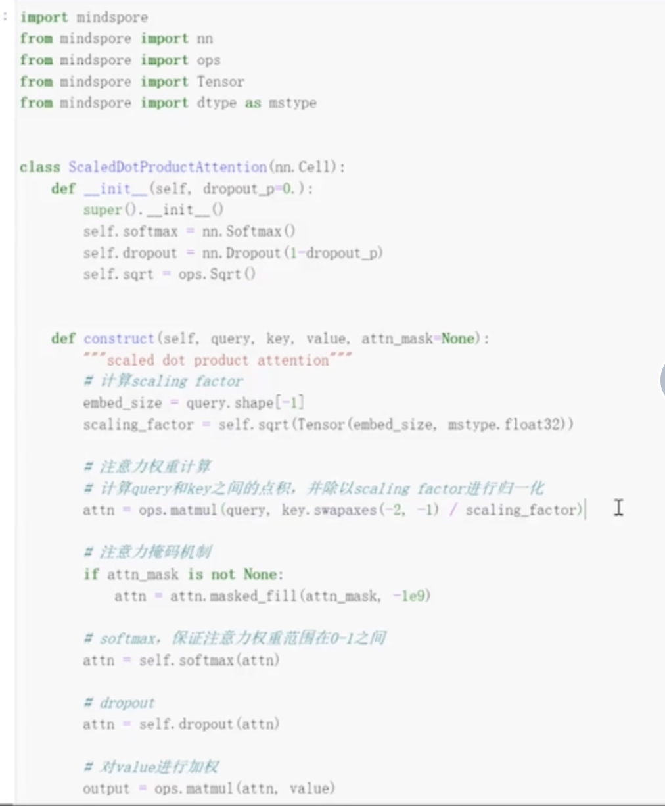
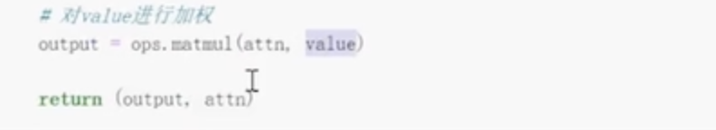
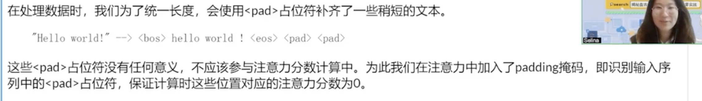
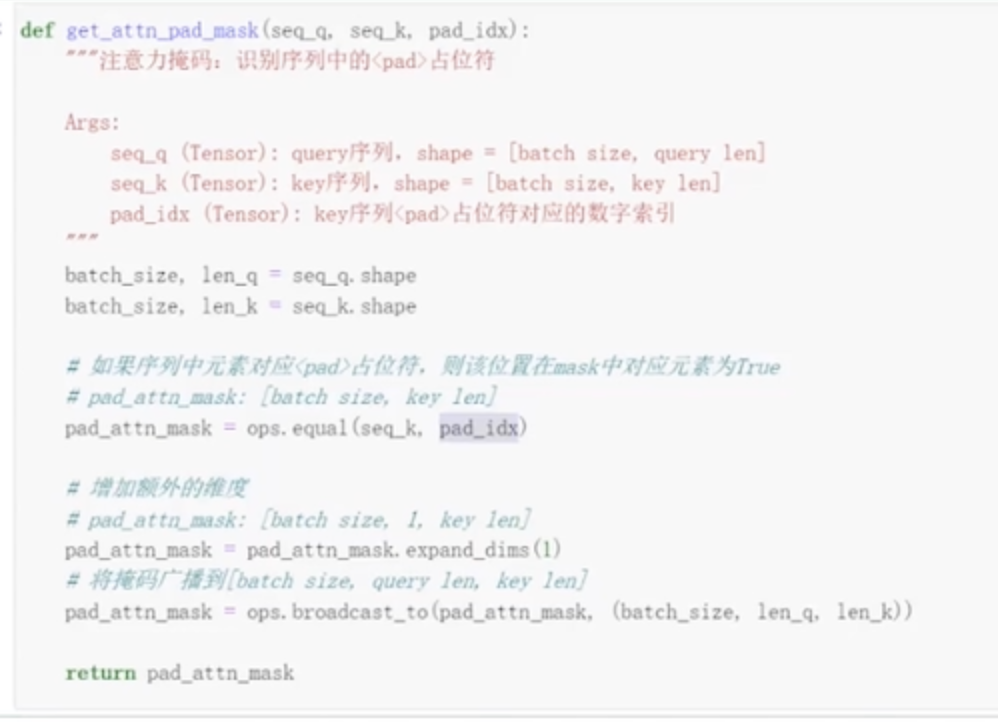
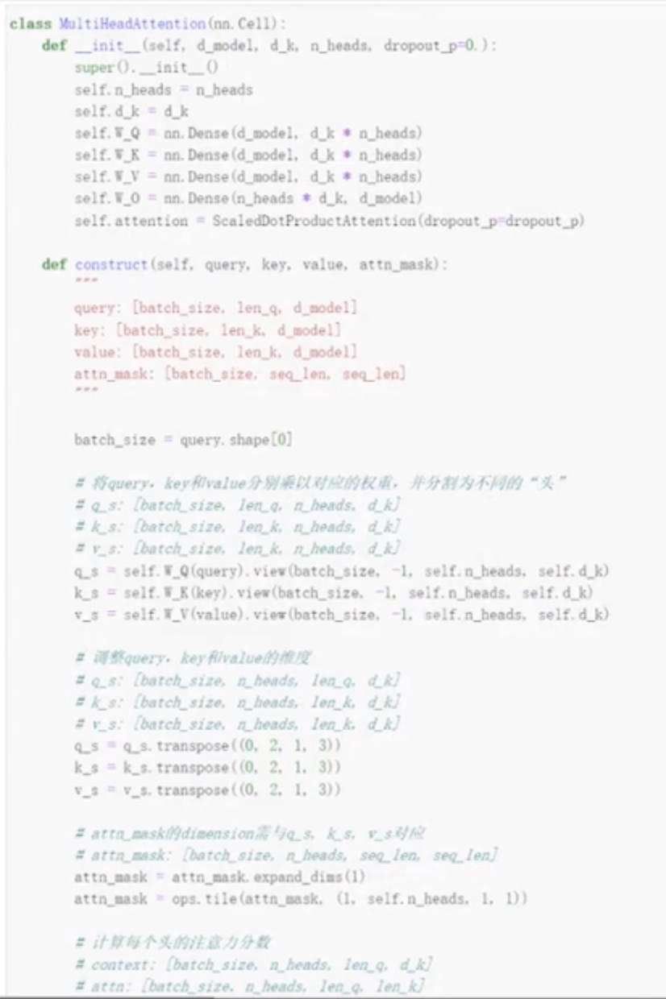
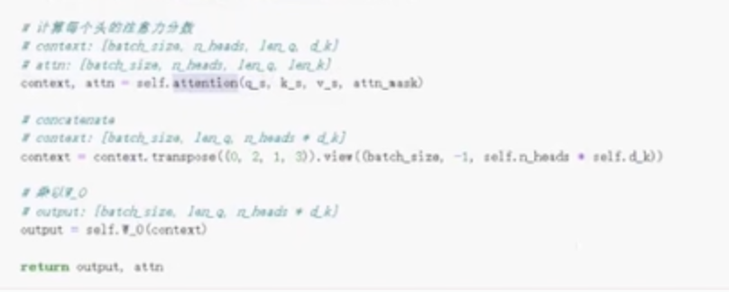
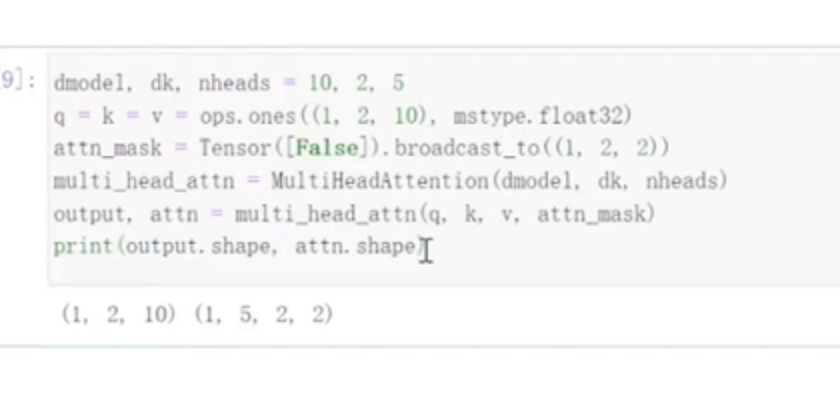

# 前言

> 现在喜欢看各种工具书，用科学的方式已粗略地学习如何阅读一本书、如何做规划、如何丝滑入眠，现在又到了早起。
>
> 这篇笔记主要记早起的情况已经设置的每日早起个人发展项目。

# 主要观点

> 根据我目前的理解，这本书有效的原因是早起的个人发展项目。
>
> - 本篇总个人发展项目见[《学习路线篇》](https://booklover79.github.io/2024/12/07/工具_学习路线/)
>
> 每个人都有自己想要活成的样子，但是每天起床就被破要做各种给定的工作和学习任务，最后并没有时间去做自己想做的事情。
>
> 而它让早起的后，不做这些固定日程，而是做自己想要的个人发展项目。那么早起变得就不那么困难，而是充满活力，像是偷来的时间，因为做自己喜欢的事情，又是早晨无人打扰，注意力容易集中起来，那么之后正点工作也容易注意力集中，不仅时间多了，效率也提高了。

## 早起的步骤

1. 睡前积极暗示自己（会睡个好觉、精神抖擞起床）
2. 把闹钟拿到离床较远的地方
3. 刷牙
4. 喝一大杯水
5. 穿晨服进行晨练

## 自我宣言

> 1. 你真正想要什么（比如健康、心态、情绪、财务和人际关系）
> 2. 为什么想要那些？
> 3. 你必须成为什么样的人，才能的到你想要的？
> 4. 你必须做什么，才能的到你想要的？
> 5. 搜集励志名言

1. 我是命运的主人，我注定会取得成功，我今天要做好一切能做到的事，创造梦想中的生活
2. 我很棒，我很聪明，大家一定很喜欢我
3. 时间比金钱更重要，比朋友更重要，比什么都重要。珍惜每一寸光阴
4. 在自己选择的职业领域里做到全球顶尖，不断重新定义自己的事业，直到理想成为现实
5. 我要成为每日早起的人
6. 做事前要进行冥想

---
### 事业成功

#### BAMS期刊论文
1. 我希望尽快完成**BAMS期刊论文**的修改
2. 想要发表一篇气象最好的顶级期刊
3. 脚踏实地，一步步去研磨文字、打磨细节
4. 期望：尽快完成投稿

---
#### 应用气象学报+专利
1. 我希望尽快完成**应用气象学报和专利**的撰写
2. 保证毕业，并将属于自己的成果发表出来
3. 速战速决，这两样东西相比于BAMS是小巫见大巫，一定要尽快完成。
4. 期望：付出多倍的努力，通过轮状法，三者同步完成

---
#### 毕业大论文
1. 我希望尽快完成**毕业大论文**的撰写
2. 不仅有助于我后续学习自己自己感兴趣的东西，还有机会参加大模型的春招
3. 每天写作，不断积累
4. 期望：
		1. 每天至少写一小节
		2. 同步开启开始订正相关的实验（+订正撰写，边做边写）

---
#### 计算机顶会

1. 我希望发表**计算机顶会**文章
2. 因为我要读计算机专业的博士
3. 每天阅读最新的顶会文章，并多多和导师交流
4. 期望：
		1. 首先阅读10篇顶会文章，翻译5篇+直接抄写5篇，并发表在博客上。（看似笨但最踏实的方法，要始终在飞）
		2. 在学会基本的写作模式后，看文章自己写摘要，并与作者的摘要进行对比，做文字提升的自我总结

---
#### 申请清北博士联合培养
1. 我希望申请`清北+浦江/鹏城实验室`**博士联合培养**
2. 想要实现清北的梦想；同时进入最好的人工智能实验室，与最优秀的科研工作者共事
3. 发表两篇顶级计算机的会议，并拥有完善的代码库
4. 期望：	
		1. 发表2篇顶会论文，并开源代码
		2. 完成经典ai项目与大模型的复现+总结
		3. 完成感兴趣英文文档的翻译

---
### 身体健康

#### 基础健康
1. 我希望通过自律保持**身体健康**
2. 健康是基础，有好的健康再谈其他的
3. 我要成为每天早睡早起、好好吃饭、每日运动的人
4. 期望
		1. 早上八点起床， 晚上十点准备休息
		2. 8-9点早饭、12点午饭、5-6点晚饭   
		3. 每日锻炼：游泳+慢跑

---
#### 健身

1. 我希望健身得到**马甲线**
2. 就是单纯觉得很酷
3. 我要每日锻炼，学习健身相关的知识，搭配合理的饮食习惯
4. 期望
     	1. 早晨慢跑三圈
     	2. 游泳+爬坡
     	3. 学习运动和饮食的知识
---
#### 心态平和

1. 我希望**心态平和**
2. 平和的心态拥有最棒的心智带宽，能让自己处在最佳的状态
3. 我要成为爱阅读的人，书中自有黄金屋，通过阅读前人的经验，我能更加多角度看待事物，从而更加平和
4. 期望每天微信读书1小时

---
#### 视力良好

1. 我希望我是一个**视力非常棒**的人，可以看到非常远处的东西
2. 让身体的器官都处于健康的位置，能够自由高效的运作
3. 给眼睛做好休息
4. 期望：
   1. 休息十分钟的时候，离开位置，下楼去转转
   2. 跳视远方
   3. 滴眼药水

---
#### 爱吃水果

1. 我希望我是一个**爱吃水果**的人
2. 水果里面有大量的维生素，有益于身体健康
3. 每天都吃水果
4. 期望：
   1. 早中晚去食堂，买每天的水果
   2. 切好放在保温盒里，学习时取用

---

### 技能向

#### 财务自由

1. 我希望实现**财务自由**
2. 金钱虽然不是万能的，但是没有金钱是万万不能的，有了金钱才能更好的去实现自己的人生理想
3. 我必须使用杠杆为自己创造财富
4. 主要有三种途径：

      1. 通过自媒体、代码库杠杆传播；
      2. 学习控制人性的欲望，通过炒股实现；
      3. 工作认识志同道合的朋友，通过合作、开发属于自己的产品创业；
5. 期望通过每日的个人发展项目里实现：

      1. 创建自媒体账号，总结自己的所思所想
      2. 学习开源的经典代码，站在巨人的肩膀
      3. 每日学习炒股相关的技术和心态
      4. 热爱工作，学习一切包括技术、打交道、企业运营等知识

#### 额外的收入

1. 我希望通过技能实现**额外的收入**
2. 财务自由是由一个又一个技能综合合成，所以在实现这个大目标之前，我需要点亮一颗又一颗技能树，为了形成有效的正反馈、同时为自己带来一定的收入，我希望利用这些技能创造收入
3. 我必须考虑实现财务自由需要的技能，然后考虑这些技能如何创造额外的收入，保底可以通过自媒体分享
4. 目前期望学习的技能：

      1. 学习kaggle竞赛，获取奖金
      2. 当励志博主，发布文字/录制视频，发布平台收获激励
      3. 当计算机分享博主，分享cs相关技术，后期可以搭建个人分享平台，进行知识付费
---

#### 精通英语阅读和写作
1. 我希望**精通英语阅读和写作**
2. 英语是国际语言，阅读世界优秀的资料，学习第一手资料
3. 我要看英文原著和影视作品
4. 期望
    1. VX读书每天阅读一章双语的故事
    2. 中英双语日记
    3. b站看一期双语的电视（反复看一期就好）
    4. 还要跑步后朗诵

---
#### 断舍离/爱整洁

1. 我希望我是一个**爱整洁**，经常断舍离的人
2. 整理身边的东西时，也是在整理自己的内心
3. 通过不断整理，提高整理的能力
4. 期望：
   1. 在学习休息的时间，多翻翻自己的东西，思考可以怎么改进摆放
   2. 多顺手把东西摆放到正确的位置上，给每个东西设置专属位置，并为其取名

---

### 生活
#### 人际关系

1. 我希望**和每个人相处愉快**
2. 好的人际关系能带来幸福感
3. 我要积极社交，相信自己热爱生活、热爱交流中思想的碰撞
4. 每个周末发展一个热爱生活的项目
    1. 摄影
    2. 美食
    3. 玩游戏
    4. 去景区散步
    5. 美妆
    6. 服装搭配
    7. 手工（用纸制作卡片笔记盒）
    8. 练字（修身养性）
    9. 旅游，提前了解当地的风土民情（我喜欢侃侃而谈，知识储备丰富的感觉）
    
#### 每日感恩

##### 李骞

> 李骞老师非常爱我，多亏有他每周不间断的关心我的学习状态，非常感恩来自他的督促，让我不断进步，我要向他学习，成为一名写作逻辑严谨、代码能力扎实、沟通能力良好的的优秀学生/合作者。
>
> 作为一名硕士研究生，感谢专家的批评指正不是一句空话，而是实质性的为你的项目提供建议、进而不断前行的重要渠道，李骞老师正是一名优秀的科研指导老师，他的批评指正只为了让你的工作变得更加优秀，从而发表高水平的论文

##### 王彦文

> 王彦文老师非常爱我，作为他刚博士毕业带的第一个学生，他对我非常帮助。我要积极与他建立联系，多交流合作，多沟通论文中存在疑议的地方，从而让论文的可解释性更强。王彦文老师非常nice，及时回复，并且提供非常有帮助性的意见，为我论文的水平更上一层楼。

---
### 每天进步一点点

1. 我希望**每天进步一点点**
2. 因为复利效应能发挥巨大的效能，帮助实现巨大的成功
3. 通过记录自己每天的情况，肯定优点，改进不足
4. 期望：
   1. 每天写日记
   2. 整理总结相册的东西，自己保存下来的都是自己受到了感动的内容，逐步积累下来，最后将构成巨大的财富

# 2024

## 24/12/21

刚好是冬至，预备早上七点起床

- [x] 7.00～7.10：散步10分钟
- [x] 7.10～7.20：《洛克菲勒写给儿子的38封信》
> 想法很容易，但是行动确比较难；有想法的人很多，但是能执行好的人确很好。所以，早点开始去做，慢慢调整，直到实现。
> 做大胆果敢的人。
> 借钱当成工具而不是最后的防御，不要畏惧。

- [x] 7.20～7.30：《我的科研助理ChatGPT使用指南》
> 两个原则：保持提示词充分清晰、不给答案设限
>
> 提示词工程的10条基本规则：
> 1. 确保提示词明确具体；
>
>    > 交流的唯一通道，所以尽可能具体：导致xx问题的xx原因/好处是什么

- [x] 7.30～7.40：《Python神经网络编程》
> 1. 太简单了，适合入门的找感觉，但是代码的解说比较少
> 2. 在树莓派上运行神经网络，也不是我涉及的领域

- [x] 7.40～7.50：[课程：PyTorch模型迁移与调优专题](https://www.hiascend.com/zh/developer/courses/detail/2203141624362937328) 第一课
> 1. 讲的太抽象了，需要上机试一下
> 2. 是插件式，保留pytorch的动态图，只需要修改少量代码

- [x] 7.50～7.60：《通用源码阅读指导书》
> Java领域的一些优秀开源项目。
> 1. apache/dubbo：一个高性能的远程过程调用框架；
> 2. netty/netty：事件驱动的异步网络应用框架；
> 3. spring-projects/spring-boot：一套简单易用的 Spring框架；
> 4. alibaba/fastjson：一套快速的 JSON解析、生成组件；
> 5. apache/kafka：一套实时数据流处理平台；
> 6. mybatis/mybatis-3：一套强大的对象关系映射工具。
>
> 涉及项目：
>
> 1. 原项目地址：https://github.com/mybatis/mybatis-3/releases/tag/mybatis-3.5.2
>
> 2. 中文注释版：https://github.com/yeecode/MybatisCN
>
> 3. 示例项目地址：https://github.com/yeecode/MyBatisDemo
>
> MyBatis背景
>
> - 面向对象：基于软件工程（封装）
> - 关系型数据库：基于数学理论
> - 转化：对象关系映射（Object Relatioinal Mapping，ORM）
>
> 为了降低转化的成本，运用ORM框架，MyBatis就是其中的一款

### 小节

由于昨晚喝了咖啡没睡着，上床比较晚了，七点起床就没睡几个小时了。虽然实际并没能早起，但是在中午起床的过程中，一直在思考是否要完成该个人发展项目，确实是想到去做自己感兴趣的项目时，困意一扫而光，反思片刻，决定虽然忙着写论文，但还是愿意完成这个目标，它是能帮助我快速进入状态+提升自己的最快途径。

生活和科研是一样的，都是由不难但是相对琐碎的事情组合而成，如果能大事化小，小事一一解决，那么你就能最后实现巨大的成功。每天完成个人发展项目，就是每天写一点儿论文，慢慢的就能累积上去。

——“不积跬步，无以至千里；不积小流，无以成江海。”

## 24/12/26

- [x] 9.00～9.05：起床
- [x] 9.05～9.15：早饭：超市三明治+牛奶
- [x] 9.15～9.30：带着咖啡，操场跑步
- [x] 7.30～7.45：qq上写早起心得，录制跑路感想视频
- [x] 7.45～8.00：《疯狂动物城》双语阅读
- [ ] 晚间项目：[《神奇动物在哪里》](https://www.bilibili.com/bangumi/play/ss34074?theme=movie&spm_id_from=333.337.0.0&from_spmid=666.25.series.0)
### 小节

因为这几天在赶论文，所以没怎么做，1221第一天开始做，但是我感觉我花的时间好多，先把时间focus on重要的论文上。但是我发现，虽然没有按计划去做，但是也可以把我做的一些项目写上来，早饭、散步/跑步、写日记/录视频、看书怎么不算呢。如果时间充分，按前一晚上设置的做当然很好，但是随心做了什么记录也是非常nice的。

---

## 24/12/27

- [x] 7.00～7.15：吃饭+跑步三圈

> 这里还有阅读《疯狂动物城》，录制视频，超市买咖啡

- [ ] 7.15～7.30：《纳瓦尔宝典》

> 饮食原则：加工越多，越少摄入，尽量吃原生态（豁然开朗）
>
> 在地球上的时间稍纵即逝，无比宝贵，务必好好珍惜
>
> 平静的内心来源于毫无杂念的大脑，消除杂念才能活在当下。所以通过写下来，把内存的东西转入硬盘，让内存活在当下。
>
> 对周遭评判的越多，自我就越膨胀。少说多看多做吧。
>
> 要有一个意识：去感受自己的思维是如何运转的

- [ ] 7.30～7.45：[推荐课程2：MindSpore LLM大模型原理和实践：Transformer](https://www.hiascend.com/zh/developer/courses/detail/1714534129244676098) 第1课

> 课程1有点儿问题，我提交了问题清单，所以先看课程2吧。
>
> Transformer，由论文**《Attention is all you need》**论文提出，位置编码
>
> - query：任务内容
> - key：索引/标签（帮助定位到答案：比如说网站搜索到的标题）
> - value：答案
>
> 注意力分数：query和key的相似度，点积，**处以模长，限制为0，1**（关注一下，放入论文！，woc，我做的我想的，和实际发展的真的好像，所以多看目前的发展）
>
> npm install -g npm
>
> 
>
> 
>
> 
>
> 
>
> bos：起始位置，eos：结束位置
>
> pad：只是为了补齐，让句子长度相同
>
> 
>
> 如果是pad，为True；如果为True，设为-1e9，softmax之后就为0了
>
> 注意力是关注两个句子之间的关系，自注意力机制关注的是句子自己本身，词和词之间的关系，这时候query=key=value=句子本身
>
> 多头注意力：多次计算注意力分数，乘以不同的权重参数，从而映射到多个小维度空间中，称之为头
>
> 
>
> 最开始*head，可以并行计算每个头，通过空间换时间，线性代数hh
>
> 
>
> 
>
> 先看吧，看完敲代码实战并总结

- [x] 7.45～8.00：《研磨记：一名博士生的回忆录》

> 她妈妈在加州大学洛杉矶分校，事业轨迹日趋向上；父亲在企业工程师，职业螺旋式下降。确实我读博很大一个动机，就是希望我的人生是始终前行的，企业里根本不可控，并不一定伴随着你能力的提升，生活越来越好，很难去说这个。
>
> 哈哈哈哈，看着作者的博士生涯，太有意思了，他文字也很有趣，妈呀，我志同道合的朋友啊，在这里！！我悟了，多看读研/博士期间的自传，和我目前的状态最为相关，加上我感兴趣的不单单是学习，更多的是研究有意思的东西，生活中的一些东西激不起我的兴趣，我感觉没啥意思。

### 小节

emm，我给自己安排的任务还比较满，基本上花一早上，我8点起床的，到现在下午三点了。但是还挺好，我非常满足，其实学到感兴趣的，整个人状态越来越兴奋了，跟玩游戏一样，一点儿不会感觉到累。

早上跑步激活身体，先跑一个月吧，然后可以变成5圈。双语书，慢慢有点点看进去了，反正比第一天看一脸懵好多了。

《纳》今天没有看到什么特别让我激情澎湃的，但是还是有小的收获，慢慢进步就好。

哇！这个课程讲的好多了，比课程1有趣，感觉像是本科的课程，研究生我就没怎么看过这些，即使打开了视频，但是由于焦虑之前也没有看下去，比较遗憾，还是要脚踏实地。加油！一切都为时不晚。

《研磨记》太好玩了，作者好厉害啊，麻省理工和斯坦福的，也是计算机，看着他的传记，代入感非常强烈，他的书也打算反复看，然后思考我对科研的想法以及规划。

今天中午细心去体验了科大校园，发现了不一样的事件，感觉也可以算作一个个人发展项目哈哈哈。

----

## 24/12/28

- [x] 7.00～7.15：食堂早饭：肠粉

- [x] 7.15～7.30：操场跑步：三圈（周末好几个学生，比工作日人多）

- [x] 7.30～7.45：《疯狂动物城》第四章

- [x] 7.45～8.00：录制视频

### 小节

感觉有点累，昨晚九点钟就在床上睡着了，保持良好的睡眠和充足的休息也是非常重要的。在与持久不在于一天能做很多！真的是日积月累、水滴石穿，做的时候尽量最小的消耗，但是能长久做下去是关键！

---

## 24/12/31

作为2024年最后一天，一定要好好完成哦！emm，我感觉早上也不宜安排太多的任务，因为太多了，人就畏难做不好了，微习惯，先设置小的习惯，简单的习惯吧！吃饭了，跑步了就很棒了，加上看课程，简直完美，个人发展项目就应该多多设置课程这种仅需要积累的，但是专门花时间又舍不得的。

- [ ] 7.00～7.15：早起+吃饭（八宝粥）
- [ ] 7.15～8.00：跑步三圈+买咖啡
- [ ] 8.00～9.00：[推荐课程2：MindSpore LLM大模型原理和实践：Transformer](https://www.hiascend.com/zh/developer/courses/detail/1714534129244676098) 第2课

### 小节

哈哈哈，没做，那就新年新气象，把一切的一切都补回来吧！

## 25/01/03

- [x] 《研磨记》
- [x] 《纳瓦尔宝典》

### 小节

一整天读完了两本书，《研磨记》是凌晨一口气读完的，深受震撼，作者和我的观念是一致的，我也希望达到作者这样的状态。《纳瓦尔宝典》其实是比较口头的一些道理，更加学术化、成体系还是多看其他的书，发现我对获得财富非常感兴趣，可以多看看经济学的书籍。都做了相应简单的总结，可以反复阅读并修改。

---

## 模版

- [ ] 7.00～7.15：xx
> 

- [ ] 7.15～7.30：xx
> 

- [ ] 7.30～7.45：xx
> 

- [x] 7.45～8.00：xx
> 

### 小节

